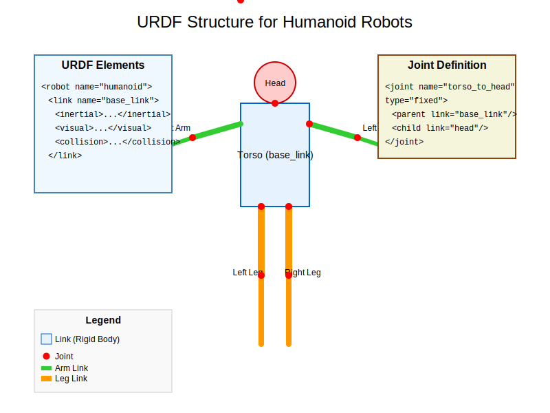

# URDF for Humanoids

## Overview

This chapter introduces URDF (Unified Robot Description Format) and how to model humanoid robots. URDF is an XML format used to describe robot models in ROS, including their physical properties, kinematic structure, and visual appearance. You'll learn to create accurate representations of humanoid robots for simulation and control.

## Learning Objectives

By the end of this chapter, you will be able to:
- Understand the structure and components of URDF files
- Create URDF models for humanoid robots
- Define joints, links, and their physical properties
- Add visual and collision properties to robot models
- Validate URDF models and visualize them in RViz
- Integrate URDF models with robot controllers

## Table of Contents

1. [Introduction to URDF](#introduction-to-urdf)
2. [URDF Structure and Components](#urdf-structure-and-components)
3. [Links and Joints](#links-and-joints)
4. [Physical Properties](#physical-properties)
5. [Visual and Collision Properties](#visual-and-collision-properties)
6. [Humanoid Robot Modeling](#humanoid-robot-modeling)
7. [URDF Validation and Visualization](#urdf-validation-and-visualization)
8. [Integration with ROS](#integration-with-ros)
9. [Summary and Next Steps](#summary-and-next-steps)

## Introduction to URDF

URDF (Unified Robot Description Format) is an XML-based format used in ROS to describe robot models. It defines the physical and visual properties of a robot, including its links (rigid parts), joints (connections between links), and other properties like inertia, visual appearance, and collision properties.

### Why URDF?

URDF is essential for:
- **Simulation**: Creating robot models for Gazebo and other simulators
- **Visualization**: Displaying robots in RViz
- **Control**: Providing kinematic information for controllers
- **Planning**: Enabling motion planning algorithms
- **Collision detection**: Defining collision properties

### Basic URDF Structure

A minimal URDF file contains a single link with no joints:

```xml
<?xml version="1.0"?>
<robot name="simple_robot">
  <link name="base_link">
    <visual>
      <geometry>
        <box size="1 1 1"/>
      </geometry>
    </visual>
    <collision>
      <geometry>
        <box size="1 1 1"/>
      </geometry>
    </collision>
  </link>
</robot>
```

## URDF Structure and Components

### Robot Element



The root element of a URDF file is the `<robot>` tag:

```xml
<robot name="my_robot">
  <!-- Robot content goes here -->
</robot>
```

### Links

Links represent rigid parts of the robot:

```xml
<link name="link_name">
  <!-- Link properties go here -->
</link>
```

### Joints

Joints connect links and define their relative motion:

```xml
<joint name="joint_name" type="joint_type">
  <parent link="parent_link_name"/>
  <child link="child_link_name"/>
  <!-- Joint properties go here -->
</joint>
```

### Materials

Materials define visual appearance:

```xml
<material name="material_name">
  <color rgba="0.8 0.2 0.2 1.0"/>
</material>
```

## Links and Joints

### Link Definition

A link can contain multiple elements:

```xml
<link name="my_link">
  <!-- Inertial properties -->
  <inertial>
    <origin xyz="0 0 0.5" rpy="0 0 0"/>
    <mass value="1"/>
    <inertia ixx="100" ixy="0" ixz="0" iyy="100" iyz="0" izz="100"/>
  </inertial>

  <!-- Visual properties -->
  <visual>
    <origin xyz="0 0 0" rpy="0 0 0"/>
    <geometry>
      <box size="1 1 1"/>
    </geometry>
    <material name="blue">
      <color rgba="0 0 1 1"/>
    </material>
  </visual>

  <!-- Collision properties -->
  <collision>
    <origin xyz="0 0 0" rpy="0 0 0"/>
    <geometry>
      <box size="1 1 1"/>
    </geometry>
  </collision>
</link>
```

### Joint Types

ROS supports several joint types:

1. **revolute**: Rotational joint with limited range
2. **continuous**: Rotational joint without limits
3. **prismatic**: Linear sliding joint with limits
4. **fixed**: No motion between links
5. **floating**: 6 DOF joint (rarely used)
6. **planar**: Motion on a plane (rarely used)

### Joint Definition

A joint connects two links:

```xml
<joint name="joint_name" type="revolute">
  <origin xyz="1 0 0" rpy="0 0 0"/>
  <parent link="parent_link"/>
  <child link="child_link"/>
  <axis xyz="0 0 1"/>
  <limit lower="-1.57" upper="1.57" effort="100" velocity="1"/>
</joint>
```

## Physical Properties

### Inertial Properties

Inertial properties are crucial for physics simulation:

```xml
<inertial>
  <!-- Origin of the inertial reference frame relative to the link frame -->
  <origin xyz="0 0 0.1" rpy="0 0 0"/>

  <!-- Mass in kilograms -->
  <mass value="0.1"/>

  <!-- Inertia matrix -->
  <inertia ixx="0.01" ixy="0" ixz="0" iyy="0.01" iyz="0" izz="0.01"/>
</inertial>
```

### Calculating Inertia

For common shapes, here are the inertia formulas:

- **Box** (width w, depth d, height h): `Ixx = 1/12 * m * (d² + h²)`
- **Cylinder** (radius r, height h): `Izz = 1/2 * m * r²`, `Ixx = Iyy = 1/12 * m * (3*r² + h²)`
- **Sphere** (radius r): `Ixx = Iyy = Izz = 2/5 * m * r²`

## Visual and Collision Properties

### Visual Properties

Visual elements define how the robot appears:

```xml
<visual>
  <!-- Origin relative to the link frame -->
  <origin xyz="0 0 0" rpy="0 0 0"/>

  <!-- Geometry definition -->
  <geometry>
    <box size="0.1 0.1 0.1"/>
    <!-- OR -->
    <!-- <cylinder radius="0.1" length="0.2"/> -->
    <!-- OR -->
    <!-- <sphere radius="0.1"/> -->
    <!-- OR -->
    <!-- <mesh filename="package://my_robot/meshes/link.dae"/> -->
  </geometry>

  <!-- Material -->
  <material name="red">
    <color rgba="1 0 0 1"/>
    <!-- OR -->
    <!-- <texture filename="package://my_robot/textures/red.png"/> -->
  </material>
</visual>
```

### Collision Properties

Collision elements define how the robot interacts with the environment:

```xml
<collision>
  <origin xyz="0 0 0" rpy="0 0 0"/>
  <geometry>
    <box size="0.1 0.1 0.1"/>
  </geometry>
</collision>
```

## Humanoid Robot Modeling

### Humanoid Robot Structure

A humanoid robot typically includes:
- **Torso**: Main body
- **Head**: With sensors (cameras, IMU, etc.)
- **Arms**: Shoulders, elbows, wrists, hands
- **Legs**: Hips, knees, ankles, feet

### Example Humanoid URDF

Here's a simplified humanoid robot model:

```xml
<?xml version="1.0"?>
<robot name="simple_humanoid">

  <!-- Materials -->
  <material name="blue">
    <color rgba="0 0 1 1"/>
  </material>
  <material name="white">
    <color rgba="1 1 1 1"/>
  </material>
  <material name="black">
    <color rgba="0 0 0 1"/>
  </material>

  <!-- Base link (torso) -->
  <link name="torso">
    <inertial>
      <origin xyz="0 0 0.3" rpy="0 0 0"/>
      <mass value="10"/>
      <inertia ixx="0.5" ixy="0" ixz="0" iyy="0.5" iyz="0" izz="0.2"/>
    </inertial>

    <visual>
      <origin xyz="0 0 0.3" rpy="0 0 0"/>
      <geometry>
        <box size="0.3 0.3 0.6"/>
      </geometry>
      <material name="white"/>
    </visual>

    <collision>
      <origin xyz="0 0 0.3" rpy="0 0 0"/>
      <geometry>
        <box size="0.3 0.3 0.6"/>
      </geometry>
    </collision>
  </link>

  <!-- Head -->
  <joint name="torso_to_head" type="fixed">
    <origin xyz="0 0 0.6" rpy="0 0 0"/>
    <parent link="torso"/>
    <child link="head"/>
  </joint>

  <link name="head">
    <inertial>
      <origin xyz="0 0 0" rpy="0 0 0"/>
      <mass value="1"/>
      <inertia ixx="0.01" ixy="0" ixz="0" iyy="0.01" iyz="0" izz="0.01"/>
    </inertial>

    <visual>
      <origin xyz="0 0 0" rpy="0 0 0"/>
      <geometry>
        <sphere radius="0.1"/>
      </geometry>
      <material name="white"/>
    </visual>

    <collision>
      <origin xyz="0 0 0" rpy="0 0 0"/>
      <geometry>
        <sphere radius="0.1"/>
      </geometry>
    </collision>
  </link>

  <!-- Left Arm -->
  <joint name="torso_to_left_shoulder" type="revolute">
    <origin xyz="0.2 0 0.4" rpy="0 0 0"/>
    <parent link="torso"/>
    <child link="left_upper_arm"/>
    <axis xyz="0 1 0"/>
    <limit lower="-1.57" upper="1.57" effort="100" velocity="1"/>
  </joint>

  <link name="left_upper_arm">
    <inertial>
      <origin xyz="0 0 -0.1" rpy="0 0 0"/>
      <mass value="2"/>
      <inertia ixx="0.02" ixy="0" ixz="0" iyy="0.02" iyz="0" izz="0.01"/>
    </inertial>

    <visual>
      <origin xyz="0 0 -0.1" rpy="0 0 0"/>
      <geometry>
        <cylinder radius="0.05" length="0.2"/>
      </geometry>
      <material name="blue"/>
    </visual>

    <collision>
      <origin xyz="0 0 -0.1" rpy="0 0 0"/>
      <geometry>
        <cylinder radius="0.05" length="0.2"/>
      </geometry>
    </collision>
  </link>

  <joint name="left_shoulder_to_elbow" type="revolute">
    <origin xyz="0 0 -0.2" rpy="0 0 0"/>
    <parent link="left_upper_arm"/>
    <child link="left_lower_arm"/>
    <axis xyz="0 1 0"/>
    <limit lower="-1.57" upper="1.57" effort="100" velocity="1"/>
  </joint>

  <link name="left_lower_arm">
    <inertial>
      <origin xyz="0 0 -0.1" rpy="0 0 0"/>
      <mass value="1.5"/>
      <inertia ixx="0.01" ixy="0" ixz="0" iyy="0.01" iyz="0" izz="0.005"/>
    </inertial>

    <visual>
      <origin xyz="0 0 -0.1" rpy="0 0 0"/>
      <geometry>
        <cylinder radius="0.04" length="0.2"/>
      </geometry>
      <material name="blue"/>
    </visual>

    <collision>
      <origin xyz="0 0 -0.1" rpy="0 0 0"/>
      <geometry>
        <cylinder radius="0.04" length="0.2"/>
      </geometry>
    </collision>
  </link>

  <!-- Right Arm (similar to left) -->
  <joint name="torso_to_right_shoulder" type="revolute">
    <origin xyz="-0.2 0 0.4" rpy="0 0 0"/>
    <parent link="torso"/>
    <child link="right_upper_arm"/>
    <axis xyz="0 1 0"/>
    <limit lower="-1.57" upper="1.57" effort="100" velocity="1"/>
  </joint>

  <link name="right_upper_arm">
    <inertial>
      <origin xyz="0 0 -0.1" rpy="0 0 0"/>
      <mass value="2"/>
      <inertia ixx="0.02" ixy="0" ixz="0" iyy="0.02" iyz="0" izz="0.01"/>
    </inertial>

    <visual>
      <origin xyz="0 0 -0.1" rpy="0 0 0"/>
      <geometry>
        <cylinder radius="0.05" length="0.2"/>
      </geometry>
      <material name="blue"/>
    </visual>

    <collision>
      <origin xyz="0 0 -0.1" rpy="0 0 0"/>
      <geometry>
        <cylinder radius="0.05" length="0.2"/>
      </geometry>
    </collision>
  </link>

  <joint name="right_shoulder_to_elbow" type="revolute">
    <origin xyz="0 0 -0.2" rpy="0 0 0"/>
    <parent link="right_upper_arm"/>
    <child link="right_lower_arm"/>
    <axis xyz="0 1 0"/>
    <limit lower="-1.57" upper="1.57" effort="100" velocity="1"/>
  </joint>

  <link name="right_lower_arm">
    <inertial>
      <origin xyz="0 0 -0.1" rpy="0 0 0"/>
      <mass value="1.5"/>
      <inertia ixx="0.01" ixy="0" ixz="0" iyy="0.01" iyz="0" izz="0.005"/>
    </inertial>

    <visual>
      <origin xyz="0 0 -0.1" rpy="0 0 0"/>
      <geometry>
        <cylinder radius="0.04" length="0.2"/>
      </geometry>
      <material name="blue"/>
    </visual>

    <collision>
      <origin xyz="0 0 -0.1" rpy="0 0 0"/>
      <geometry>
        <cylinder radius="0.04" length="0.2"/>
      </geometry>
    </collision>
  </link>

  <!-- Left Leg -->
  <joint name="torso_to_left_hip" type="revolute">
    <origin xyz="0.07 0 0" rpy="0 0 0"/>
    <parent link="torso"/>
    <child link="left_upper_leg"/>
    <axis xyz="0 1 0"/>
    <limit lower="-1.57" upper="1.57" effort="100" velocity="1"/>
  </joint>

  <link name="left_upper_leg">
    <inertial>
      <origin xyz="0 0 -0.2" rpy="0 0 0"/>
      <mass value="3"/>
      <inertia ixx="0.05" ixy="0" ixz="0" iyy="0.05" iyz="0" izz="0.01"/>
    </inertial>

    <visual>
      <origin xyz="0 0 -0.2" rpy="0 0 0"/>
      <geometry>
        <cylinder radius="0.06" length="0.4"/>
      </geometry>
      <material name="black"/>
    </visual>

    <collision>
      <origin xyz="0 0 -0.2" rpy="0 0 0"/>
      <geometry>
        <cylinder radius="0.06" length="0.4"/>
      </geometry>
    </collision>
  </link>

  <joint name="left_hip_to_knee" type="revolute">
    <origin xyz="0 0 -0.4" rpy="0 0 0"/>
    <parent link="left_upper_leg"/>
    <child link="left_lower_leg"/>
    <axis xyz="0 1 0"/>
    <limit lower="-1.57" upper="1.57" effort="100" velocity="1"/>
  </joint>

  <link name="left_lower_leg">
    <inertial>
      <origin xyz="0 0 -0.2" rpy="0 0 0"/>
      <mass value="2.5"/>
      <inertia ixx="0.03" ixy="0" ixz="0" iyy="0.03" iyz="0" izz="0.008"/>
    </inertial>

    <visual>
      <origin xyz="0 0 -0.2" rpy="0 0 0"/>
      <geometry>
        <cylinder radius="0.05" length="0.4"/>
      </geometry>
      <material name="black"/>
    </visual>

    <collision>
      <origin xyz="0 0 -0.2" rpy="0 0 0"/>
      <geometry>
        <cylinder radius="0.05" length="0.4"/>
      </geometry>
    </collision>
  </link>

  <!-- Right Leg (similar to left) -->
  <joint name="torso_to_right_hip" type="revolute">
    <origin xyz="-0.07 0 0" rpy="0 0 0"/>
    <parent link="torso"/>
    <child link="right_upper_leg"/>
    <axis xyz="0 1 0"/>
    <limit lower="-1.57" upper="1.57" effort="100" velocity="1"/>
  </joint>

  <link name="right_upper_leg">
    <inertial>
      <origin xyz="0 0 -0.2" rpy="0 0 0"/>
      <mass value="3"/>
      <inertia ixx="0.05" ixy="0" ixz="0" iyy="0.05" iyz="0" izz="0.01"/>
    </inertial>

    <visual>
      <origin xyz="0 0 -0.2" rpy="0 0 0"/>
      <geometry>
        <cylinder radius="0.06" length="0.4"/>
      </geometry>
      <material name="black"/>
    </visual>

    <collision>
      <origin xyz="0 0 -0.2" rpy="0 0 0"/>
      <geometry>
        <cylinder radius="0.06" length="0.4"/>
      </geometry>
    </collision>
  </link>

  <joint name="right_hip_to_knee" type="revolute">
    <origin xyz="0 0 -0.4" rpy="0 0 0"/>
    <parent link="right_upper_leg"/>
    <child link="right_lower_leg"/>
    <axis xyz="0 1 0"/>
    <limit lower="-1.57" upper="1.57" effort="100" velocity="1"/>
  </joint>

  <link name="right_lower_leg">
    <inertial>
      <origin xyz="0 0 -0.2" rpy="0 0 0"/>
      <mass value="2.5"/>
      <inertia ixx="0.03" ixy="0" ixz="0" iyy="0.03" iyz="0" izz="0.008"/>
    </inertial>

    <visual>
      <origin xyz="0 0 -0.2" rpy="0 0 0"/>
      <geometry>
        <cylinder radius="0.05" length="0.4"/>
      </geometry>
      <material name="black"/>
    </visual>

    <collision>
      <origin xyz="0 0 -0.2" rpy="0 0 0"/>
      <geometry>
        <cylinder radius="0.05" length="0.4"/>
      </geometry>
    </collision>
  </link>

</robot>
```

## URDF Validation and Visualization

### Checking URDF Files

You can validate URDF files using the check_urdf tool:

```bash
# Install the tool if not available
sudo apt-get install ros-rolling-urdf

# Check your URDF file
check_urdf /path/to/your/robot.urdf
```

### Visualizing URDF

To visualize your URDF model in RViz:

```bash
# Launch robot state publisher
ros2 run robot_state_publisher robot_state_publisher --ros-args -p robot_description:=$(cat /path/to/your/robot.urdf)

# Or if using a launch file
ros2 launch your_package display.launch.py
```

### Using xacro

For complex robots, xacro (XML Macros) can simplify URDF:

```xml
<?xml version="1.0"?>
<robot xmlns:xacro="http://www.ros.org/wiki/xacro" name="humanoid_with_xacro">

  <!-- Define properties -->
  <xacro:property name="M_PI" value="3.1415926535897931" />

  <!-- Macro for creating a simple link -->
  <xacro:macro name="simple_link" params="name mass xyz_length">
    <link name="${name}">
      <inertial>
        <origin xyz="0 0 0" rpy="0 0 0"/>
        <mass value="${mass}"/>
        <inertia ixx="1" ixy="0" ixz="0" iyy="1" iyz="0" izz="1"/>
      </inertial>
      <visual>
        <origin xyz="0 0 0" rpy="0 0 0"/>
        <geometry>
          <box size="${xyz_length}"/>
        </geometry>
      </visual>
      <collision>
        <origin xyz="0 0 0" rpy="0 0 0"/>
        <geometry>
          <box size="${xyz_length}"/>
        </geometry>
      </collision>
    </link>
  </xacro:macro>

  <!-- Use the macro -->
  <xacro:simple_link name="base_link" mass="1" xyz_length="0.5 0.5 0.5"/>

</robot>
```

## Integration with ROS

### Robot State Publisher

The robot_state_publisher node publishes joint states to TF:

```python
import rclpy
from rclpy.node import Node
from sensor_msgs.msg import JointState
from tf2_ros import TransformBroadcaster
from geometry_msgs.msg import TransformStamped

class JointStatePublisher(Node):
    def __init__(self):
        super().__init__('joint_state_publisher')

        # Publisher for joint states
        self.joint_pub = self.create_publisher(JointState, 'joint_states', 10)

        # Transform broadcaster for TF
        self.tf_broadcaster = TransformBroadcaster(self)

        # Timer for publishing
        self.timer = self.create_timer(0.1, self.publish_joint_states)

        # Initialize joint values
        self.joint_names = ['joint1', 'joint2']  # Replace with your joint names
        self.joint_values = [0.0, 0.0]  # Replace with initial values

    def publish_joint_states(self):
        # Create joint state message
        msg = JointState()
        msg.name = self.joint_names
        msg.position = self.joint_values
        msg.header.stamp = self.get_clock().now().to_msg()
        msg.header.frame_id = 'base_link'

        # Publish joint states
        self.joint_pub.publish(msg)

        # Broadcast transforms (simplified)
        # In a real implementation, you would compute transforms from joint values

def main(args=None):
    rclpy.init(args=args)
    node = JointStatePublisher()

    try:
        rclpy.spin(node)
    except KeyboardInterrupt:
        pass
    finally:
        node.destroy_node()
        rclpy.shutdown()

if __name__ == '__main__':
    main()
```

### Launch File for URDF

Create a launch file to bring up your robot:

```python
# launch/display.launch.py
from launch import LaunchDescription
from launch.actions import DeclareLaunchArgument
from launch.substitutions import LaunchConfiguration
from launch_ros.actions import Node

def generate_launch_description():
    # Declare arguments
    urdf_arg = DeclareLaunchArgument(
        'urdf',
        default_value='path/to/your/robot.urdf',
        description='URDF file path'
    )

    # Robot state publisher
    robot_state_publisher = Node(
        package='robot_state_publisher',
        executable='robot_state_publisher',
        parameters=[
            {'robot_description': open(LaunchConfiguration('urdf')).read()}
        ]
    )

    # Joint state publisher (GUI for testing)
    joint_state_publisher = Node(
        package='joint_state_publisher',
        executable='joint_state_publisher',
        parameters=[
            {'source_list': ['joint_states']}
        ]
    )

    # Joint state publisher GUI
    joint_state_publisher_gui = Node(
        package='joint_state_publisher_gui',
        executable='joint_state_publisher_gui'
    )

    # RViz2
    rviz = Node(
        package='rviz2',
        executable='rviz2',
        arguments=['-d', 'path/to/your/config.rviz']
    )

    return LaunchDescription([
        urdf_arg,
        robot_state_publisher,
        joint_state_publisher,
        joint_state_publisher_gui,
        rviz
    ])
```

## Summary and Next Steps

In this chapter, you learned:
- The structure and components of URDF files
- How to define links and joints for humanoid robots
- How to specify physical, visual, and collision properties
- How to create complex humanoid robot models
- How to validate and visualize URDF models
- How to integrate URDF with ROS systems

### Key Takeaways

- URDF is the standard format for robot descriptions in ROS
- Proper inertial properties are crucial for physics simulation
- Visual and collision properties can differ for optimization
- Xacro simplifies complex URDF models with macros
- Robot state publisher bridges URDF models with ROS TF system

### Next Steps

In the next module, you'll learn about simulation environments using Gazebo, where you'll use these URDF models to create realistic robot simulations.

## Exercises

1. Create a URDF model for a simple 2-wheeled robot
2. Add sensors (cameras, IMU) to your humanoid model
3. Create a xacro macro for generating humanoid limbs
4. Validate your URDF file and visualize it in RViz
5. Create a launch file that displays your robot model

## References

- URDF Documentation: http://wiki.ros.org/urdf
- Xacro Documentation: http://wiki.ros.org/xacro
- Robot State Publisher: http://wiki.ros.org/robot_state_publisher
- TF2 Documentation: http://wiki.ros.org/tf2