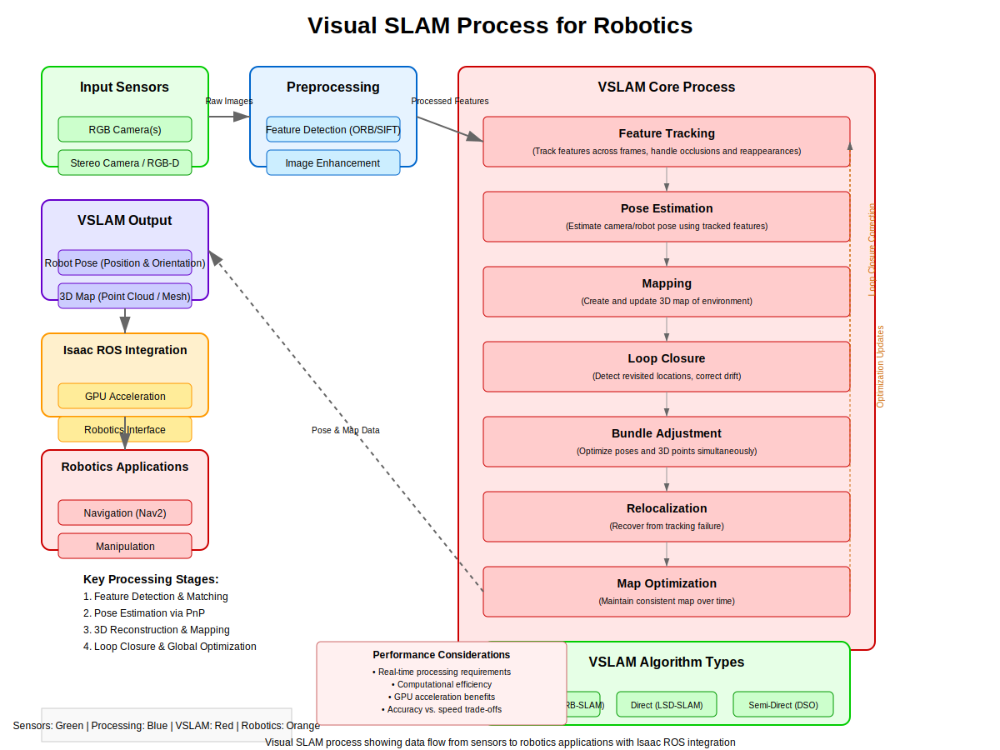

# Isaac ROS + VSLAM

## Overview

This chapter focuses on Visual Simultaneous Localization and Mapping (VSLAM) using NVIDIA Isaac ROS packages. VSLAM enables robots to build a map of an unknown environment while simultaneously localizing themselves within that map using visual sensors. You'll learn to implement VSLAM systems using Isaac ROS packages, which provide optimized algorithms for GPU-accelerated processing.

## Learning Objectives

By the end of this chapter, you will be able to:
- Understand the principles of Visual SLAM and its applications in robotics
- Install and configure Isaac ROS packages for VSLAM
- Implement VSLAM systems using camera and IMU sensors
- Optimize VSLAM performance using GPU acceleration
- Integrate VSLAM with navigation systems
- Evaluate VSLAM accuracy and performance

## Table of Contents

1. [Introduction to Visual SLAM](#introduction-to-visual-slam)
2. [Isaac ROS VSLAM Packages](#isaac-ros-vslam-packages)
3. [Camera and Sensor Setup](#camera-and-sensor-setup)
4. [VSLAM Algorithms and Implementation](#vslam-algorithms-and-implementation)
5. [GPU Acceleration and Optimization](#gpu-acceleration-and-optimization)
6. [Integration with Navigation](#integration-with-navigation)
7. [Performance Evaluation](#performance-evaluation)
8. [Summary and Next Steps](#summary-and-next-steps)

## Introduction to Visual SLAM

### What is Visual SLAM?

Visual SLAM (Simultaneous Localization and Mapping) is a technique that allows robots to simultaneously:
- **Localize** themselves in an unknown environment
- **Map** the environment using visual sensors (cameras)

This is accomplished by analyzing visual features in camera images over time to estimate the robot's motion and reconstruct the 3D structure of the environment.

### VSLAM vs. Other SLAM Approaches

| Approach | Sensors | Advantages | Disadvantages |
|----------|---------|------------|---------------|
| Visual SLAM | Cameras | Rich information, low cost | Light-dependent, texture-dependent |
| LiDAR SLAM | LiDAR | Robust, accurate | Expensive, less information |
| Visual-Inertial SLAM | Cameras + IMU | Robust to motion blur | More complex, requires calibration |

### Applications of VSLAM

- Autonomous navigation in GPS-denied environments
- Indoor mapping and exploration
- Augmented reality applications
- Robot localization and path planning
- Inspection and surveillance tasks

### VSLAM Pipeline

The typical VSLAM pipeline consists of:



1. **Feature Detection**: Extract distinctive features from images
2. **Feature Matching**: Match features across consecutive frames
3. **Motion Estimation**: Estimate camera motion from feature correspondences
4. **Mapping**: Reconstruct 3D points from triangulation
5. **Optimization**: Refine pose and map estimates using bundle adjustment
6. **Loop Closure**: Detect revisited locations to correct drift

## Isaac ROS VSLAM Packages

### Overview of Isaac ROS

Isaac ROS is a collection of GPU-accelerated perception packages that provide:
- Optimized algorithms for robotics perception tasks
- Integration with NVIDIA hardware (Jetson, RTX GPUs)
- ROS 2 compatibility
- Real-time performance

### Key VSLAM Packages

#### Isaac ROS Stereo DNN

For stereo vision-based depth estimation:

```bash
# Install Isaac ROS Stereo DNN
sudo apt-get install ros-humble-isaac-ros-stereo-dnn
```

```python
# Example launch file for stereo DNN
# launch/stereo_dnn.launch.py
from launch import LaunchDescription
from launch_ros.actions import ComposableNodeContainer
from launch_ros.descriptions import ComposableNode

def generate_launch_description():
    container = ComposableNodeContainer(
        name='stereo_dnn_container',
        namespace='isaac_ros',
        package='rclcpp_components',
        executable='component_container_mt',
        composable_node_descriptions=[
            ComposableNode(
                package='isaac_ros_stereo_image_proc',
                plugin='nvidia::isaac_ros::stereo_image_proc::DisparityNode',
                name='disparity_node'
            ),
            ComposableNode(
                package='isaac_ros_stereo_dnn',
                plugin='nvidia::isaac_ros::dnn_stereo_depth::DnnStereoDepthNode',
                name='dnn_stereo_depth_node'
            )
        ],
        output='screen'
    )

    return LaunchDescription([container])
```

#### Isaac ROS AprilTag

For fiducial marker-based pose estimation:

```python
# Example AprilTag detection node
# apriltag_detector.py
import rclpy
from rclpy.node import Node
from sensor_msgs.msg import Image
from geometry_msgs.msg import PoseStamped
from vision_msgs.msg import Detection2DArray
import cv2
from cv_bridge import CvBridge

class AprilTagDetector(Node):
    def __init__(self):
        super().__init__('april_tag_detector')

        self.subscription = self.create_subscription(
            Image,
            'image_raw',
            self.image_callback,
            10
        )

        self.pose_publisher = self.create_publisher(
            PoseStamped,
            'tag_pose',
            10
        )

        self.detection_publisher = self.create_publisher(
            Detection2DArray,
            'tag_detections',
            10
        )

        self.bridge = CvBridge()

        # AprilTag detector parameters
        import apriltag
        self.detector = apriltag.Detector()

    def image_callback(self, msg):
        # Convert ROS image to OpenCV
        cv_image = self.bridge.imgmsg_to_cv2(msg, desired_encoding='bgr8')

        # Convert to grayscale for detection
        gray = cv2.cvtColor(cv_image, cv2.COLOR_BGR2GRAY)

        # Detect AprilTags
        detections = self.detector.detect(gray)

        # Process detections
        for detection in detections:
            # Extract tag ID and pose
            tag_id = detection.tag_id
            center = detection.center

            # Create detection message
            detection_msg = self.create_detection_msg(detection, msg.header)

            # Publish detection
            self.detection_publisher.publish(detection_msg)

            # Extract pose information
            pose_msg = self.create_pose_msg(detection, msg.header)
            self.pose_publisher.publish(pose_msg)

    def create_detection_msg(self, detection, header):
        # Create vision_msgs/Detection2D message
        detection_msg = Detection2D()
        detection_msg.header = header
        # Add detection details
        return detection_msg

    def create_pose_msg(self, detection, header):
        # Create pose message from detection
        pose_msg = PoseStamped()
        pose_msg.header = header
        # Add pose details
        return pose_msg
```

#### Isaac ROS Visual Slam

The main package for VSLAM:

```bash
# Install Isaac ROS Visual SLAM
sudo apt-get install ros-humble-isaac-ros-visual-slam
```

### Installing Isaac ROS Packages

```bash
# Update package list
sudo apt update

# Install Isaac ROS Visual SLAM packages
sudo apt install ros-humble-isaac-ros-visual-slam
sudo apt install ros-humble-isaac-ros-stereo-image-proc
sudo apt install ros-humble-isaac-ros-segmentation
sudo apt install ros-humble-isaac-ros-bit-mapper
sudo apt install ros-humble-isaac-ros-peoplesegmap-ros
```

## Camera and Sensor Setup

### Camera Calibration

Proper camera calibration is crucial for accurate VSLAM:

```python
# camera_calibration.py
import cv2
import numpy as np
import yaml
from cv_bridge import CvBridge
import rclpy
from rclpy.node import Node
from sensor_msgs.msg import Image
from sensor_msgs.msg import CameraInfo

class CameraCalibrator(Node):
    def __init__(self):
        super().__init__('camera_calibrator')

        self.subscription = self.create_subscription(
            Image,
            'image_raw',
            self.image_callback,
            10
        )

        self.bridge = CvBridge()

        # Calibration parameters
        self.chessboard_size = (9, 6)  # Interior corners
        self.square_size = 0.025  # 2.5 cm squares
        self.obj_points = []  # 3D points in real world space
        self.img_points = []  # 2D points in image plane

        # For stereo calibration, you need two cameras
        self.left_images = []
        self.right_images = []

    def image_callback(self, msg):
        # Convert ROS image to OpenCV
        cv_image = self.bridge.imgmsg_to_cv2(msg, desired_encoding='bgr8')

        # Convert to grayscale
        gray = cv2.cvtColor(cv_image, cv2.COLOR_BGR2GRAY)

        # Find chessboard corners
        ret, corners = cv2.findChessboardCorners(
            gray,
            self.chessboard_size,
            cv2.CALIB_CB_ADAPTIVE_THRESH + cv2.CALIB_CB_FAST_CHECK + cv2.CALIB_CB_NORMALIZE_IMAGE
        )

        if ret:
            # Refine corner locations
            corners = cv2.cornerSubPix(
                gray,
                corners,
                (11, 11),
                (-1, -1),
                (cv2.TERM_CRITERIA_EPS + cv2.TERM_CRITERIA_MAX_ITER, 30, 0.001)
            )

            # Create 3D points for chessboard corners
            objp = np.zeros((self.chessboard_size[0] * self.chessboard_size[1], 3), np.float32)
            objp[:, :2] = np.mgrid[0:self.chessboard_size[0], 0:self.chessboard_size[1]].T.reshape(-1, 2)
            objp *= self.square_size

            # Store points
            self.obj_points.append(objp)
            self.img_points.append(corners)

            self.get_logger().info(f'Found chessboard. Total samples: {len(self.obj_points)}')

            # Draw and display the corners
            cv2.drawChessboardCorners(cv_image, self.chessboard_size, corners, ret)
            cv2.imshow('Calibration', cv_image)
            cv2.waitKey(1000)  # Show for 1 second

    def calibrate_camera(self):
        if len(self.obj_points) < 10:
            self.get_logger().error('Need at least 10 calibration samples')
            return None, None

        # Calibrate camera
        ret, mtx, dist, rvecs, tvecs = cv2.calibrateCamera(
            self.obj_points,
            self.img_points,
            (640, 480),  # Image size
            None,
            None
        )

        if ret:
            self.get_logger().info(f'Calibration successful. Reprojection error: {ret}')

            # Save calibration data
            self.save_calibration_data(mtx, dist)
            return mtx, dist
        else:
            self.get_logger().error('Calibration failed')
            return None, None

    def save_calibration_data(self, camera_matrix, distortion_coeffs):
        # Create camera info message
        camera_info = CameraInfo()
        camera_info.header.frame_id = 'camera_link'
        camera_info.height = 480
        camera_info.width = 640
        camera_info.distortion_model = 'plumb_bob'
        camera_info.d = distortion_coeffs[0].tolist()
        camera_info.k = camera_matrix.flatten().tolist()

        # Save to YAML file
        calibration_data = {
            'image_width': 640,
            'image_height': 480,
            'camera_name': 'camera',
            'camera_matrix': {
                'rows': 3,
                'cols': 3,
                'data': camera_matrix.flatten().tolist()
            },
            'distortion_coefficients': {
                'rows': 1,
                'cols': 5,
                'data': distortion_coeffs[0].tolist()
            }
        }

        with open('camera_calibration.yaml', 'w') as f:
            yaml.dump(calibration_data, f)

        self.get_logger().info('Calibration data saved to camera_calibration.yaml')

def main(args=None):
    rclpy.init(args=args)
    calibrator = CameraCalibrator()

    print("Collecting calibration images. Press 'c' to capture, 'q' to quit and calibrate")

    try:
        rclpy.spin(calibrator)
    except KeyboardInterrupt:
        calibrator.get_logger().info('Calibration interrupted')
    finally:
        # Calibrate when done
        camera_matrix, dist_coeffs = calibrator.calibrate_camera()
        calibrator.destroy_node()
        rclpy.shutdown()
        cv2.destroyAllWindows()

if __name__ == '__main__':
    main()
```

### IMU Integration

For Visual-Inertial SLAM, IMU data is crucial:

```python
# visual_inertial_fusion.py
import rclpy
from rclpy.node import Node
from sensor_msgs.msg import Image, Imu
from geometry_msgs.msg import PoseWithCovarianceStamped
from tf2_ros import TransformBroadcaster
import numpy as np
from collections import deque

class VisualInertialFusion(Node):
    def __init__(self):
        super().__init__('visual_inertial_fusion')

        # Subscriptions
        self.image_sub = self.create_subscription(
            Image,
            'camera/image_raw',
            self.image_callback,
            10
        )

        self.imu_sub = self.create_subscription(
            Imu,
            'imu/data',
            self.imu_callback,
            10
        )

        # Publishers
        self.pose_pub = self.create_publisher(
            PoseWithCovarianceStamped,
            'visual_inertial_pose',
            10
        )

        # Transform broadcaster
        self.tf_broadcaster = TransformBroadcaster(self)

        # Buffer for IMU data
        self.imu_buffer = deque(maxlen=100)
        self.image_timestamps = deque(maxlen=100)

        # State estimation
        self.position = np.array([0.0, 0.0, 0.0])
        self.orientation = np.array([0.0, 0.0, 0.0, 1.0])  # quaternion
        self.velocity = np.array([0.0, 0.0, 0.0])

        # Timing
        self.last_imu_time = None
        self.last_image_time = None

    def image_callback(self, msg):
        # Store image timestamp
        self.image_timestamps.append(msg.header.stamp.sec + msg.header.stamp.nanosec * 1e-9)

        # Process visual features here
        # This would typically involve feature extraction and matching
        self.process_visual_features(msg)

    def imu_callback(self, msg):
        # Store IMU data
        imu_data = {
            'angular_velocity': np.array([
                msg.angular_velocity.x,
                msg.angular_velocity.y,
                msg.angular_velocity.z
            ]),
            'linear_acceleration': np.array([
                msg.linear_acceleration.x,
                msg.linear_acceleration.y,
                msg.linear_acceleration.z
            ]),
            'orientation': np.array([
                msg.orientation.x,
                msg.orientation.y,
                msg.orientation.z,
                msg.orientation.w
            ]),
            'timestamp': msg.header.stamp.sec + msg.header.stamp.nanosec * 1e-9
        }

        self.imu_buffer.append(imu_data)

        # Update state using IMU data
        if self.last_imu_time is not None:
            dt = imu_data['timestamp'] - self.last_imu_time
            self.integrate_imu_data(imu_data, dt)

        self.last_imu_time = imu_data['timestamp']

    def process_visual_features(self, image_msg):
        # Extract and match visual features
        # This is a simplified example - in practice, you'd use more sophisticated methods
        pass

    def integrate_imu_data(self, imu_data, dt):
        # Integrate IMU data to estimate motion
        # This is a basic integration - real systems use more sophisticated methods

        # Update velocity from acceleration
        self.velocity += imu_data['linear_acceleration'] * dt

        # Update position from velocity
        self.position += self.velocity * dt

        # Update orientation from angular velocity (simplified)
        # In practice, you'd use proper quaternion integration
        angular_vel = imu_data['angular_velocity']
        angle_magnitude = np.linalg.norm(angular_vel) * dt

        if angle_magnitude > 0:
            axis = angular_vel / angle_magnitude
            # Convert axis-angle to quaternion
            half_angle = angle_magnitude / 2.0
            sin_half = np.sin(half_angle)

            delta_quat = np.array([
                axis[0] * sin_half,
                axis[1] * sin_half,
                axis[2] * sin_half,
                np.cos(half_angle)
            ])

            # Apply rotation to current orientation
            self.orientation = self.quaternion_multiply(self.orientation, delta_quat)
            # Normalize quaternion
            self.orientation = self.orientation / np.linalg.norm(self.orientation)

    def quaternion_multiply(self, q1, q2):
        """Multiply two quaternions"""
        w1, x1, y1, z1 = q1
        w2, x2, y2, z2 = q2

        w = w1 * w2 - x1 * x2 - y1 * y2 - z1 * z2
        x = w1 * x2 + x1 * w2 + y1 * z2 - z1 * y2
        y = w1 * y2 - x1 * z2 + y1 * w2 + z1 * x2
        z = w1 * z2 + x1 * y2 - y1 * x2 + z1 * w2

        return np.array([w, x, y, z])

    def publish_pose(self):
        # Create and publish pose message
        pose_msg = PoseWithCovarianceStamped()
        pose_msg.header.stamp = self.get_clock().now().to_msg()
        pose_msg.header.frame_id = 'map'

        # Set position
        pose_msg.pose.pose.position.x = self.position[0]
        pose_msg.pose.pose.position.y = self.position[1]
        pose_msg.pose.pose.position.z = self.position[2]

        # Set orientation
        pose_msg.pose.pose.orientation.x = self.orientation[0]
        pose_msg.pose.pose.orientation.y = self.orientation[1]
        pose_msg.pose.pose.orientation.z = self.orientation[2]
        pose_msg.pose.pose.orientation.w = self.orientation[3]

        # Set covariance (simplified)
        pose_msg.pose.covariance = [0.1] * 36  # Placeholder values

        self.pose_pub.publish(pose_msg)
```

## VSLAM Algorithms and Implementation

### Feature Detection and Matching

Isaac ROS provides optimized feature detection:

```python
# feature_detector.py
import rclpy
from rclpy.node import Node
from sensor_msgs.msg import Image
from vision_msgs.msg import Point2D, Detection2D, Detection2DArray
from cv_bridge import CvBridge
import cv2
import numpy as np

class IsaacFeatureDetector(Node):
    def __init__(self):
        super().__init__('isaac_feature_detector')

        self.subscription = self.create_subscription(
            Image,
            'camera/image_raw',
            self.image_callback,
            10
        )

        self.feature_publisher = self.create_publisher(
            Detection2DArray,
            'feature_detections',
            10
        )

        self.bridge = CvBridge()

        # Initialize feature detector
        # Isaac ROS provides optimized detectors
        self.detector = cv2.SIFT_create()  # Could be replaced with Isaac ROS optimized version

        # For tracking features across frames
        self.prev_image = None
        self.prev_features = None

    def image_callback(self, msg):
        # Convert ROS image to OpenCV
        cv_image = self.bridge.imgmsg_to_cv2(msg, desired_encoding='bgr8')

        # Convert to grayscale
        gray = cv2.cvtColor(cv_image, cv2.COLOR_BGR2GRAY)

        # Detect features
        keypoints = self.detector.detect(gray, None)

        # Convert to ROS message
        detections = Detection2DArray()
        detections.header = msg.header

        for kp in keypoints:
            detection = Detection2D()
            detection.bbox.center.x = kp.pt[0]
            detection.bbox.center.y = kp.pt[1]
            detection.bbox.size_x = 10.0  # Feature size
            detection.bbox.size_y = 10.0
            detections.detections.append(detection)

        # Publish detections
        self.feature_publisher.publish(detections)

        # Store for tracking in next frame
        self.prev_image = gray
        self.prev_features = keypoints

    def track_features(self, curr_image):
        """Track features from previous frame to current frame"""
        if self.prev_features is None:
            return None, None

        # Convert keypoints to points
        prev_points = np.float32([kp.pt for kp in self.prev_features]).reshape(-1, 1, 2)

        # Track features using Lucas-Kanade optical flow
        curr_points, status, err = cv2.calcOpticalFlowPyrLK(
            self.prev_image, curr_image, prev_points, None
        )

        # Filter out bad points
        good_new = curr_points[status == 1]
        good_old = prev_points[status == 1]

        return good_new, good_old
```

### Isaac ROS Visual SLAM Node

```python
# visual_slam_node.py
import rclpy
from rclpy.node import Node
from sensor_msgs.msg import Image, CameraInfo, Imu
from geometry_msgs.msg import PoseStamped, TwistStamped
from nav_msgs.msg import Odometry
from visualization_msgs.msg import MarkerArray
import tf2_ros
from tf2_ros import TransformBroadcaster
import numpy as np

class IsaacVisualSlamNode(Node):
    def __init__(self):
        super().__init__('isaac_visual_slam')

        # Declare parameters
        self.declare_parameter('enable_imu_fusion', True)
        self.declare_parameter('publish_pose', True)
        self.declare_parameter('publish_odom', True)
        self.declare_parameter('map_frame', 'map')
        self.declare_parameter('odom_frame', 'odom')
        self.declare_parameter('base_frame', 'base_link')

        self.enable_imu_fusion = self.get_parameter('enable_imu_fusion').value
        self.publish_pose = self.get_parameter('publish_pose').value
        self.publish_odom = self.get_parameter('publish_odom').value
        self.map_frame = self.get_parameter('map_frame').value
        self.odom_frame = self.get_parameter('odom_frame').value
        self.base_frame = self.get_parameter('base_frame').value

        # Subscriptions
        self.image_sub = self.create_subscription(
            Image,
            'camera/image_raw',
            self.image_callback,
            10
        )

        self.camera_info_sub = self.create_subscription(
            CameraInfo,
            'camera/camera_info',
            self.camera_info_callback,
            10
        )

        if self.enable_imu_fusion:
            self.imu_sub = self.create_subscription(
                Imu,
                'imu/data',
                self.imu_callback,
                10
            )

        # Publishers
        if self.publish_pose:
            self.pose_pub = self.create_publisher(
                PoseStamped,
                'slam/pose',
                10
            )

        if self.publish_odom:
            self.odom_pub = self.create_publisher(
                Odometry,
                'slam/odometry',
                10
            )

        self.map_pub = self.create_publisher(
            MarkerArray,
            'slam/map',
            10
        )

        # TF broadcaster
        self.tf_broadcaster = TransformBroadcaster(self)

        # SLAM state
        self.camera_matrix = None
        self.distortion_coeffs = None
        self.current_pose = np.eye(4)  # 4x4 transformation matrix
        self.map_points = []  # 3D points in the map
        self.imu_data = None

        # For motion estimation
        self.prev_image = None
        self.prev_features = None
        self.prev_timestamp = None

    def camera_info_callback(self, msg):
        """Process camera calibration information"""
        if self.camera_matrix is not None:
            return  # Already initialized

        self.camera_matrix = np.array(msg.k).reshape(3, 3)
        self.distortion_coeffs = np.array(msg.d)

        self.get_logger().info('Camera calibration loaded')

    def image_callback(self, msg):
        """Process incoming camera images for SLAM"""
        if self.camera_matrix is None:
            return  # Wait for camera calibration

        # Process image for features and motion estimation
        self.process_slam_frame(msg)

    def imu_callback(self, msg):
        """Process IMU data for visual-inertial fusion"""
        if not self.enable_imu_fusion:
            return

        # Store IMU data for fusion
        self.imu_data = {
            'angular_velocity': np.array([
                msg.angular_velocity.x,
                msg.angular_velocity.y,
                msg.angular_velocity.z
            ]),
            'linear_acceleration': np.array([
                msg.linear_acceleration.x,
                msg.linear_acceleration.y,
                msg.linear_acceleration.z
            ]),
            'orientation': np.array([
                msg.orientation.x,
                msg.orientation.y,
                msg.orientation.z,
                msg.orientation.w
            ]),
            'timestamp': msg.header.stamp.sec + msg.header.stamp.nanosec * 1e-9
        }

    def process_slam_frame(self, image_msg):
        """Process a single frame for SLAM"""
        # Convert ROS image to OpenCV
        from cv_bridge import CvBridge
        bridge = CvBridge()
        cv_image = bridge.imgmsg_to_cv2(image_msg, desired_encoding='bgr8')
        gray = cv2.cvtColor(cv_image, cv2.COLOR_BGR2GRAY)

        # Extract features
        keypoints = self.extract_features(gray)

        if self.prev_image is not None:
            # Track features between frames
            motion = self.estimate_motion(self.prev_image, gray, self.prev_features, keypoints)

            if motion is not None:
                # Update pose based on motion
                self.update_pose(motion)

                # Add new features to map
                self.update_map(gray, keypoints)

        # Store current frame data
        self.prev_image = gray
        self.prev_features = keypoints
        self.prev_timestamp = image_msg.header.stamp.sec + image_msg.header.stamp.nanosec * 1e-9

        # Publish results
        self.publish_results(image_msg.header)

    def extract_features(self, image):
        """Extract features from image using optimized method"""
        # In Isaac ROS, this would use GPU-accelerated feature extraction
        # For example, using Isaac ROS' optimized SIFT or ORB implementation
        detector = cv2.SIFT_create(nfeatures=1000)
        keypoints, descriptors = detector.detectAndCompute(image, None)
        return keypoints, descriptors

    def estimate_motion(self, prev_image, curr_image, prev_features, curr_features):
        """Estimate motion between two frames"""
        # Use optical flow or feature matching to estimate motion
        if prev_features[0] is None or curr_features[0] is None:
            return None

        # Convert keypoints to points
        prev_pts = np.float32([kp.pt for kp in prev_features[0]]).reshape(-1, 1, 2)
        curr_pts = np.float32([kp.pt for kp in curr_features[0]]).reshape(-1, 1, 2)

        # Use RANSAC to find fundamental matrix and filter outliers
        if len(prev_pts) >= 8:
            F, mask = cv2.findFundamentalMat(prev_pts, curr_pts, cv2.RANSAC, 4, 0.999)

            # Get inlier points
            inlier_prev = prev_pts[mask.ravel() == 1]
            inlier_curr = curr_pts[mask.ravel() == 1]

            if len(inlier_prev) >= 8:
                # Estimate essential matrix
                E = self.camera_matrix.T @ F @ self.camera_matrix

                # Recover pose
                _, R, t, mask_pose = cv2.recoverPose(E, inlier_prev, inlier_curr, self.camera_matrix)

                # Create transformation matrix
                transform = np.eye(4)
                transform[:3, :3] = R
                transform[:3, 3] = t.ravel()

                return transform

        return None

    def update_pose(self, motion_transform):
        """Update the current pose based on motion"""
        self.current_pose = self.current_pose @ motion_transform

    def update_map(self, image, features):
        """Update the map with new 3D points"""
        # In a real implementation, this would triangulate points
        # and add them to a map representation
        pass

    def publish_results(self, header):
        """Publish SLAM results"""
        if self.publish_pose:
            pose_msg = self.create_pose_message(header)
            self.pose_pub.publish(pose_msg)

        if self.publish_odom:
            odom_msg = self.create_odom_message(header)
            self.odom_pub.publish(odom_msg)

        # Broadcast transform
        self.broadcast_transform(header)

    def create_pose_message(self, header):
        """Create PoseStamped message from current pose"""
        pose_msg = PoseStamped()
        pose_msg.header = header
        pose_msg.header.frame_id = self.map_frame

        # Extract position and orientation from transformation matrix
        position = self.current_pose[:3, 3]
        pose_msg.pose.position.x = position[0]
        pose_msg.pose.position.y = position[1]
        pose_msg.pose.position.z = position[2]

        # Convert rotation matrix to quaternion
        R = self.current_pose[:3, :3]
        qw, qx, qy, qz = self.rotation_matrix_to_quaternion(R)
        pose_msg.pose.orientation.w = qw
        pose_msg.pose.orientation.x = qx
        pose_msg.pose.orientation.y = qy
        pose_msg.pose.orientation.z = qz

        return pose_msg

    def create_odom_message(self, header):
        """Create Odometry message from current pose"""
        odom_msg = Odometry()
        odom_msg.header = header
        odom_msg.header.frame_id = self.map_frame
        odom_msg.child_frame_id = self.base_frame

        # Set pose
        position = self.current_pose[:3, 3]
        odom_msg.pose.pose.position.x = position[0]
        odom_msg.pose.pose.position.y = position[1]
        odom_msg.pose.pose.position.z = position[2]

        R = self.current_pose[:3, :3]
        qw, qx, qy, qz = self.rotation_matrix_to_quaternion(R)
        odom_msg.pose.pose.orientation.w = qw
        odom_msg.pose.pose.orientation.x = qx
        odom_msg.pose.pose.orientation.y = qy
        odom_msg.pose.pose.orientation.z = qz

        # Set covariance (simplified)
        odom_msg.pose.covariance = [0.1] * 36

        return odom_msg

    def broadcast_transform(self, header):
        """Broadcast the transform from map to base_link"""
        from geometry_msgs.msg import TransformStamped

        t = TransformStamped()
        t.header.stamp = header.stamp
        t.header.frame_id = self.map_frame
        t.child_frame_id = self.base_frame

        position = self.current_pose[:3, 3]
        t.transform.translation.x = position[0]
        t.transform.translation.y = position[1]
        t.transform.translation.z = position[2]

        R = self.current_pose[:3, :3]
        qw, qx, qy, qz = self.rotation_matrix_to_quaternion(R)
        t.transform.rotation.w = qw
        t.transform.rotation.x = qx
        t.transform.rotation.y = qy
        t.transform.rotation.z = qz

        self.tf_broadcaster.sendTransform(t)

    def rotation_matrix_to_quaternion(self, R):
        """Convert rotation matrix to quaternion"""
        trace = np.trace(R)
        if trace > 0:
            s = np.sqrt(trace + 1.0) * 2  # s = 4 * qw
            qw = 0.25 * s
            qx = (R[2, 1] - R[1, 2]) / s
            qy = (R[0, 2] - R[2, 0]) / s
            qz = (R[1, 0] - R[0, 1]) / s
        else:
            if R[0, 0] > R[1, 1] and R[0, 0] > R[2, 2]:
                s = np.sqrt(1.0 + R[0, 0] - R[1, 1] - R[2, 2]) * 2  # s = 4 * qx
                qw = (R[2, 1] - R[1, 2]) / s
                qx = 0.25 * s
                qy = (R[0, 1] + R[1, 0]) / s
                qz = (R[0, 2] + R[2, 0]) / s
            elif R[1, 1] > R[2, 2]:
                s = np.sqrt(1.0 + R[1, 1] - R[0, 0] - R[2, 2]) * 2  # s = 4 * qy
                qw = (R[0, 2] - R[2, 0]) / s
                qx = (R[0, 1] + R[1, 0]) / s
                qy = 0.25 * s
                qz = (R[1, 2] + R[2, 1]) / s
            else:
                s = np.sqrt(1.0 + R[2, 2] - R[0, 0] - R[1, 1]) * 2  # s = 4 * qz
                qw = (R[1, 0] - R[0, 1]) / s
                qx = (R[0, 2] + R[2, 0]) / s
                qy = (R[1, 2] + R[2, 1]) / s
                qz = 0.25 * s

        # Normalize quaternion
        norm = np.sqrt(qw*qw + qx*qx + qy*qy + qz*qz)
        return qw/norm, qx/norm, qy/norm, qz/norm
```

## GPU Acceleration and Optimization

### Leveraging CUDA for VSLAM

Isaac ROS uses CUDA for GPU acceleration:

```python
# gpu_vslam_optimizer.py
import rclpy
from rclpy.node import Node
import numpy as np
import cupy as cp  # Use CuPy for GPU operations
from sensor_msgs.msg import Image
from cv_bridge import CvBridge

class GpuVslamOptimizer(Node):
    def __init__(self):
        super().__init__('gpu_vslam_optimizer')

        self.subscription = self.create_subscription(
            Image,
            'camera/image_raw',
            self.gpu_image_callback,
            10
        )

        self.bridge = CvBridge()

        # Initialize GPU memory pools
        self.init_gpu_memory()

    def init_gpu_memory(self):
        """Initialize GPU memory pools for optimization"""
        # Set memory pool for faster allocation
        self.memory_pool = cp.cuda.MemoryPool()
        cp.cuda.set_allocator(self.memory_pool.malloc)

    def gpu_image_callback(self, msg):
        """Process image using GPU acceleration"""
        # Convert ROS image to OpenCV
        cv_image = self.bridge.imgmsg_to_cv2(msg, desired_encoding='bgr8')

        # Transfer image to GPU
        gpu_image = cp.asarray(cv_image)

        # Perform GPU-accelerated operations
        features = self.extract_gpu_features(gpu_image)

        # Process features on GPU
        processed_features = self.process_features_gpu(features)

        # Transfer results back to CPU if needed
        cpu_result = cp.asnumpy(processed_features)

        self.get_logger().info(f'Processed {len(cpu_result)} features on GPU')

    def extract_gpu_features(self, gpu_image):
        """Extract features using GPU acceleration"""
        # In practice, you'd use Isaac ROS' optimized feature extraction
        # This is a conceptual example

        # Convert to grayscale on GPU
        if gpu_image.ndim == 3:
            gray_gpu = 0.299 * gpu_image[:, :, 0] + 0.587 * gpu_image[:, :, 1] + 0.114 * gpu_image[:, :, 2]
        else:
            gray_gpu = gpu_image

        # Apply GPU-accelerated operations
        # Example: simple corner detection using GPU
        # In real implementation, use Isaac ROS optimized functions

        return gray_gpu

    def process_features_gpu(self, features):
        """Process features using GPU acceleration"""
        # Perform operations on GPU
        # Example: apply some transformation
        processed = features * 1.1  # Simple operation

        return processed
```

### Performance Optimization Techniques

```python
# vslam_performance_optimizer.py
import rclpy
from rclpy.node import Node
from sensor_msgs.msg import Image
from std_msgs.msg import Int32
import time
import threading
from collections import deque

class VslamPerformanceOptimizer(Node):
    def __init__(self):
        super().__init__('vslam_performance_optimizer')

        self.subscription = self.create_subscription(
            Image,
            'camera/image_raw',
            self.optimized_image_callback,
            10
        )

        # Performance monitoring
        self.performance_pub = self.create_publisher(
            Int32,
            'slam_performance',
            10
        )

        # Frame processing parameters
        self.frame_skip = 1  # Process every Nth frame
        self.frame_counter = 0
        self.processing_times = deque(maxlen=100)

        # Multi-threading for heavy processing
        self.processing_queue = []
        self.processing_lock = threading.Lock()
        self.processing_thread = threading.Thread(target=self.processing_worker)
        self.processing_thread.start()

    def optimized_image_callback(self, msg):
        """Optimized image callback with performance considerations"""
        start_time = time.time()

        # Frame skipping for performance
        self.frame_counter += 1
        if self.frame_counter % self.frame_skip != 0:
            return  # Skip this frame

        # Add to processing queue
        with self.processing_lock:
            self.processing_queue.append(msg)

        # Calculate and publish performance metrics
        processing_time = time.time() - start_time
        self.processing_times.append(processing_time)

        avg_time = sum(self.processing_times) / len(self.processing_times) if self.processing_times else 0

        perf_msg = Int32()
        perf_msg.data = int(1.0 / avg_time) if avg_time > 0 else 0  # FPS
        self.performance_pub.publish(perf_msg)

    def processing_worker(self):
        """Background thread for heavy processing"""
        while rclpy.ok():
            if self.processing_queue:
                with self.processing_lock:
                    if self.processing_queue:
                        msg = self.processing_queue.pop(0)

                # Perform actual SLAM processing
                self.perform_slam_processing(msg)

    def perform_slam_processing(self, image_msg):
        """Perform the actual SLAM processing"""
        # This would contain the real SLAM algorithm
        # For this example, we'll just simulate processing
        time.sleep(0.01)  # Simulate processing time

    def adjust_performance(self, target_fps):
        """Dynamically adjust performance parameters"""
        # Adjust frame skipping based on target FPS
        current_fps = len(self.processing_times) / sum(self.processing_times) if self.processing_times else 30

        if current_fps > target_fps:
            self.frame_skip += 1  # Skip more frames
        elif current_fps < target_fps * 0.8:  # Lower threshold to avoid oscillation
            self.frame_skip = max(1, self.frame_skip - 1)  # Skip fewer frames

        self.get_logger().info(f'Adjusted frame skip to {self.frame_skip} for target {target_fps} FPS')
```

## Integration with Navigation

### SLAM to Navigation Pipeline

```python
# slam_navigation_bridge.py
import rclpy
from rclpy.node import Node
from geometry_msgs.msg import PoseStamped, PoseWithCovarianceStamped
from nav_msgs.msg import OccupancyGrid, Path
from sensor_msgs.msg import LaserScan
from tf2_ros import Buffer, TransformListener
import numpy as np

class SlamNavigationBridge(Node):
    def __init__(self):
        super().__init__('slam_navigation_bridge')

        # SLAM subscriptions
        self.slam_pose_sub = self.create_subscription(
            PoseWithCovarianceStamped,
            'slam/pose',
            self.slam_pose_callback,
            10
        )

        # Navigation publishers
        self.amcl_pose_pub = self.create_publisher(
            PoseWithCovarianceStamped,
            'amcl_pose',
            10
        )

        self.map_pub = self.create_publisher(
            OccupancyGrid,
            'map',
            10
        )

        # TF buffer for coordinate transformations
        self.tf_buffer = Buffer()
        self.tf_listener = TransformListener(self.tf_buffer, self)

        # Navigation parameters
        self.map_resolution = 0.05  # meters per cell
        self.map_width = 400  # cells
        self.map_height = 400  # cells
        self.map_origin_x = -10.0  # meters
        self.map_origin_y = -10.0  # meters

        # Initialize map
        self.initialize_map()

    def initialize_map(self):
        """Initialize the occupancy grid map"""
        self.occupancy_map = np.zeros((self.map_height, self.map_width), dtype=np.int8)
        self.occupancy_map.fill(-1)  # Unknown

    def slam_pose_callback(self, msg):
        """Handle SLAM pose updates"""
        # Convert SLAM pose to AMCL format
        amcl_pose = PoseWithCovarianceStamped()
        amcl_pose.header = msg.header
        amcl_pose.pose = msg.pose

        # Publish to AMCL for localization refinement
        self.amcl_pose_pub.publish(amcl_pose)

        # Update robot position in map frame
        self.update_robot_position(msg.pose.pose)

    def update_robot_position(self, pose):
        """Update robot position in the map"""
        # Convert world coordinates to map coordinates
        map_x = int((pose.position.x - self.map_origin_x) / self.map_resolution)
        map_y = int((pose.position.y - self.map_origin_y) / self.map_resolution)

        # Update map around robot (simple approach)
        if 0 <= map_x < self.map_width and 0 <= map_y < self.map_height:
            # Mark robot position as free space
            self.occupancy_map[map_y, map_x] = 0  # Free space

    def create_map_message(self):
        """Create OccupancyGrid message from internal map"""
        map_msg = OccupancyGrid()
        map_msg.header.stamp = self.get_clock().now().to_msg()
        map_msg.header.frame_id = 'map'

        map_msg.info.resolution = self.map_resolution
        map_msg.info.width = self.map_width
        map_msg.info.height = self.map_height
        map_msg.info.origin.position.x = self.map_origin_x
        map_msg.info.origin.position.y = self.map_origin_y
        map_msg.info.origin.position.z = 0.0
        map_msg.info.origin.orientation.w = 1.0

        # Flatten the 2D map array
        map_msg.data = self.occupancy_map.flatten().tolist()

        return map_msg

    def publish_map(self):
        """Publish the occupancy grid map"""
        map_msg = self.create_map_message()
        self.map_pub.publish(map_msg)

    def integrate_lidar_with_slam(self, lidar_msg):
        """Integrate LiDAR data with SLAM map"""
        # This would integrate LiDAR scan data into the SLAM map
        # For this example, we'll just log the integration
        self.get_logger().info(f'Integrating LiDAR scan with {len(lidar_msg.ranges)} ranges')
```

### Launch File for Complete Pipeline

```xml
<!-- launch/vslam_navigation_pipeline.launch.py -->
from launch import LaunchDescription
from launch.actions import DeclareLaunchArgument
from launch.substitutions import LaunchConfiguration
from launch_ros.actions import Node, ComposableNodeContainer
from launch_ros.descriptions import ComposableNode

def generate_launch_description():
    # Declare arguments
    use_sim_time = LaunchConfiguration('use_sim_time')

    # Isaac ROS Visual SLAM container
    visual_slam_container = ComposableNodeContainer(
        name='visual_slam_container',
        namespace='isaac_ros',
        package='rclcpp_components',
        executable='component_container_mt',
        composable_node_descriptions=[
            ComposableNode(
                package='isaac_ros_visual_slam',
                plugin='nvidia::isaac_ros::visual_slam::VisualSlamNode',
                name='visual_slam_node',
                parameters=[{
                    'enable_rectification': True,
                    'enable_imu_fusion': True,
                    'publish_odom_tf': True,
                    'use_sim_time': use_sim_time
                }]
            )
        ],
        output='screen'
    )

    # Navigation container
    navigation_container = ComposableNodeContainer(
        name='navigation_container',
        namespace='nav2',
        package='rclcpp_components',
        executable='component_container_mt',
        composable_node_descriptions=[
            ComposableNode(
                package='nav2_map_server',
                plugin='nav2_map_server::MapServer',
                name='map_server'
            ),
            ComposableNode(
                package='nav2_amcl',
                plugin='nav2_amcl::AmclNode',
                name='amcl'
            ),
            ComposableNode(
                package='nav2_planner',
                plugin='nav2_planner::PlannerServer',
                name='planner_server'
            ),
            ComposableNode(
                package='nav2_controller',
                plugin='nav2_controller::ControllerServer',
                name='controller_server'
            )
        ],
        output='screen'
    )

    # SLAM to Navigation bridge
    slam_navigation_bridge = Node(
        package='your_robot_slam',
        executable='slam_navigation_bridge',
        name='slam_navigation_bridge',
        parameters=[{
            'use_sim_time': use_sim_time
        }],
        output='screen'
    )

    return LaunchDescription([
        DeclareLaunchArgument(
            'use_sim_time',
            default_value='false',
            description='Use simulation time if true'
        ),
        visual_slam_container,
        navigation_container,
        slam_navigation_bridge
    ])
```

## Performance Evaluation

### Evaluation Metrics

```python
# vslam_evaluator.py
import rclpy
from rclpy.node import Node
from geometry_msgs.msg import PoseStamped, PoseWithCovarianceStamped
from nav_msgs.msg import Path
from std_msgs.msg import Float32
import numpy as np
from collections import deque

class VslamEvaluator(Node):
    def __init__(self):
        super().__init__('vslam_evaluator')

        # Subscriptions
        self.slam_pose_sub = self.create_subscription(
            PoseWithCovarianceStamped,
            'slam/pose',
            self.slam_pose_callback,
            10
        )

        self.ground_truth_sub = self.create_subscription(
            PoseStamped,
            'ground_truth/pose',
            self.ground_truth_callback,
            10
        )

        # Publishers for evaluation metrics
        self.rmse_pub = self.create_publisher(Float32, 'slam_rmse', 10)
        self.ate_pub = self.create_publisher(Float32, 'slam_ate', 10)
        self.rpe_pub = self.create_publisher(Float32, 'slam_rpe', 10)

        # Storage for evaluation
        self.slam_poses = deque(maxlen=1000)
        self.ground_truth_poses = deque(maxlen=1000)
        self.timestamps = deque(maxlen=1000)

        # Evaluation parameters
        self.eval_window = 100  # Number of poses to evaluate at once
        self.align_poses = True  # Whether to align coordinate frames

    def slam_pose_callback(self, msg):
        """Store SLAM estimated poses"""
        pose = np.array([
            msg.pose.pose.position.x,
            msg.pose.pose.position.y,
            msg.pose.pose.position.z
        ])

        timestamp = msg.header.stamp.sec + msg.header.stamp.nanosec * 1e-9

        self.slam_poses.append(pose)
        self.timestamps.append(timestamp)

    def ground_truth_callback(self, msg):
        """Store ground truth poses"""
        pose = np.array([
            msg.pose.position.x,
            msg.pose.position.y,
            msg.pose.position.z
        ])

        self.ground_truth_poses.append(pose)

    def calculate_rmse(self):
        """Calculate Root Mean Square Error"""
        if len(self.slam_poses) < 2 or len(self.ground_truth_poses) < 2:
            return float('inf')

        # Align the sequences by length
        min_len = min(len(self.slam_poses), len(self.ground_truth_poses))
        slam_array = np.array(list(self.slam_poses)[-min_len:])
        gt_array = np.array(list(self.ground_truth_poses)[-min_len:])

        # Calculate errors
        errors = np.linalg.norm(slam_array - gt_array, axis=1)
        rmse = np.sqrt(np.mean(errors**2))

        return rmse

    def calculate_ate(self):
        """Calculate Absolute Trajectory Error"""
        if len(self.slam_poses) < 2 or len(self.ground_truth_poses) < 2:
            return float('inf')

        min_len = min(len(self.slam_poses), len(self.ground_truth_poses))
        slam_array = np.array(list(self.slam_poses)[-min_len:])
        gt_array = np.array(list(self.ground_truth_poses)[-min_len:])

        # If alignment is needed, compute optimal transformation
        if self.align_poses:
            # Compute transformation between SLAM and GT
            slam_mean = np.mean(slam_array, axis=0)
            gt_mean = np.mean(gt_array, axis=0)

            # Center both trajectories
            slam_centered = slam_array - slam_mean
            gt_centered = gt_array - gt_mean

            # Compute optimal rotation using SVD
            H = slam_centered.T @ gt_centered
            U, _, Vt = np.linalg.svd(H)
            R = Vt.T @ U.T

            # Ensure proper rotation matrix (no reflection)
            if np.linalg.det(R) < 0:
                Vt[2, :] *= -1
                R = Vt.T @ U.T

            # Apply transformation
            aligned_slam = ((slam_array - slam_mean) @ R.T) + gt_mean
            errors = np.linalg.norm(aligned_slam - gt_array, axis=1)
        else:
            errors = np.linalg.norm(slam_array - gt_array, axis=1)

        ate = np.mean(errors)
        return ate

    def calculate_rpe(self):
        """Calculate Relative Pose Error"""
        if len(self.slam_poses) < 3 or len(self.ground_truth_poses) < 3:
            return float('inf')

        min_len = min(len(self.slam_poses), len(self.ground_truth_poses))
        slam_array = np.array(list(self.slam_poses)[-min_len:])
        gt_array = np.array(list(self.ground_truth_poses)[-min_len:])

        # Calculate relative poses (consecutive differences)
        slam_rel = np.diff(slam_array, axis=0)
        gt_rel = np.diff(gt_array, axis=0)

        # Calculate relative pose errors
        rel_errors = np.linalg.norm(slam_rel - gt_rel, axis=1)
        rpe = np.mean(rel_errors)

        return rpe

    def publish_evaluation_metrics(self):
        """Publish all evaluation metrics"""
        rmse = self.calculate_rmse()
        ate = self.calculate_ate()
        rpe = self.calculate_rpe()

        # Publish metrics
        rmse_msg = Float32()
        rmse_msg.data = float(rmse)
        self.rmse_pub.publish(rmse_msg)

        ate_msg = Float32()
        ate_msg.data = float(ate)
        self.ate_pub.publish(ate_msg)

        rpe_msg = Float32()
        rpe_msg.data = float(rpe)
        self.rpe_pub.publish(rpe_msg)

        # Log metrics
        self.get_logger().info(
            f'Evaluation Metrics - RMSE: {rmse:.3f}, '
            f'ATE: {ate:.3f}, RPE: {rpe:.3f}'
        )
```

## Summary and Next Steps

In this chapter, you learned:
- The principles of Visual SLAM and its applications
- How to install and configure Isaac ROS VSLAM packages
- How to implement VSLAM systems with camera and IMU sensors
- How to optimize VSLAM performance using GPU acceleration
- How to integrate VSLAM with navigation systems
- How to evaluate VSLAM performance

### Key Takeaways

- Visual SLAM enables robots to navigate in unknown environments without prior maps
- Isaac ROS provides GPU-accelerated VSLAM algorithms for real-time performance
- Proper sensor calibration and fusion are crucial for accurate SLAM
- Performance optimization is essential for real-time applications
- Evaluation metrics help assess SLAM system quality

### Next Steps

In the next chapter, you'll learn about Nav2 for humanoid navigation, where you'll apply VSLAM results to enable humanoid robots to navigate complex environments.

## Exercises

1. Implement a simple VSLAM system using Isaac ROS packages
2. Integrate IMU data with visual SLAM for improved accuracy
3. Optimize your VSLAM system for real-time performance
4. Evaluate your system using ground truth data
5. Integrate your VSLAM system with the Nav2 navigation stack

## References

- Isaac ROS Documentation: https://nvidia-isaac-ros.github.io/
- Visual SLAM Survey: https://arxiv.org/abs/1606.05830
- ORB-SLAM: https://github.com/raulmur/ORB_SLAM3
- RTAB-Map: http://introlab.github.io/rtabmap/
- Nav2 Documentation: https://navigation.ros.org/