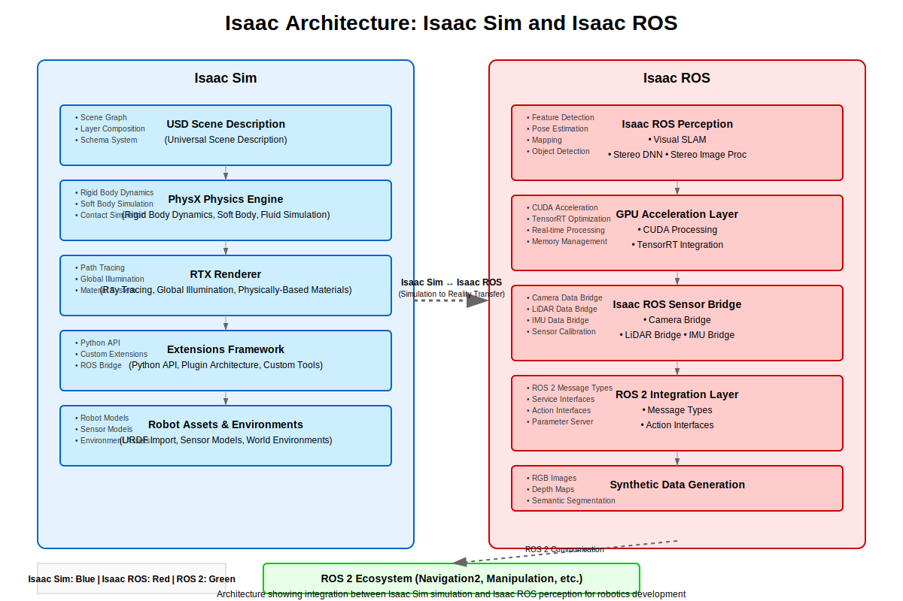

# Isaac Sim Basics + Synthetic Data

## Overview

This chapter introduces NVIDIA Isaac Sim, a powerful simulation environment designed for robotics and AI development. Isaac Sim provides high-fidelity physics simulation, photorealistic rendering, and tools for generating synthetic data for training AI models. You'll learn how to set up Isaac Sim, create simulation environments, and leverage synthetic data generation for robotics applications.

## Learning Objectives

By the end of this chapter, you will be able to:
- Install and configure NVIDIA Isaac Sim for robotics development
- Create and customize simulation environments with realistic physics
- Generate synthetic data for AI model training
- Integrate Isaac Sim with ROS 2 for robot simulation
- Optimize simulation performance and realism

## Table of Contents

1. [Introduction to Isaac Sim](#introduction-to-isaac-sim)
2. [Installation and Setup](#installation-and-setup)
3. [Isaac Sim Architecture](#isaac-sim-architecture)
4. [Creating Simulation Environments](#creating-simulation-environments)
5. [Synthetic Data Generation](#synthetic-data-generation)
6. [ROS 2 Integration](#ros-2-integration)
7. [Performance Optimization](#performance-optimization)
8. [Summary and Next Steps](#summary-and-next-steps)

## Introduction to Isaac Sim

### What is Isaac Sim?

NVIDIA Isaac Sim is a robotics simulation application built on NVIDIA Omniverse. It provides:
- High-fidelity physics simulation using PhysX
- Photorealistic rendering with RTX technology
- Support for synthetic data generation
- Integration with popular robotics frameworks (ROS, ROS 2)
- Extensive robot and sensor models
- Tools for AI training and testing

### Key Features

1. **High-Fidelity Physics**: Uses PhysX 5 for accurate physics simulation
2. **Photorealistic Rendering**: RTX ray tracing for realistic visuals
3. **Synthetic Data Generation**: Tools for generating training data
4. **ROS/ROS 2 Bridge**: Native integration with ROS/ROS 2
5. **Extensible Architecture**: Python API for customization
6. **Multi-GPU Support**: Leverages multiple GPUs for performance

### Use Cases

- Robot development and testing
- AI model training with synthetic data
- Algorithm validation in realistic environments
- Human-robot interaction studies
- Autonomous system development

## Installation and Setup

### System Requirements

- **GPU**: NVIDIA GPU with RTX or GTX 10xx/20xx/30xx/40xx series
- **VRAM**: 8GB+ recommended, 16GB+ preferred
- **OS**: Ubuntu 20.04/22.04, Windows 10/11
- **RAM**: 16GB+ recommended
- **Storage**: 20GB+ available space

### Installation Steps

#### Method 1: Omniverse Launcher (Recommended)
1. Download Omniverse Launcher from NVIDIA Developer website
2. Install Isaac Sim from the launcher
3. Launch Isaac Sim and accept license terms

#### Method 2: Docker (For headless operation)
```bash
# Pull Isaac Sim Docker image
docker pull nvcr.io/nvidia/isaac-sim:4.0.0

# Run Isaac Sim container
docker run --gpus all -it --rm \
  --network=host \
  --env "DISPLAY" \
  --volume="/tmp/.X11-unix:/tmp/.X11-unix:rw" \
  --volume="/home/$USER:/workspace:rw" \
  nvcr.io/nvidia/isaac-sim:4.0.0
```

### Initial Configuration

After installation, configure Isaac Sim for robotics development:

1. **Launch Isaac Sim**
2. **Set up workspace**:
   - Create a new project or open an existing one
   - Set up the asset library
   - Configure physics settings

3. **Install extensions**:
   - Isaac Sim ROS2 Bridge
   - Synthetic Data Extension
   - Robot Framework extensions

## Isaac Sim Architecture

### Core Components



Isaac Sim is built on the Omniverse platform with these key components:

#### USD (Universal Scene Description)
- Scene representation format
- Hierarchical scene graph
- Layer-based composition
- Extensible schema system

#### PhysX Physics Engine
- Real-time physics simulation
- Rigid body dynamics
- Soft body simulation
- Fluid simulation

#### RTX Renderer
- Path tracing
- Global illumination
- Realistic materials
- Multi-GPU rendering

#### Extensions Framework
- Python API for customization
- Plugin architecture
- ROS/ROS 2 integration
- Custom tools and workflows

### Scene Structure

Isaac Sim uses a hierarchical scene structure:

```
World
├── Physics Scene
├── Renderer Scene
├── Robot(s)
│   ├── Links
│   ├── Joints
│   └── Sensors
├── Environment
│   ├── Ground Plane
│   ├── Objects
│   └── Lighting
└── Cameras & Sensors
```

### Coordinate Systems

Isaac Sim uses the Omniverse coordinate system:
- **X**: Right
- **Y**: Up
- **Z**: Forward (left-handed system)

This differs from ROS:
- **X**: Forward
- **Y**: Left
- **Z**: Up (right-handed system)

## Creating Simulation Environments

### Basic Environment Setup

```python
# Example Python script to create a basic environment in Isaac Sim
import omni
from omni.isaac.core import World
from omni.isaac.core.utils.stage import add_reference_to_stage
from omni.isaac.core.utils.nucleus import get_assets_root_path
from omni.isaac.core.utils.prims import create_prim
import numpy as np

# Create a new world
my_world = World(stage_units_in_meters=1.0)

# Add ground plane
my_world.scene.add_default_ground_plane()

# Add a simple box
box = my_world.scene.add(
    prim_path="/World/Box",
    name="my_box",
    position=np.array([1.0, 0.0, 0.5]),
    size=0.5,
    color=np.array([0.8, 0.2, 0.2])
)

# Reset the world to initialize
my_world.reset()
```

### Adding Robots

#### Loading Robot Models

Isaac Sim supports various robot formats:

```python
from omni.isaac.core.robots import Robot
from omni.isaac.core.utils.nucleus import get_assets_root_path
from omni.isaac.core.utils.stage import add_reference_to_stage

# Add a robot from the NVIDIA asset library
assets_root_path = get_assets_root_path()
if assets_root_path is None:
    print("Could not use Isaac Sim assets library stage")
else:
    # Add a simple wheeled robot
    add_reference_to_stage(
        prim_path="/World/Robot",
        path=assets_root_path + "/Isaac/Robots/Franka/franka_alt_fingers.usd"
    )
```

#### Custom Robot Import

To import your own robot:

1. **Convert to USD**: Use Isaac Sim's URDF importer or convert manually
2. **Validate Joints**: Ensure joint limits and types are correct
3. **Add Sensors**: Configure cameras, LiDAR, IMU, etc.
4. **Set Mass Properties**: Ensure realistic inertial properties

### Environment Objects

#### Static Objects
```python
# Add static objects to the environment
from omni.isaac.core.objects import DynamicCuboid, DynamicSphere

# Add a static table
table = DynamicCuboid(
    prim_path="/World/Table",
    name="table",
    position=np.array([2.0, 0.0, 0.5]),
    size=np.array([1.0, 0.6, 0.8]),
    color=np.array([0.7, 0.7, 0.7])
)
my_world.scene.add(table)
```

#### Dynamic Objects
```python
# Add dynamic objects that can move
dynamic_object = DynamicCuboid(
    prim_path="/World/DynamicBox",
    name="dynamic_box",
    position=np.array([0.0, 1.0, 0.5]),
    size=np.array([0.2, 0.2, 0.2]),
    color=np.array([0.2, 0.7, 0.2]),
    mass=0.5
)
my_world.scene.add(dynamic_object)
```

### Lighting and Materials

#### Environment Lighting
```python
from omni.isaac.core.utils.prims import get_prim_at_path
from pxr import Gf

# Add dome light for environment lighting
dome_light = get_prim_at_path("/World/DomeLight")
dome_light.GetAttribute("inputs:color").Set(Gf.Vec3f(0.5, 0.5, 0.5))
dome_light.GetAttribute("inputs:intensity").Set(3000)
```

#### Materials
Isaac Sim supports physically-based materials (PBR):
- Albedo (base color)
- Normal maps
- Metallic and roughness
- Specular properties

## Synthetic Data Generation

### Overview of Synthetic Data

Synthetic data generation in Isaac Sim allows you to create large datasets for training AI models by simulating various scenarios, lighting conditions, and object configurations.

### Synthetic Data Extension

The Synthetic Data Extension provides tools for:
- RGB image generation
- Depth maps
- Semantic segmentation
- Instance segmentation
- 3D bounding boxes
- Point clouds
- Optical flow

### Setting Up Synthetic Data

```python
# Example: Setting up synthetic data generation
import omni.syntheticdata as sd
from omni.syntheticdata import sensors
import numpy as np

# Create a camera sensor for synthetic data
camera = my_world.scene.add(
    prim_path="/World/Camera",
    name="camera",
    position=np.array([0.5, 0.0, 1.0]),
    orientation=np.array([0.707, 0.0, 0.0, 0.707])  # 90 degree rotation
)

# Configure synthetic data sensors
sensors.create_annotated_depth_sensor(
    prim_path="/World/Camera",
    resolution=(640, 480),
    position=(0.0, 0.0, 0.0),
    orientation=(0.0, 0.0, 0.0, 1.0)
)
```

### Data Generation Workflow

#### 1. Environment Randomization
```python
# Randomize object positions and orientations
def randomize_environment():
    # Randomize object positions
    for obj in environment_objects:
        new_pos = np.array([
            np.random.uniform(-2, 2),
            np.random.uniform(-2, 2),
            np.random.uniform(0.1, 1.0)
        ])
        obj.set_world_pos(new_pos)

    # Randomize lighting
    dome_light.GetAttribute("inputs:intensity").Set(
        np.random.uniform(1000, 5000)
    )
```

#### 2. Camera Positioning
```python
# Move camera to different positions for diverse views
def move_camera():
    camera_positions = [
        [0.5, 0.0, 1.0],   # Front view
        [0.0, 0.5, 1.0],   # Side view
        [0.0, 0.0, 2.0],   # Top-down view
        [-0.5, 0.0, 1.0],  # Rear view
    ]

    for pos in camera_positions:
        camera.set_world_pos(pos)
        # Capture data at this position
        capture_synthetic_data()
```

#### 3. Data Capture
```python
# Capture synthetic data
def capture_synthetic_data():
    # Render the scene
    my_world.render()

    # Get RGB image
    rgb_data = sd.acquire_data("/World/Camera", sd.DataTypes.rgb)

    # Get depth data
    depth_data = sd.acquire_data("/World/Camera", sd.DataTypes.depth)

    # Get segmentation data
    seg_data = sd.acquire_data("/World/Camera", sd.DataTypes.instance_segmentation)

    # Save data
    save_data(rgb_data, depth_data, seg_data)
```

### Synthetic Data Applications

#### Object Detection
- Generate bounding boxes for training object detection models
- Create datasets with various lighting and background conditions
- Simulate occlusions and challenging scenarios

#### Semantic Segmentation
- Generate pixel-perfect segmentation masks
- Create datasets for scene understanding
- Train models for environment perception

#### Depth Estimation
- Generate ground truth depth maps
- Train monocular depth estimation models
- Create datasets with varying textures and materials

## ROS 2 Integration

### Isaac ROS Bridge

The Isaac ROS Bridge provides native integration between Isaac Sim and ROS 2, allowing:
- Real-time sensor data publishing
- Robot control command subscription
- TF tree synchronization
- ROS message conversion

### Setting Up ROS 2 Bridge

1. **Install Isaac ROS Extensions**:
   - Isaac ROS Bridge
   - Isaac ROS Sensors
   - Isaac ROS Manipulators (if applicable)

2. **Configure ROS 2 Environment**:
```bash
# Source ROS 2
source /opt/ros/humble/setup.bash

# Source Isaac ROS packages
source /path/to/isaac_ros_ws/install/setup.bash
```

### Publishing Sensor Data

```python
# Example: Publishing sensor data to ROS 2
from geometry_msgs.msg import Twist
from sensor_msgs.msg import LaserScan, Image, Imu
import rclpy
from rclpy.node import Node

class IsaacSimRosBridge(Node):
    def __init__(self):
        super().__init__('isaac_sim_ros_bridge')

        # Publishers for robot control
        self.cmd_vel_sub = self.create_subscription(
            Twist,
            '/cmd_vel',
            self.cmd_vel_callback,
            10
        )

        # Publishers for sensor data
        self.scan_pub = self.create_publisher(LaserScan, '/scan', 10)
        self.image_pub = self.create_publisher(Image, '/camera/image_raw', 10)
        self.imu_pub = self.create_publisher(Imu, '/imu', 10)

        # Timer for publishing sensor data
        self.timer = self.create_timer(0.1, self.publish_sensor_data)

    def cmd_vel_callback(self, msg):
        # Process velocity commands from ROS
        linear_vel = msg.linear.x
        angular_vel = msg.angular.z

        # Send to simulated robot
        self.send_to_robot(linear_vel, angular_vel)

    def publish_sensor_data(self):
        # Get sensor data from Isaac Sim
        scan_data = self.get_lidar_data()
        image_data = self.get_camera_data()
        imu_data = self.get_imu_data()

        # Publish to ROS topics
        self.scan_pub.publish(scan_data)
        self.image_pub.publish(image_data)
        self.imu_pub.publish(imu_data)
```

### Supported ROS Messages

Isaac Sim supports common ROS message types:
- **Sensor Data**: LaserScan, Image, PointCloud2, Imu, MagneticField
- **Robot Control**: Twist, JointState, FollowJointTrajectory
- **Navigation**: Odometry, Path, PoseStamped
- **Visualization**: Marker, MarkerArray

### Launch Files for Integration

```xml
<!-- Example launch file for Isaac Sim + ROS 2 -->
<launch>
  <!-- Start Isaac Sim -->
  <node name="isaac_sim" pkg="isaac_sim" exec="isaac_sim_app" output="screen">
    <param name="config_file" value="$(find-pkg-share my_robot_isaac)/config/sim_config.yaml"/>
  </node>

  <!-- Start robot state publisher -->
  <node name="robot_state_publisher" pkg="robot_state_publisher" exec="robot_state_publisher">
    <param name="robot_description" value="$(var robot_description)"/>
  </node>

  <!-- Start joint state publisher -->
  <node name="joint_state_publisher" pkg="joint_state_publisher" exec="joint_state_publisher">
    <param name="rate" value="50"/>
  </node>

  <!-- Start navigation stack -->
  <include file="$(find-pkg-share nav2_bringup)/launch/navigation_launch.py"/>
</launch>
```

## Performance Optimization

### Simulation Settings

#### Physics Optimization
```python
# Optimize physics settings for performance
def configure_physics():
    # Set appropriate solver iterations
    physics_scene = get_physics_scene()
    physics_scene.SetSolverType("TGS")  # Use TGS solver
    physics_scene.SetSolverPositionIterationCount(4)  # Reduce iterations
    physics_scene.SetSolverVelocityIterationCount(1)  # Reduce iterations

    # Adjust timestep
    physics_scene.SetTimeStepsPerSecond(60)  # 60 Hz
```

#### Rendering Optimization
```python
# Optimize rendering for performance
def configure_rendering():
    # Reduce render quality during training
    render_settings = {
        "render_resolution": [640, 480],  # Lower resolution
        "aa_samples": 1,  # Disable antialiasing
        "max_ray_depth": 2,  # Reduce ray depth
    }

    # Apply settings
    apply_render_settings(render_settings)
```

### Data Pipeline Optimization

#### Efficient Data Generation
```python
# Optimize synthetic data generation
def optimized_data_generation():
    # Batch process multiple frames
    batch_size = 16

    # Pre-allocate memory
    rgb_buffer = np.zeros((batch_size, 480, 640, 3), dtype=np.uint8)
    depth_buffer = np.zeros((batch_size, 480, 640), dtype=np.float32)

    # Generate data in batches
    for i in range(batch_size):
        # Randomize environment
        randomize_environment()

        # Capture data
        rgb_buffer[i] = get_rgb_image()
        depth_buffer[i] = get_depth_image()

    # Process and save batch
    save_batch_data(rgb_buffer, depth_buffer)
```

### Multi-GPU Utilization

For systems with multiple GPUs:
1. **Render on GPU 0**: Handle rendering and graphics
2. **Physics on GPU 1**: Handle physics simulation
3. **AI Processing on GPU 2**: Handle neural network inference

## Practical Example: Setting Up a Simple Robot in Isaac Sim

Let's create a complete example that demonstrates setting up a simple differential drive robot in Isaac Sim:

```python
# complete_isaac_sim_example.py
import omni
from omni.isaac.core import World
from omni.isaac.core.utils.stage import add_reference_to_stage
from omni.isaac.core.utils.prims import create_prim
from omni.isaac.core.utils.nucleus import get_assets_root_path
from omni.isaac.core.robots import Robot
from omni.isaac.core.objects import DynamicCuboid
from omni.isaac.core.sensors import Camera
import numpy as np
import carb

class IsaacSimRobotExample:
    def __init__(self):
        self.world = World(stage_units_in_meters=1.0)
        self.setup_scene()

    def setup_scene(self):
        # Add ground plane
        self.world.scene.add_default_ground_plane()

        # Add a simple differential drive robot
        # For this example, we'll create a simple box-based robot
        robot = DynamicCuboid(
            prim_path="/World/Robot",
            name="simple_robot",
            position=np.array([0.0, 0.0, 0.1]),
            size=np.array([0.3, 0.2, 0.1]),
            color=np.array([0.2, 0.2, 0.8])
        )
        self.world.scene.add(robot)

        # Add a camera to the robot
        camera = Camera(
            prim_path="/World/Robot/Camera",
            name="robot_camera",
            position=np.array([0.15, 0.0, 0.1]),
            frequency=30
        )
        self.world.scene.add(camera)

        # Add some objects to interact with
        for i in range(5):
            obj = DynamicCuboid(
                prim_path=f"/World/Object{i}",
                name=f"object_{i}",
                position=np.array([
                    np.random.uniform(-2, 2),
                    np.random.uniform(-2, 2),
                    0.1
                ]),
                size=np.array([0.1, 0.1, 0.1]),
                color=np.array([np.random.random(), np.random.random(), np.random.random()])
            )
            self.world.scene.add(obj)

    def run_simulation(self):
        self.world.reset()

        for i in range(1000):  # Run for 1000 steps
            # Simple control: move in a square pattern
            if i % 200 < 100:
                # Move forward
                robot_prim = self.world.scene.get_object("simple_robot")
                current_pos = robot_prim.get_world_pos()
                new_pos = current_pos + np.array([0.01, 0, 0])
                robot_prim.set_world_pos(new_pos)
            else:
                # Turn
                robot_prim = self.world.scene.get_object("simple_robot")
                # In a real example, you would set orientation here

            self.world.step(render=True)

            # Occasionally capture camera data
            if i % 30 == 0:
                camera = self.world.scene.get_sensor("robot_camera")
                image = camera.get_rgb()
                print(f"Captured image at step {i}")

def main():
    example = IsaacSimRobotExample()
    example.run_simulation()

if __name__ == "__main__":
    main()
```

## Summary and Next Steps

In this chapter, you learned:
- How to install and configure NVIDIA Isaac Sim
- How to create and customize simulation environments
- How to generate synthetic data for AI model training
- How to integrate Isaac Sim with ROS 2
- How to optimize simulation performance

### Key Takeaways

- Isaac Sim provides high-fidelity simulation with photorealistic rendering
- Synthetic data generation is crucial for training robust AI models
- ROS 2 integration enables seamless transition between simulation and real robots
- Performance optimization is important for large-scale data generation
- Isaac Sim supports complex robotics scenarios with realistic physics

### Next Steps

In the next chapter, you'll learn about Isaac ROS and Visual SLAM (VSLAM), where you'll explore advanced perception techniques using Isaac Sim and ROS integration.

## Exercises

1. Create a simple environment in Isaac Sim with multiple objects
2. Implement a robot controller that navigates around obstacles
3. Generate synthetic data for object detection training
4. Integrate your Isaac Sim environment with ROS 2
5. Optimize your simulation for performance while maintaining quality

## References

- Isaac Sim Documentation: https://docs.omniverse.nvidia.com/isaacsim/latest/isaacsim.html
- Omniverse Platform: https://developer.nvidia.com/omniverse
- Isaac ROS: https://github.com/NVIDIA-ISAAC-ROS
- USD Documentation: https://graphics.pixar.com/usd/docs/index.html
- PhysX Documentation: https://gameworksdocs.nvidia.com/PhysX/4.1/documentation/physxguide/