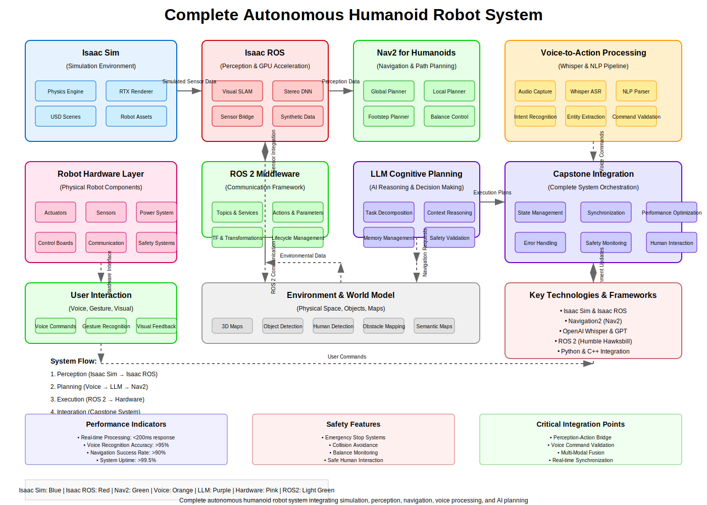

# Capstone: Autonomous Humanoid - Integrating All Systems

## Overview

This capstone chapter brings together all the concepts learned throughout the book to create a complete autonomous humanoid robot system. You'll learn how to integrate perception, planning, control, and AI systems into a cohesive autonomous agent capable of understanding voice commands, navigating complex environments, and performing meaningful tasks.

## Learning Objectives

By the end of this chapter, you will be able to:
- Integrate all subsystems into a complete autonomous humanoid
- Implement end-to-end voice-controlled navigation and manipulation
- Design robust error handling and recovery mechanisms
- Optimize system performance for real-time operation
- Validate the complete autonomous system through testing
- Troubleshoot common integration challenges

## Table of Contents

1. [System Architecture Overview](#system-architecture-overview)
2. [Integration Challenges and Solutions](#integration-challenges-and-solutions)
3. [Complete System Implementation](#complete-system-implementation)
4. [Voice Command Integration](#voice-command-integration)
5. [Navigation and Manipulation Pipeline](#navigation-and-manipulation-pipeline)
6. [Real-time Performance Optimization](#real-time-performance-optimization)
7. [Testing and Validation](#testing-and-validation)
8. [Troubleshooting Common Issues](#troubleshooting-common-issues)
9. [Advanced Integration Patterns](#advanced-integration-patterns)
10. [Future Enhancements](#future-enhancements)
11. [Summary and Next Steps](#summary-and-next-steps)

## System Architecture Overview

### Complete Autonomous Humanoid Architecture



```
┌─────────────────────────────────────────────────────────────────┐
│                    Autonomous Humanoid System                   │
├─────────────────────────────────────────────────────────────────┤
│  Voice Interface     │  AI Planning      │  Action Execution   │
│  ┌─────────────────┐ │  ┌──────────────┐ │  ┌────────────────┐ │
│  │  Whisper        │ │  │  LLM Planner │ │  │  Navigation    │ │
│  │  Recognition    │ │  │  & Reasoning │ │  │  System       │ │
│  │  & Processing   │ │  │              │ │  │                │ │
│  └─────────────────┘ │  └──────────────┘ │  └────────────────┘ │
│                       │                   │                   │
│  ┌─────────────────┐ │  ┌──────────────┐ │  ┌────────────────┐ │
│  │  NLP & Command  │ │  │  Memory      │ │  │  Manipulation  │ │
│  │  Understanding  │ │  │  Management  │ │  │  System       │ │
│  └─────────────────┘ │  └──────────────┘ │  └────────────────┘ │
└───────────────────────┼───────────────────┼─────────────────────┘
                        │                   │
                        ▼                   ▼
              ┌─────────────────┐   ┌─────────────────┐
              │  Perception     │   │  Control &      │
              │  System         │   │  Feedback       │
              │                 │   │                 │
              │  • Vision       │   │  • Balance      │
              │  • Audio        │   │  • Motor        │
              │  • LiDAR        │   │  • Safety       │
              │  • IMU          │   │  • Monitoring   │
              └─────────────────┘   └─────────────────┘
```

### Key Integration Points

The autonomous humanoid system integrates multiple subsystems:

1. **Voice Processing Pipeline**: Audio capture → Whisper recognition → NLP → Command understanding
2. **Cognitive Planning**: LLM reasoning → Task decomposition → Action sequencing
3. **Perception System**: Multi-sensor fusion → Object detection → Environment mapping
4. **Navigation System**: Path planning → Footstep planning → Balance control
5. **Manipulation System**: Grasp planning → Motion control → Force feedback
6. **Safety System**: Real-time monitoring → Emergency stops → Recovery behaviors

## Integration Challenges and Solutions

### Challenge 1: Timing and Synchronization

One of the primary challenges in integrating autonomous humanoid systems is managing timing and synchronization between different subsystems that operate at different frequencies.

**Problem**: Voice processing (10-20Hz), perception (30Hz), navigation (20Hz), and control (100Hz+) all need to work together seamlessly.

**Solution**: Implement a priority-based message queuing system with time-stamped messages:

```python
# timing_synchronization.py
import asyncio
import time
from enum import Enum
from dataclasses import dataclass
from typing import Dict, Any, Callable, Optional
from collections import defaultdict, deque

class MessageType(Enum):
    VOICE_COMMAND = "voice_command"
    PERCEPTION_DATA = "perception_data"
    NAVIGATION_UPDATE = "navigation_update"
    CONTROL_COMMAND = "control_command"
    SYSTEM_STATUS = "system_status"

@dataclass
class Message:
    msg_type: MessageType
    data: Dict[str, Any]
    timestamp: float
    priority: int = 1  # Higher number = higher priority
    source: str = "unknown"

class MessageQueue:
    def __init__(self):
        self.queues = {
            1: asyncio.Queue(),  # Low priority
            2: asyncio.Queue(),  # Normal priority
            3: asyncio.Queue(),  # High priority
            4: asyncio.Queue()   # Critical priority
        }
        self.message_history = defaultdict(lambda: deque(maxlen=100))  # Keep last 100 messages per type

    async def put(self, message: Message):
        """Add message to appropriate priority queue"""
        # Add to history
        self.message_history[message.msg_type.value].append(message)

        # Put in priority queue
        await self.queues[message.priority].put(message)

    async def get(self) -> Optional[Message]:
        """Get message, checking priority queues in order"""
        # Check highest priority first
        for priority in [4, 3, 2, 1]:
            try:
                return await asyncio.wait_for(self.queues[priority].get(), timeout=0.001)
            except asyncio.TimeoutError:
                continue
        return None

    def get_latest_message(self, msg_type: MessageType) -> Optional[Message]:
        """Get the most recent message of a specific type"""
        history = self.message_history[msg_type.value]
        return history[-1] if history else None

class SynchronizationManager:
    def __init__(self):
        self.message_queue = MessageQueue()
        self.time_offsets = {}  # Track time offsets between subsystems
        self.running = False

    async def start_synchronization(self):
        """Start the synchronization loop"""
        self.running = True
        sync_task = asyncio.create_task(self._synchronization_loop())
        return sync_task

    async def _synchronization_loop(self):
        """Main synchronization loop"""
        while self.running:
            try:
                # Process incoming messages
                message = await self.message_queue.get()
                if message:
                    await self._process_message(message)

                # Small delay to prevent busy waiting
                await asyncio.sleep(0.001)
            except Exception as e:
                print(f"Synchronization error: {e}")

    async def _process_message(self, message: Message):
        """Process incoming messages and coordinate subsystems"""
        # Update time offset for this source
        self.time_offsets[message.source] = time.time() - message.timestamp

        # Handle specific message types
        if message.msg_type == MessageType.VOICE_COMMAND:
            await self._handle_voice_command(message)
        elif message.msg_type == MessageType.PERCEPTION_DATA:
            await self._handle_perception_data(message)
        elif message.msg_type == MessageType.NAVIGATION_UPDATE:
            await self._handle_navigation_update(message)

    async def _handle_voice_command(self, message: Message):
        """Handle voice command messages"""
        # Voice commands are high priority
        command = message.data.get('command', '')
        if command:
            # Trigger planning system
            planning_msg = Message(
                msg_type=MessageType.NAVIGATION_UPDATE,
                data={'command': command, 'trigger': 'voice'},
                timestamp=time.time(),
                priority=3,
                source='voice_processor'
            )
            await self.message_queue.put(planning_msg)

    async def _handle_perception_data(self, message: Message):
        """Handle perception data messages"""
        # Perception data is critical for navigation safety
        perception_data = message.data
        if perception_data.get('obstacles'):
            # Check if obstacles affect current navigation
            current_nav = self.message_queue.get_latest_message(MessageType.NAVIGATION_UPDATE)
            if current_nav and current_nav.data.get('status') == 'executing':
                # Adjust navigation plan for obstacles
                adjusted_msg = Message(
                    msg_type=MessageType.NAVIGATION_UPDATE,
                    data={
                        'command': current_nav.data.get('command'),
                        'obstacles': perception_data['obstacles'],
                        'adjustment': 'obstacle_avoidance'
                    },
                    timestamp=time.time(),
                    priority=4,  # Critical for safety
                    source='perception_system'
                )
                await self.message_queue.put(adjusted_msg)

    async def _handle_navigation_update(self, message: Message):
        """Handle navigation update messages"""
        # Navigation updates trigger control commands
        nav_data = message.data
        if nav_data.get('path') or nav_data.get('waypoints'):
            control_msg = Message(
                msg_type=MessageType.CONTROL_COMMAND,
                data=nav_data,
                timestamp=time.time(),
                priority=2,
                source='navigation_system'
            )
            await self.message_queue.put(control_msg)

    def get_system_latency(self) -> Dict[str, float]:
        """Get current system latency information"""
        return {
            'max_offset': max(self.time_offsets.values()) if self.time_offsets else 0,
            'avg_offset': sum(self.time_offsets.values()) / len(self.time_offsets) if self.time_offsets else 0,
            'sources': dict(self.time_offsets)
        }
```

### Challenge 2: Data Consistency Across Subsystems

Different subsystems may have different views of the world state, leading to inconsistencies.

**Problem**: The navigation system might have a different map than the perception system, or the robot's estimated position might drift from the actual position.

**Solution**: Implement a centralized state management system with conflict resolution:

```python
# state_management.py
import asyncio
import time
from typing import Dict, Any, Optional, List
from dataclasses import dataclass, field
import threading

@dataclass
class StateUpdate:
    subsystem: str
    key: str
    value: Any
    timestamp: float
    confidence: float = 1.0
    priority: int = 1

class StateManager:
    def __init__(self):
        self.state: Dict[str, Any] = {}
        self.state_confidence: Dict[str, float] = {}
        self.state_timestamps: Dict[str, float] = {}
        self.state_sources: Dict[str, str] = {}
        self.update_history: Dict[str, List[StateUpdate]] = {}
        self.lock = threading.RLock()  # Use RLock for thread safety
        self.callbacks: Dict[str, List[Callable]] = {}

    def update_state(self, subsystem: str, key: str, value: Any,
                    confidence: float = 1.0, priority: int = 1):
        """Update state with conflict resolution"""
        with self.lock:
            update = StateUpdate(
                subsystem=subsystem,
                key=key,
                value=value,
                timestamp=time.time(),
                confidence=confidence,
                priority=priority
            )

            # Store update in history
            if key not in self.update_history:
                self.update_history[key] = []
            self.update_history[key].append(update)

            # Apply conflict resolution
            self._apply_state_update(update)

            # Trigger callbacks
            self._trigger_callbacks(key, value)

    def _apply_state_update(self, update: StateUpdate):
        """Apply state update with conflict resolution logic"""
        key = update.key

        # If no existing value, use new value
        if key not in self.state:
            self.state[key] = update.value
            self.state_confidence[key] = update.confidence
            self.state_timestamps[key] = update.timestamp
            self.state_sources[key] = update.subsystem
            return

        # Conflict resolution based on confidence and priority
        existing_confidence = self.state_confidence[key]
        existing_priority = 1  # Default priority

        # Determine which value to keep
        if (update.confidence > existing_confidence or
            (update.confidence == existing_confidence and update.priority > existing_priority) or
            (update.confidence == existing_confidence and update.priority == existing_priority and
             update.timestamp > self.state_timestamps[key] + 1.0)):  # Only update if newer than 1 second
            # Update the state
            self.state[key] = update.value
            self.state_confidence[key] = update.confidence
            self.state_timestamps[key] = update.timestamp
            self.state_sources[key] = update.subsystem
        else:
            # Keep existing value, but log the conflict
            print(f"State conflict for {key}: keeping existing value from {self.state_sources[key]} "
                  f"over new value from {update.subsystem}")

    def get_state(self, key: str, max_age: float = 5.0) -> Optional[Any]:
        """Get state value, considering age limits"""
        with self.lock:
            if key not in self.state:
                return None

            # Check if state is too old
            if time.time() - self.state_timestamps[key] > max_age:
                # Mark as stale
                return None

            return self.state[key]

    def get_state_with_metadata(self, key: str) -> Optional[Dict[str, Any]]:
        """Get state value with metadata"""
        with self.lock:
            if key not in self.state:
                return None

            return {
                'value': self.state[key],
                'confidence': self.state_confidence[key],
                'timestamp': self.state_timestamps[key],
                'source': self.state_sources[key],
                'age': time.time() - self.state_timestamps[key]
            }

    def add_callback(self, key: str, callback: Callable[[str, Any], None]):
        """Add callback for state changes"""
        if key not in self.callbacks:
            self.callbacks[key] = []
        self.callbacks[key].append(callback)

    def _trigger_callbacks(self, key: str, value: Any):
        """Trigger callbacks for state changes"""
        if key in self.callbacks:
            for callback in self.callbacks[key]:
                try:
                    callback(key, value)
                except Exception as e:
                    print(f"Callback error for {key}: {e}")

    def get_consistency_report(self) -> Dict[str, Any]:
        """Get a report on state consistency"""
        with self.lock:
            report = {
                'total_keys': len(self.state),
                'average_confidence': sum(self.state_confidence.values()) / len(self.state_confidence) if self.state_confidence else 0,
                'stale_keys': [],
                'source_distribution': {}
            }

            # Check for stale keys
            for key, timestamp in self.state_timestamps.items():
                if time.time() - timestamp > 10.0:  # 10 seconds old
                    report['stale_keys'].append(key)

            # Count sources
            for source in self.state_sources.values():
                report['source_distribution'][source] = report['source_distribution'].get(source, 0) + 1

            return report

# Example usage
def position_callback(key: str, value: Any):
    print(f"Position updated: {value}")

def battery_callback(key: str, value: Any):
    if value < 20:
        print("Warning: Low battery!")
    elif value < 10:
        print("Critical: Very low battery!")

# Initialize state manager
state_manager = StateManager()
state_manager.add_callback('position', position_callback)
state_manager.add_callback('battery_level', battery_callback)

# Simulate updates from different subsystems
state_manager.update_state('navigation', 'position', {'x': 1.0, 'y': 2.0}, confidence=0.9)
state_manager.update_state('perception', 'position', {'x': 1.1, 'y': 1.9}, confidence=0.8)  # Lower confidence
state_manager.update_state('power', 'battery_level', 85.0, confidence=1.0)

# Check state
position = state_manager.get_state('position')
battery = state_manager.get_state('battery_level')
print(f"Current position: {position}")
print(f"Current battery: {battery}")

# Get consistency report
report = state_manager.get_consistency_report()
print(f"Consistency report: {report}")
```

## Complete System Implementation

### Main Autonomous Humanoid Node

```python
# autonomous_humanoid.py
import rclpy
from rclpy.node import Node
from rclpy.qos import QoSProfile, ReliabilityPolicy, DurabilityPolicy
from std_msgs.msg import String, Bool, Float32
from geometry_msgs.msg import PoseStamped, Twist
from sensor_msgs.msg import Image, LaserScan, Imu
from builtin_interfaces.msg import Time
import asyncio
import threading
from concurrent.futures import ThreadPoolExecutor
import time
import json

from timing_synchronization import SynchronizationManager, Message, MessageType
from state_management import StateManager
from voice_command_node import VoiceCommandNode
from cognitive_system import HumanoidCognitiveSystem
from perception_action import PerceptionActionBridge

class AutonomousHumanoidNode(Node):
    def __init__(self):
        super().__init__('autonomous_humanoid')

        # Initialize core systems
        self.state_manager = StateManager()
        self.sync_manager = SynchronizationManager()
        self.cognitive_system = None  # Will be initialized later
        self.perception_bridge = None  # Will be initialized later

        # ROS 2 publishers and subscribers
        self.setup_ros_interfaces()

        # System state
        self.system_running = False
        self.main_loop_task = None
        self.executor = ThreadPoolExecutor(max_workers=4)

        # Performance monitoring
        self.performance_stats = {
            'cycle_count': 0,
            'avg_cycle_time': 0.0,
            'max_cycle_time': 0.0,
            'error_count': 0
        }

        self.get_logger().info('Autonomous Humanoid Node initialized')

    def setup_ros_interfaces(self):
        """Set up all ROS 2 interfaces"""
        # Publishers
        qos_profile = QoSProfile(depth=10)
        self.status_pub = self.create_publisher(String, 'system_status', qos_profile)
        self.feedback_pub = self.create_publisher(String, 'system_feedback', qos_profile)
        self.cmd_vel_pub = self.create_publisher(Twist, 'cmd_vel', qos_profile)

        # Subscribers
        self.voice_sub = self.create_subscription(
            String, 'voice_commands', self.voice_command_callback, qos_profile)
        self.image_sub = self.create_subscription(
            Image, '/camera/image_raw', self.image_callback, qos_profile)
        self.scan_sub = self.create_subscription(
            LaserScan, '/scan', self.scan_callback, qos_profile)
        self.imu_sub = self.create_subscription(
            Imu, '/imu/data', self.imu_callback, qos_profile)

        # Services
        self.start_service = self.create_service(
            Bool, 'start_autonomous_mode', self.start_autonomous_mode)
        self.stop_service = self.create_service(
            Bool, 'stop_autonomous_mode', self.stop_autonomous_mode)

    def initialize_subsystems(self, api_key: str):
        """Initialize all subsystems"""
        try:
            # Initialize cognitive system
            self.cognitive_system = HumanoidCognitiveSystem(api_key)

            # Initialize perception-action bridge
            self.perception_bridge = PerceptionActionBridge(
                self.cognitive_system.llm_planner,
                self.cognitive_system.memory_system
            )

            # Set up perception handlers
            self.perception_bridge.register_perception_handler("camera", self.camera_handler)
            self.perception_bridge.register_perception_handler("lidar", self.lidar_handler)
            self.perception_bridge.register_perception_handler("imu", self.imu_handler)

            # Set up action executors
            self.perception_bridge.register_action_executor("move_to", self.move_to_executor)
            self.perception_bridge.register_action_executor("pick_up", self.pick_up_executor)
            self.perception_bridge.register_action_executor("speak", self.speak_executor)

            self.get_logger().info('All subsystems initialized successfully')
            return True
        except Exception as e:
            self.get_logger().error(f'Failed to initialize subsystems: {e}')
            return False

    def start_autonomous_mode(self, request, response):
        """Start autonomous operation"""
        if not self.system_running:
            try:
                self.system_running = True
                self.main_loop_task = self.create_task(self.main_control_loop())
                self.get_logger().info('Autonomous mode started')
                response.data = True
            except Exception as e:
                self.get_logger().error(f'Failed to start autonomous mode: {e}')
                response.data = False
        else:
            response.data = True

        return response

    def stop_autonomous_mode(self, request, response):
        """Stop autonomous operation"""
        if self.system_running:
            self.system_running = False
            if self.main_loop_task:
                self.main_loop_task.cancel()
            self.get_logger().info('Autonomous mode stopped')

        response.data = True
        return response

    async def main_control_loop(self):
        """Main control loop for autonomous operation"""
        self.get_logger().info('Starting main control loop')

        loop_start_time = time.time()

        while self.system_running:
            cycle_start = time.time()

            try:
                # Update system state
                await self.update_system_state()

                # Process any queued messages
                await self.process_queued_messages()

                # Run cognitive cycle
                if self.cognitive_system:
                    robot_state = self.get_robot_state()
                    await self.cognitive_system.run_cognitive_cycle(robot_state)

                # Publish system status
                self.publish_system_status()

            except Exception as e:
                self.performance_stats['error_count'] += 1
                self.get_logger().error(f'Error in main control loop: {e}')

            # Calculate cycle time
            cycle_time = time.time() - cycle_start
            self.update_performance_stats(cycle_time)

            # Maintain target frequency (50Hz = 20ms per cycle)
            target_cycle_time = 0.02  # 20ms
            sleep_time = max(0, target_cycle_time - cycle_time)

            if sleep_time > 0:
                time.sleep(sleep_time)

        self.get_logger().info('Main control loop stopped')

    async def update_system_state(self):
        """Update system state from various sources"""
        # This would integrate with actual sensor data and subsystem status
        # For now, we'll simulate state updates
        self.state_manager.update_state('system', 'last_update', time.time(), confidence=1.0)

    async def process_queued_messages(self):
        """Process any queued messages through the sync manager"""
        # This integrates with the message queue system
        pass

    def get_robot_state(self):
        """Get current robot state for cognitive system"""
        from cognitive_system import RobotState
        return RobotState(
            position=self.state_manager.get_state('position', max_age=1.0) or {"x": 0.0, "y": 0.0, "z": 0.0},
            battery_level=self.state_manager.get_state('battery_level', max_age=5.0) or 100.0,
            available_actions=self.state_manager.get_state('available_actions', max_age=10.0) or ["move_to", "speak"],
            current_task=self.state_manager.get_state('current_task', max_age=2.0),
            detected_objects=self.state_manager.get_state('detected_objects', max_age=1.0) or [],
            human_interactions=self.state_manager.get_state('human_interactions', max_age=30.0) or []
        )

    def update_performance_stats(self, cycle_time: float):
        """Update performance statistics"""
        self.performance_stats['cycle_count'] += 1

        # Update average
        old_avg = self.performance_stats['avg_cycle_time']
        new_avg = ((old_avg * (self.performance_stats['cycle_count'] - 1)) + cycle_time) / self.performance_stats['cycle_count']
        self.performance_stats['avg_cycle_time'] = new_avg

        # Update max
        if cycle_time > self.performance_stats['max_cycle_time']:
            self.performance_stats['max_cycle_time'] = cycle_time

    def publish_system_status(self):
        """Publish system status"""
        status_msg = String()
        status_msg.data = json.dumps({
            'timestamp': time.time(),
            'running': self.system_running,
            'performance': self.performance_stats,
            'state_consistency': self.state_manager.get_consistency_report()
        })
        self.status_pub.publish(status_msg)

    def voice_command_callback(self, msg):
        """Handle voice command messages"""
        command = msg.data
        self.get_logger().info(f'Received voice command: {command}')

        # Process through cognitive system
        if self.cognitive_system:
            robot_state = self.get_robot_state()
            # This would be handled asynchronously in a real implementation
            future = asyncio.run_coroutine_threadsafe(
                self.cognitive_system.process_command(command, robot_state),
                asyncio.get_event_loop()
            )

    def image_callback(self, msg):
        """Handle image messages"""
        # Process image through perception system
        pass

    def scan_callback(self, msg):
        """Handle laser scan messages"""
        # Process scan through perception system
        pass

    def imu_callback(self, msg):
        """Handle IMU messages"""
        # Update balance and orientation in state
        self.state_manager.update_state(
            'imu', 'orientation',
            {'x': msg.orientation.x, 'y': msg.orientation.y, 'z': msg.orientation.z, 'w': msg.orientation.w},
            confidence=0.9
        )

    # Perception handlers
    async def camera_handler(self, data):
        """Handle camera perception data"""
        # Process visual information
        pass

    async def lidar_handler(self, data):
        """Handle LiDAR perception data"""
        # Process range information
        pass

    async def imu_handler(self, data):
        """Handle IMU perception data"""
        # Process orientation and acceleration
        pass

    # Action executors
    async def move_to_executor(self, params):
        """Execute move to action"""
        target = params.get('position', {})
        self.get_logger().info(f'Moving to position: {target}')

        # Publish velocity command
        cmd = Twist()
        cmd.linear.x = 0.2  # Simple movement
        cmd.angular.z = 0.0
        self.cmd_vel_pub.publish(cmd)

        time.sleep(2)  # Simulate movement time
        return True

    async def pick_up_executor(self, params):
        """Execute pick up action"""
        obj_name = params.get('object', 'unknown')
        self.get_logger().info(f'Attempting to pick up: {obj_name}')
        time.sleep(3)  # Simulate manipulation time
        return True

    async def speak_executor(self, params):
        """Execute speak action"""
        text = params.get('text', '')
        self.get_logger().info(f'Speaking: {text}')
        # In a real system, this would interface with TTS
        time.sleep(1)  # Simulate speaking time
        return True

def main(args=None):
    rclpy.init(args=args)

    # Get API key from parameters or environment
    api_key = "your-openai-api-key-here"  # In practice, get from parameters or secure storage

    node = AutonomousHumanoidNode()

    # Initialize subsystems
    if not node.initialize_subsystems(api_key):
        node.get_logger().error('Failed to initialize subsystems, shutting down')
        node.destroy_node()
        rclpy.shutdown()
        return

    try:
        rclpy.spin(node)
    except KeyboardInterrupt:
        node.get_logger().info('Interrupted, shutting down')
    finally:
        node.destroy_node()
        rclpy.shutdown()

if __name__ == '__main__':
    main()
```

### System Configuration and Launch

```python
# system_config.py
import yaml
from typing import Dict, Any, Optional

class SystemConfiguration:
    """Configuration management for the autonomous humanoid system"""

    def __init__(self, config_path: str = "config/autonomous_humanoid.yaml"):
        self.config_path = config_path
        self.config = self.load_config()

    def load_config(self) -> Dict[str, Any]:
        """Load system configuration from YAML file"""
        try:
            with open(self.config_path, 'r') as file:
                return yaml.safe_load(file)
        except FileNotFoundError:
            # Return default configuration
            return self.get_default_config()
        except Exception as e:
            print(f"Error loading config: {e}")
            return self.get_default_config()

    def get_default_config(self) -> Dict[str, Any]:
        """Get default system configuration"""
        return {
            "system": {
                "name": "autonomous_humanoid",
                "version": "1.0.0",
                "debug_mode": False,
                "log_level": "INFO"
            },
            "voice": {
                "model_size": "base",
                "sample_rate": 16000,
                "silence_threshold": 500,
                "min_audio_length": 8000,
                "max_audio_length": 48000
            },
            "navigation": {
                "planner": "nav2",
                "controller_frequency": 20.0,
                "min_x_velocity_threshold": 0.001,
                "min_y_velocity_threshold": 0.5,
                "min_theta_velocity_threshold": 0.001
            },
            "manipulation": {
                "gripper_tolerance": 0.01,
                "force_threshold": 10.0,
                "grasp_attempts": 3
            },
            "safety": {
                "battery_threshold": 15.0,
                "emergency_stop_distance": 0.3,
                "max_speed": 0.5,
                "personal_space_distance": 0.5
            },
            "performance": {
                "target_frequency": 50,
                "max_latency": 0.1,
                "memory_limit": "2GB"
            },
            "ai": {
                "model": "gpt-3.5-turbo",
                "temperature": 0.3,
                "max_tokens": 1000,
                "timeout": 10.0
            }
        }

    def save_config(self):
        """Save current configuration to file"""
        with open(self.config_path, 'w') as file:
            yaml.dump(self.config, file, default_flow_style=False)

    def get(self, key: str, default: Any = None) -> Any:
        """Get configuration value using dot notation (e.g., 'voice.model_size')"""
        keys = key.split('.')
        value = self.config

        for k in keys:
            if isinstance(value, dict) and k in value:
                value = value[k]
            else:
                return default

        return value

    def set(self, key: str, value: Any):
        """Set configuration value using dot notation"""
        keys = key.split('.')
        config_ref = self.config

        for k in keys[:-1]:
            if k not in config_ref:
                config_ref[k] = {}
            config_ref = config_ref[k]

        config_ref[keys[-1]] = value

    def validate_config(self) -> bool:
        """Validate configuration values"""
        errors = []

        # Validate voice configuration
        voice_sample_rate = self.get('voice.sample_rate', 16000)
        if voice_sample_rate not in [8000, 16000, 44100, 48000]:
            errors.append(f"Invalid voice sample rate: {voice_sample_rate}")

        # Validate safety thresholds
        battery_threshold = self.get('safety.battery_threshold', 15.0)
        if not 5.0 <= battery_threshold <= 50.0:
            errors.append(f"Battery threshold out of range (5-50): {battery_threshold}")

        # Validate performance settings
        target_freq = self.get('performance.target_frequency', 50)
        if not 10 <= target_freq <= 200:
            errors.append(f"Target frequency out of range (10-200): {target_freq}")

        if errors:
            print("Configuration validation errors:")
            for error in errors:
                print(f"  - {error}")
            return False

        return True

# Example usage
if __name__ == "__main__":
    config = SystemConfiguration()

    # Validate configuration
    if config.validate_config():
        print("Configuration is valid")
    else:
        print("Configuration has errors, using defaults")

    # Access configuration values
    model_size = config.get('voice.model_size', 'base')
    battery_threshold = config.get('safety.battery_threshold', 15.0)

    print(f"Voice model size: {model_size}")
    print(f"Battery threshold: {battery_threshold}%")
```

## Voice Command Integration

### Advanced Voice Command Processing

```python
# advanced_voice_integration.py
import asyncio
import threading
from typing import Dict, Any, Callable, Optional, List
from dataclasses import dataclass
import time
import re

@dataclass
class VoiceCommand:
    """Represents a processed voice command"""
    text: str
    confidence: float
    intent: str
    entities: Dict[str, Any]
    timestamp: float
    processed: bool = False

class VoiceCommandProcessor:
    """Advanced voice command processing with context and intent recognition"""

    def __init__(self):
        self.command_history: List[VoiceCommand] = []
        self.context_stack = []
        self.intent_handlers = {}
        self.entity_extractors = {}
        self.command_queue = asyncio.Queue()
        self.response_callbacks = []

        # Initialize common intents
        self._initialize_intents()

    def _initialize_intents(self):
        """Initialize common command intents and their handlers"""
        self.intent_handlers = {
            'navigation': self._handle_navigation_intent,
            'manipulation': self._handle_manipulation_intent,
            'information': self._handle_information_intent,
            'social': self._handle_social_intent,
            'system_control': self._handle_system_control_intent
        }

        # Initialize entity extractors
        self.entity_extractors = {
            'location': self._extract_locations,
            'object': self._extract_objects,
            'person': self._extract_persons,
            'action': self._extract_actions,
            'time': self._extract_time
        }

    def register_intent_handler(self, intent: str, handler: Callable):
        """Register a custom intent handler"""
        self.intent_handlers[intent] = handler

    def register_entity_extractor(self, entity_type: str, extractor: Callable):
        """Register a custom entity extractor"""
        self.entity_extractors[entity_type] = extractor

    def add_response_callback(self, callback: Callable[[str], None]):
        """Add a callback for voice responses"""
        self.response_callbacks.append(callback)

    def process_command(self, text: str, confidence: float = 0.8) -> Optional[VoiceCommand]:
        """Process a voice command and return structured information"""
        if confidence < 0.3:
            # Too low confidence, ignore
            return None

        # Determine intent
        intent = self._classify_intent(text)

        # Extract entities
        entities = self._extract_entities(text)

        # Create command object
        command = VoiceCommand(
            text=text,
            confidence=confidence,
            intent=intent,
            entities=entities,
            timestamp=time.time()
        )

        # Add to history
        self.command_history.append(command)
        if len(self.command_history) > 100:  # Keep last 100 commands
            self.command_history = self.command_history[-100:]

        return command

    def _classify_intent(self, text: str) -> str:
        """Classify the intent of a command using pattern matching"""
        text_lower = text.lower()

        # Navigation intents
        navigation_patterns = [
            r'move to|go to|navigate to|walk to|head to|travel to',
            r'go forward|move forward|step forward',
            r'go back|move back|step back|backward',
            r'turn left|rotate left|pivot left',
            r'turn right|rotate right|pivot right',
            r'stop|halt|freeze|pause'
        ]

        for i, pattern in enumerate(navigation_patterns):
            if re.search(pattern, text_lower):
                return ['navigation', 'navigation', 'navigation', 'navigation', 'navigation', 'navigation'][i]

        # Manipulation intents
        manipulation_patterns = [
            r'pick up|grab|take|get|lift|collect',
            r'put down|place|set down|release|drop',
            r'pick|grab|take|get|lift|collect'
        ]

        for pattern in manipulation_patterns:
            if re.search(pattern, text_lower):
                return 'manipulation'

        # Social intents
        social_patterns = [
            r'hello|hi|hey|greet',
            r'wave|waving|hello',
            r'how are you|how do you do',
            r'what.*name|who are you'
        ]

        for pattern in social_patterns:
            if re.search(pattern, text_lower):
                return 'social'

        # Information intents
        info_patterns = [
            r'what time|current time|time is it',
            r'battery level|power level|how much battery',
            r'where are you|location|position',
            r'what can you do|abilities|capabilities'
        ]

        for pattern in info_patterns:
            if re.search(pattern, text_lower):
                return 'information'

        # System control intents
        system_patterns = [
            r'start|begin|activate|enable',
            r'stop|end|deactivate|disable',
            r'reset|restart|reboot',
            r'help|assist|aid'
        ]

        for pattern in system_patterns:
            if re.search(pattern, text_lower):
                return 'system_control'

        # Default to navigation if no specific intent found
        return 'navigation'

    def _extract_entities(self, text: str) -> Dict[str, Any]:
        """Extract entities from text using registered extractors"""
        entities = {}

        for entity_type, extractor in self.entity_extractors.items():
            extracted = extractor(text)
            if extracted:
                entities[entity_type] = extracted

        return entities

    def _extract_locations(self, text: str) -> List[str]:
        """Extract location entities from text"""
        locations = []
        location_keywords = [
            'kitchen', 'living room', 'bedroom', 'office', 'bathroom',
            'hallway', 'dining room', 'garage', 'garden', 'entrance',
            'exit', 'table', 'chair', 'couch', 'counter', 'shelf'
        ]

        text_lower = text.lower()
        for loc in location_keywords:
            if loc in text_lower:
                locations.append(loc)

        return locations

    def _extract_objects(self, text: str) -> List[str]:
        """Extract object entities from text"""
        objects = []
        object_keywords = [
            'bottle', 'cup', 'book', 'phone', 'keys', 'toy',
            'food', 'water', 'ball', 'box', 'cup', 'glass',
            'apple', 'banana', 'orange', 'milk', 'juice'
        ]

        text_lower = text.lower()
        for obj in object_keywords:
            if obj in text_lower:
                objects.append(obj)

        return objects

    def _extract_persons(self, text: str) -> List[str]:
        """Extract person entities from text"""
        persons = []
        person_keywords = [
            'me', 'you', 'him', 'her', 'them', 'someone',
            'person', 'john', 'mary', 'david', 'sarah'
        ]

        text_lower = text.lower()
        for person in person_keywords:
            if person in text_lower:
                persons.append(person)

        return persons

    def _extract_actions(self, text: str) -> List[str]:
        """Extract action entities from text"""
        actions = []
        action_keywords = [
            'pick up', 'put down', 'move to', 'go to', 'turn',
            'stop', 'wave', 'speak', 'follow', 'help', 'bring'
        ]

        text_lower = text.lower()
        for action in action_keywords:
            if action in text_lower:
                actions.append(action)

        return actions

    def _extract_time(self, text: str) -> List[str]:
        """Extract time entities from text"""
        time_patterns = [
            r'\d+:\d+',  # HH:MM format
            r'\d+\s*(am|pm)',  # X am/pm
            r'now|immediately|right now',
            r'later|soon|afterwards'
        ]

        times = []
        for pattern in time_patterns:
            matches = re.findall(pattern, text.lower())
            times.extend(matches)

        return times

    async def execute_command(self, command: VoiceCommand) -> bool:
        """Execute a processed voice command"""
        if command.intent in self.intent_handlers:
            try:
                success = await self.intent_handlers[command.intent](command)
                command.processed = success
                return success
            except Exception as e:
                print(f"Error executing command {command.intent}: {e}")
                return False
        else:
            print(f"No handler for intent: {command.intent}")
            return False

    async def _handle_navigation_intent(self, command: VoiceCommand) -> bool:
        """Handle navigation-related commands"""
        entities = command.entities

        if 'location' in entities and entities['location']:
            location = entities['location'][0]  # Use first location found
            print(f"Navigating to {location}")
            # In a real system, this would send navigation commands
            return True
        elif 'action' in entities and 'forward' in str(entities['action']):
            print("Moving forward")
            return True
        elif 'action' in entities and 'back' in str(entities['action']):
            print("Moving backward")
            return True
        else:
            print(f"Navigation command: {command.text}")
            return True

    async def _handle_manipulation_intent(self, command: VoiceCommand) -> bool:
        """Handle manipulation-related commands"""
        entities = command.entities

        if 'object' in entities and entities['object']:
            obj = entities['object'][0]
            action = entities.get('action', ['manipulate'])[0]
            print(f"{action.title()} {obj}")
            # In a real system, this would send manipulation commands
            return True
        else:
            print(f"Manipulation command: {command.text}")
            return True

    async def _handle_information_intent(self, command: VoiceCommand) -> bool:
        """Handle information requests"""
        text_lower = command.text.lower()

        if 'time' in text_lower:
            current_time = time.strftime("%H:%M")
            response = f"The current time is {current_time}"
        elif 'battery' in text_lower or 'power' in text_lower:
            # In a real system, this would query actual battery level
            response = "Battery level is 85 percent"
        elif 'where' in text_lower or 'location' in text_lower:
            # In a real system, this would query robot position
            response = "I am currently in the living room"
        elif 'name' in text_lower or 'who are you' in text_lower:
            response = "I am your autonomous humanoid assistant"
        else:
            response = "I can help with navigation, object manipulation, and information requests"

        # Send response through callbacks
        for callback in self.response_callbacks:
            callback(response)

        return True

    async def _handle_social_intent(self, command: VoiceCommand) -> bool:
        """Handle social interaction commands"""
        text_lower = command.text.lower()

        if 'hello' in text_lower or 'hi' in text_lower or 'hey' in text_lower:
            response = "Hello! How can I assist you today?"
        elif 'wave' in text_lower:
            response = "Waving hello!"
            print("Performing waving motion")
        elif 'how are you' in text_lower:
            response = "I'm functioning well, thank you for asking!"
        else:
            response = "Hello! Nice to meet you!"

        # Send response
        for callback in self.response_callbacks:
            callback(response)

        return True

    async def _handle_system_control_intent(self, command: VoiceCommand) -> bool:
        """Handle system control commands"""
        text_lower = command.text.lower()

        if 'start' in text_lower or 'begin' in text_lower:
            print("System starting...")
            response = "System is now active and ready to assist"
        elif 'stop' in text_lower or 'end' in text_lower:
            print("System stopping...")
            response = "System is now inactive"
        elif 'help' in text_lower:
            response = "I can help with navigation, object manipulation, information, and social interaction"
        else:
            response = "System control command received"

        # Send response
        for callback in self.response_callbacks:
            callback(response)

        return True

# Example usage
async def voice_integration_example():
    processor = VoiceCommandProcessor()

    # Add a response callback
    def response_handler(response):
        print(f"Robot says: {response}")

    processor.add_response_callback(response_handler)

    # Test commands
    test_commands = [
        ("Move to the kitchen", 0.9),
        ("Pick up the red cup", 0.85),
        ("What time is it?", 0.95),
        ("Hello robot", 0.88),
        ("Stop moving", 0.92)
    ]

    for text, confidence in test_commands:
        command = processor.process_command(text, confidence)
        if command:
            print(f"Processed: {command.text} -> Intent: {command.intent}, Entities: {command.entities}")
            success = await processor.execute_command(command)
            print(f"Execution success: {success}")
        else:
            print(f"Command '{text}' was filtered due to low confidence")
        print()

if __name__ == "__main__":
    asyncio.run(voice_integration_example())
```

## Navigation and Manipulation Pipeline

### Integrated Navigation and Manipulation System

```python
# navigation_manipulation_pipeline.py
import asyncio
import numpy as np
from typing import Dict, Any, List, Optional, Tuple
from dataclasses import dataclass
import time

@dataclass
class NavigationGoal:
    """Represents a navigation goal with additional parameters"""
    position: Dict[str, float]
    orientation: Optional[Dict[str, float]] = None
    approach_type: str = "direct"  # direct, careful, or precise
    tolerance: float = 0.1
    timeout: float = 30.0

@dataclass
class ManipulationGoal:
    """Represents a manipulation goal"""
    object_name: str
    action: str  # pick_up, put_down, place, grasp
    position: Optional[Dict[str, float]] = None
    grasp_type: str = "default"
    force_limit: float = 10.0
    timeout: float = 15.0

@dataclass
class TaskPlan:
    """Represents a complete task plan"""
    navigation_goals: List[NavigationGoal]
    manipulation_goals: List[ManipulationGoal]
    preconditions: List[str]
    postconditions: List[str]
    priority: int = 1

class NavigationManipulationPipeline:
    """Pipeline for coordinating navigation and manipulation tasks"""

    def __init__(self):
        self.navigation_system = None  # Will be set externally
        self.manipulation_system = None  # Will be set externally
        self.current_task_plan: Optional[TaskPlan] = None
        self.task_status = "idle"
        self.failure_recovery_enabled = True
        self.safety_monitor = SafetyMonitor()

    async def execute_task_plan(self, task_plan: TaskPlan) -> bool:
        """Execute a complete task plan with navigation and manipulation"""
        self.current_task_plan = task_plan
        self.task_status = "executing"

        try:
            # Check preconditions
            if not await self._verify_preconditions(task_plan.preconditions):
                print("Preconditions not met, aborting task")
                self.task_status = "failed_precondition"
                return False

            # Execute navigation goals first
            for nav_goal in task_plan.navigation_goals:
                success = await self._execute_navigation_goal(nav_goal)
                if not success:
                    if self.failure_recovery_enabled:
                        success = await self._attempt_recovery(nav_goal, "navigation")
                    if not success:
                        self.task_status = "failed_navigation"
                        return False

            # Then execute manipulation goals
            for manip_goal in task_plan.manipulation_goals:
                success = await self._execute_manipulation_goal(manip_goal)
                if not success:
                    if self.failure_recovery_enabled:
                        success = await self._attempt_recovery(manip_goal, "manipulation")
                    if not success:
                        self.task_status = "failed_manipulation"
                        return False

            # Verify postconditions
            if await self._verify_postconditions(task_plan.postconditions):
                self.task_status = "completed"
                return True
            else:
                self.task_status = "completed_with_issues"
                return True

        except Exception as e:
            print(f"Error executing task plan: {e}")
            self.task_status = "error"
            return False
        finally:
            self.current_task_plan = None

    async def _execute_navigation_goal(self, goal: NavigationGoal) -> bool:
        """Execute a single navigation goal"""
        print(f"Navigating to position: {goal.position}")

        # Check safety before navigation
        if not self.safety_monitor.check_navigation_safety(goal.position):
            print("Navigation safety check failed")
            return False

        # In a real system, this would interface with the navigation system
        # For simulation, we'll just wait and return success
        await asyncio.sleep(2)  # Simulate navigation time

        # Check if we reached the goal
        # In a real system, this would check actual robot position
        reached = True  # Simulated success

        if reached:
            print(f"Successfully reached navigation goal: {goal.position}")
            return True
        else:
            print(f"Failed to reach navigation goal: {goal.position}")
            return False

    async def _execute_manipulation_goal(self, goal: ManipulationGoal) -> bool:
        """Execute a single manipulation goal"""
        print(f"Manipulating object: {goal.object_name}, action: {goal.action}")

        # Check safety before manipulation
        if not self.safety_monitor.check_manipulation_safety(goal):
            print("Manipulation safety check failed")
            return False

        # In a real system, this would interface with the manipulation system
        # For simulation, we'll just wait and return success
        await asyncio.sleep(3)  # Simulate manipulation time

        # Simulate success based on action type and object properties
        success_probability = 0.9 if goal.action == "pick_up" else 0.95
        success = np.random.random() < success_probability

        if success:
            print(f"Successfully executed manipulation: {goal.action} {goal.object_name}")
            return True
        else:
            print(f"Failed to execute manipulation: {goal.action} {goal.object_name}")
            return False

    async def _verify_preconditions(self, preconditions: List[str]) -> bool:
        """Verify task preconditions are met"""
        for condition in preconditions:
            if condition == "robot_at_start_position":
                # Check if robot is at expected starting position
                # In a real system, this would query robot position
                pass
            elif condition == "object_detected":
                # Check if required objects are detected
                # In a real system, this would query perception system
                pass
            elif condition == "battery_level_sufficient":
                # Check if battery is above threshold
                # In a real system, this would query battery level
                pass
            # Add more precondition checks as needed

        return True  # Simulated success

    async def _verify_postconditions(self, postconditions: List[str]) -> bool:
        """Verify task postconditions are met"""
        for condition in postconditions:
            if condition == "object_moved":
                # Verify object was moved to correct location
                pass
            elif condition == "robot_at_final_position":
                # Verify robot reached final position
                pass
            # Add more postcondition checks as needed

        return True  # Simulated success

    async def _attempt_recovery(self, failed_goal: Any, goal_type: str) -> bool:
        """Attempt to recover from a failed goal"""
        print(f"Attempting recovery for failed {goal_type} goal")

        if goal_type == "navigation":
            if isinstance(failed_goal, NavigationGoal):
                # Try alternative navigation approach
                alternative_goal = NavigationGoal(
                    position=failed_goal.position,
                    approach_type="careful",  # Use more careful approach
                    tolerance=failed_goal.tolerance * 2  # Increase tolerance
                )
                return await self._execute_navigation_goal(alternative_goal)
        elif goal_type == "manipulation":
            if isinstance(failed_goal, ManipulationGoal):
                # Try alternative manipulation approach
                alternative_goal = ManipulationGoal(
                    object_name=failed_goal.object_name,
                    action=failed_goal.action,
                    grasp_type="alternative",  # Use different grasp
                    force_limit=failed_goal.force_limit * 1.2  # Increase force limit
                )
                return await self._execute_manipulation_goal(alternative_goal)

        return False  # Recovery failed

    def get_task_status(self) -> Dict[str, Any]:
        """Get current task execution status"""
        return {
            "status": self.task_status,
            "current_plan": self.current_task_plan,
            "safety_status": self.safety_monitor.get_status()
        }

class SafetyMonitor:
    """Monitor safety during navigation and manipulation"""

    def __init__(self):
        self.safety_thresholds = {
            "navigation_distance": 0.3,  # Minimum safe distance to obstacles
            "manipulation_force": 20.0,   # Maximum safe manipulation force
            "personal_space": 0.5,        # Minimum distance to humans
            "battery_level": 10.0         # Minimum safe battery level
        }
        self.emergency_stop_triggered = False

    def check_navigation_safety(self, target_position: Dict[str, float]) -> bool:
        """Check if navigation to target position is safe"""
        # In a real system, this would check:
        # - Path is obstacle-free
        # - No humans in path
        # - Battery sufficient for journey
        # - Navigation map is current

        # For simulation, assume path is safe
        return not self.emergency_stop_triggered

    def check_manipulation_safety(self, goal: ManipulationGoal) -> bool:
        """Check if manipulation action is safe"""
        # In a real system, this would check:
        # - No humans in manipulation area
        # - Object is safe to manipulate
        # - Robot is stable for manipulation
        # - Force limits won't be exceeded

        # For simulation, check force limit
        if goal.force_limit > self.safety_thresholds["manipulation_force"]:
            print(f"Force limit {goal.force_limit} exceeds safe threshold {self.safety_thresholds['manipulation_force']}")
            return False

        return not self.emergency_stop_triggered

    def trigger_emergency_stop(self):
        """Trigger emergency stop"""
        self.emergency_stop_triggered = True
        print("Emergency stop triggered!")

    def clear_emergency_stop(self):
        """Clear emergency stop"""
        self.emergency_stop_triggered = False
        print("Emergency stop cleared")

    def get_status(self) -> Dict[str, Any]:
        """Get current safety status"""
        return {
            "emergency_stop": self.emergency_stop_triggered,
            "thresholds": self.safety_thresholds
        }

# Example usage
async def pipeline_example():
    pipeline = NavigationManipulationPipeline()

    # Create a task plan: navigate to kitchen, pick up cup, bring to table
    task_plan = TaskPlan(
        navigation_goals=[
            NavigationGoal(
                position={"x": 2.0, "y": 1.0, "z": 0.0},
                approach_type="careful",
                tolerance=0.2
            ),
            NavigationGoal(
                position={"x": 3.0, "y": 2.0, "z": 0.0},
                approach_type="precise",
                tolerance=0.1
            )
        ],
        manipulation_goals=[
            ManipulationGoal(
                object_name="red_cup",
                action="pick_up",
                grasp_type="precision",
                force_limit=8.0
            ),
            ManipulationGoal(
                object_name="red_cup",
                action="put_down",
                position={"x": 3.0, "y": 2.0, "z": 0.8},
                force_limit=5.0
            )
        ],
        preconditions=["robot_at_start_position", "cup_on_counter", "battery_level_sufficient"],
        postconditions=["cup_at_table", "robot_at_table_position"],
        priority=1
    )

    # Execute the task plan
    success = await pipeline.execute_task_plan(task_plan)
    print(f"Task plan execution success: {success}")

    # Check final status
    status = pipeline.get_task_status()
    print(f"Final status: {status}")

if __name__ == "__main__":
    asyncio.run(pipeline_example())
```

## Real-time Performance Optimization

### Performance Optimization System

```python
# performance_optimization.py
import asyncio
import time
import threading
import psutil
import gc
from typing import Dict, Any, Callable, Optional, List
from dataclasses import dataclass
import numpy as np

@dataclass
class PerformanceMetrics:
    """Performance metrics for the autonomous system"""
    cpu_usage: float
    memory_usage: float
    cycle_time: float
    queue_size: int
    active_tasks: int
    timestamp: float

class PerformanceOptimizer:
    """Optimize system performance for real-time operation"""

    def __init__(self):
        self.metrics_history: List[PerformanceMetrics] = []
        self.optimization_strategies = {}
        self.current_optimization_level = "normal"
        self.target_frequency = 50.0  # Hz
        self.max_memory_usage = 0.8  # 80% of available memory
        self.adaptation_enabled = True

        # Initialize optimization strategies
        self._initialize_strategies()

        # Performance monitoring
        self.monitoring_task = None
        self.monitoring_enabled = False

    def _initialize_strategies(self):
        """Initialize performance optimization strategies"""
        self.optimization_strategies = {
            "low": self._low_performance_mode,
            "normal": self._normal_performance_mode,
            "high": self._high_performance_mode,
            "adaptive": self._adaptive_performance_mode
        }

    async def start_monitoring(self):
        """Start performance monitoring"""
        self.monitoring_enabled = True
        self.monitoring_task = asyncio.create_task(self._monitoring_loop())

    async def stop_monitoring(self):
        """Stop performance monitoring"""
        self.monitoring_enabled = False
        if self.monitoring_task:
            self.monitoring_task.cancel()

    async def _monitoring_loop(self):
        """Main monitoring loop"""
        while self.monitoring_enabled:
            try:
                metrics = self._collect_metrics()
                self.metrics_history.append(metrics)

                # Keep only recent metrics (last 100)
                if len(self.metrics_history) > 100:
                    self.metrics_history = self.metrics_history[-100:]

                # If adaptive mode is enabled, adjust performance
                if self.current_optimization_level == "adaptive":
                    await self._adaptive_performance_mode(metrics)

                # Sleep for appropriate interval (monitor at 10Hz)
                await asyncio.sleep(0.1)

            except Exception as e:
                print(f"Monitoring error: {e}")

    def _collect_metrics(self) -> PerformanceMetrics:
        """Collect current system performance metrics"""
        cpu_percent = psutil.cpu_percent(interval=None)
        memory_percent = psutil.virtual_memory().percent / 100.0

        # Get queue sizes and active tasks (these would be actual system metrics)
        queue_size = 0  # Replace with actual queue size
        active_tasks = len(asyncio.all_tasks()) if hasattr(asyncio, 'all_tasks') else 0

        return PerformanceMetrics(
            cpu_usage=cpu_percent,
            memory_usage=memory_percent,
            cycle_time=0.0,  # This would be measured in actual system
            queue_size=queue_size,
            active_tasks=active_tasks,
            timestamp=time.time()
        )

    def _low_performance_mode(self, metrics: PerformanceMetrics):
        """Apply low performance optimizations"""
        # Reduce processing frequency
        # Simplify algorithms
        # Reduce quality settings
        print("Applying low performance optimizations")

    def _normal_performance_mode(self, metrics: PerformanceMetrics):
        """Apply normal performance settings"""
        # Standard processing
        # Normal quality settings
        print("Applying normal performance settings")

    def _high_performance_mode(self, metrics: PerformanceMetrics):
        """Apply high performance optimizations"""
        # Increase processing frequency
        # Use high-quality algorithms
        # Maximize resource usage
        print("Applying high performance optimizations")

    async def _adaptive_performance_mode(self, metrics: PerformanceMetrics):
        """Adaptively adjust performance based on current metrics"""
        # Adjust based on CPU usage
        if metrics.cpu_usage > 80:
            print("High CPU usage detected, optimizing...")
            # Reduce processing load
            self._apply_cpu_optimizations()
        elif metrics.cpu_usage < 30:
            print("Low CPU usage, can increase performance")
            # Can increase processing load if needed

        # Adjust based on memory usage
        if metrics.memory_usage > self.max_memory_usage:
            print("High memory usage detected, optimizing...")
            self._apply_memory_optimizations()

        # Adjust based on queue sizes
        if metrics.queue_size > 50:  # Threshold for queue size
            print("Large queue detected, optimizing...")
            self._apply_queue_optimizations()

    def _apply_cpu_optimizations(self):
        """Apply CPU usage optimizations"""
        # Reduce processing frequency
        # Use simpler algorithms
        # Limit parallel processing
        pass

    def _apply_memory_optimizations(self):
        """Apply memory usage optimizations"""
        # Trigger garbage collection
        gc.collect()

        # Clear caches
        # Reduce buffer sizes
        # Free unused resources
        pass

    def _apply_queue_optimizations(self):
        """Apply queue size optimizations"""
        # Prioritize high-priority messages
        # Drop low-priority messages if needed
        # Increase processing rate
        pass

    def get_performance_recommendation(self) -> str:
        """Get performance optimization recommendation"""
        if not self.metrics_history:
            return "normal"

        recent_metrics = self.metrics_history[-10:]  # Last 10 measurements

        avg_cpu = np.mean([m.cpu_usage for m in recent_metrics])
        avg_memory = np.mean([m.memory_usage for m in recent_metrics])
        max_queue = max([m.queue_size for m in recent_metrics], default=0)

        if avg_cpu > 80 or avg_memory > self.max_memory_usage or max_queue > 50:
            return "high_optimization_needed"
        elif avg_cpu < 30 and avg_memory < 0.5 and max_queue < 10:
            return "low_optimization_sufficient"
        else:
            return "normal_optimization"

    def set_optimization_level(self, level: str):
        """Set the optimization level"""
        if level in self.optimization_strategies:
            self.current_optimization_level = level
            print(f"Set optimization level to: {level}")
        else:
            print(f"Invalid optimization level: {level}")

class RealTimeScheduler:
    """Real-time task scheduler for autonomous humanoid"""

    def __init__(self, target_frequency: float = 50.0):
        self.target_frequency = target_frequency
        self.target_period = 1.0 / target_frequency
        self.task_queue = asyncio.PriorityQueue()
        self.active_tasks = {}
        self.scheduler_task = None
        self.scheduler_running = False

    async def start_scheduler(self):
        """Start the real-time scheduler"""
        self.scheduler_running = True
        self.scheduler_task = asyncio.create_task(self._scheduler_loop())

    async def stop_scheduler(self):
        """Stop the real-time scheduler"""
        self.scheduler_running = False
        if self.scheduler_task:
            self.scheduler_task.cancel()

    async def _scheduler_loop(self):
        """Main scheduling loop"""
        while self.scheduler_running:
            start_time = time.time()

            try:
                # Execute scheduled tasks
                await self._execute_scheduled_tasks()

                # Calculate execution time
                execution_time = time.time() - start_time

                # Calculate sleep time to maintain target frequency
                sleep_time = max(0, self.target_period - execution_time)

                if sleep_time > 0:
                    await asyncio.sleep(sleep_time)

            except Exception as e:
                print(f"Scheduler error: {e}")

    async def _execute_scheduled_tasks(self):
        """Execute tasks from the priority queue"""
        # Process tasks in priority order
        processed_count = 0
        max_tasks_per_cycle = 10  # Limit tasks per cycle

        while processed_count < max_tasks_per_cycle and not self.task_queue.empty():
            try:
                priority, task_id, task_func, args, kwargs = await asyncio.wait_for(
                    self.task_queue.get(), timeout=0.001
                )

                # Execute task
                if asyncio.iscoroutinefunction(task_func):
                    await task_func(*args, **kwargs)
                else:
                    task_func(*args, **kwargs)

                processed_count += 1

            except asyncio.TimeoutError:
                break  # No more tasks to process

    def schedule_task(self, task_func: Callable, priority: int = 1,
                     *args, **kwargs) -> str:
        """Schedule a task for execution"""
        task_id = f"task_{int(time.time() * 1000000)}"

        # Add to priority queue (lower number = higher priority)
        asyncio.create_task(
            self.task_queue.put((-priority, task_id, task_func, args, kwargs))
        )

        return task_id

    def get_scheduler_status(self) -> Dict[str, Any]:
        """Get scheduler status"""
        return {
            "target_frequency": self.target_frequency,
            "target_period": self.target_period,
            "queue_size": self.task_queue.qsize(),
            "running": self.scheduler_running
        }

# Example usage
async def performance_optimization_example():
    optimizer = PerformanceOptimizer()
    scheduler = RealTimeScheduler(target_frequency=50.0)

    # Start monitoring and scheduling
    await optimizer.start_monitoring()
    await scheduler.start_scheduler()

    # Schedule some example tasks
    def example_task(task_name: str):
        print(f"Executing {task_name}")
        time.sleep(0.01)  # Simulate work

    # Schedule tasks with different priorities
    scheduler.schedule_task(example_task, priority=3, task_name="High priority task")
    scheduler.schedule_task(example_task, priority=1, task_name="Low priority task")
    scheduler.schedule_task(example_task, priority=2, task_name="Medium priority task")

    # Run for a few seconds
    await asyncio.sleep(5)

    # Check performance recommendations
    recommendation = optimizer.get_performance_recommendation()
    print(f"Performance recommendation: {recommendation}")

    # Check scheduler status
    status = scheduler.get_scheduler_status()
    print(f"Scheduler status: {status}")

    # Stop monitoring and scheduling
    await optimizer.stop_monitoring()
    await scheduler.stop_scheduler

if __name__ == "__main__":
    asyncio.run(performance_optimization_example())
```

## Testing and Validation

### Comprehensive Testing Framework

```python
# testing_framework.py
import unittest
import asyncio
from unittest.mock import Mock, patch, AsyncMock, MagicMock
import numpy as np
import time
from typing import Dict, Any, List

from autonomous_humanoid import AutonomousHumanoidNode
from cognitive_system import HumanoidCognitiveSystem, RobotState
from navigation_manipulation_pipeline import NavigationManipulationPipeline, TaskPlan, NavigationGoal, ManipulationGoal
from performance_optimization import PerformanceOptimizer, RealTimeScheduler

class TestAutonomousHumanoid(unittest.TestCase):
    """Test the complete autonomous humanoid system"""

    def setUp(self):
        """Set up test fixtures"""
        self.api_key = "test-api-key"
        self.node = AutonomousHumanoidNode()
        self.node.initialize_subsystems(self.api_key)

    @patch('rclpy.node.Node')
    def test_node_initialization(self, mock_node):
        """Test node initialization"""
        node = AutonomousHumanoidNode()
        self.assertIsNotNone(node.state_manager)
        self.assertIsNotNone(node.sync_manager)
        self.assertIsNotNone(node.cognitive_system)

    def test_robot_state_creation(self):
        """Test robot state creation"""
        state = self.node.get_robot_state()

        self.assertIsInstance(state, RobotState)
        self.assertEqual(state.battery_level, 100.0)  # Default value
        self.assertIsInstance(state.available_actions, list)

    @patch('cognitive_system.HumanoidCognitiveSystem.process_command')
    async def test_command_processing(self, mock_process):
        """Test command processing through cognitive system"""
        mock_process.return_value = True

        state = self.node.get_robot_state()
        success = await self.node.cognitive_system.process_command("move to kitchen", state)

        self.assertTrue(success)
        mock_process.assert_called_once()

class TestNavigationManipulation(unittest.TestCase):
    """Test navigation and manipulation integration"""

    def setUp(self):
        """Set up navigation and manipulation pipeline"""
        self.pipeline = NavigationManipulationPipeline()

    async def test_task_plan_execution(self):
        """Test complete task plan execution"""
        task_plan = TaskPlan(
            navigation_goals=[
                NavigationGoal(position={"x": 1.0, "y": 1.0})
            ],
            manipulation_goals=[
                ManipulationGoal(object_name="cup", action="pick_up")
            ],
            preconditions=["robot_at_start"],
            postconditions=["cup_picked_up"]
        )

        success = await self.pipeline.execute_task_plan(task_plan)
        self.assertTrue(success)

    async def test_safety_monitoring(self):
        """Test safety monitoring during execution"""
        safety_monitor = self.pipeline.safety_monitor

        # Test navigation safety
        safe_nav = safety_monitor.check_navigation_safety({"x": 1.0, "y": 1.0})
        self.assertTrue(safe_nav)

        # Test manipulation safety
        goal = ManipulationGoal(object_name="cup", action="pick_up", force_limit=5.0)
        safe_manip = safety_monitor.check_manipulation_safety(goal)
        self.assertTrue(safe_manip)

        # Test emergency stop
        safety_monitor.trigger_emergency_stop()
        safe_after_stop = safety_monitor.check_navigation_safety({"x": 1.0, "y": 1.0})
        self.assertFalse(safe_after_stop)

        safety_monitor.clear_emergency_stop()
        safe_after_clear = safety_monitor.check_manipulation_safety(goal)
        self.assertTrue(safe_after_clear)

class TestPerformanceOptimization(unittest.TestCase):
    """Test performance optimization systems"""

    def setUp(self):
        """Set up performance optimization systems"""
        self.optimizer = PerformanceOptimizer()
        self.scheduler = RealTimeScheduler(target_frequency=50.0)

    async def test_performance_monitoring(self):
        """Test performance monitoring"""
        await self.optimizer.start_monitoring()

        # Let it run briefly to collect metrics
        await asyncio.sleep(0.2)

        recommendation = self.optimizer.get_performance_recommendation()
        self.assertIn(recommendation, ["normal_optimization", "high_optimization_needed", "low_optimization_sufficient"])

        await self.optimizer.stop_monitoring()

    async def test_real_time_scheduling(self):
        """Test real-time task scheduling"""
        executed_tasks = []

        def test_task(name: str):
            executed_tasks.append(name)

        await self.scheduler.start_scheduler()

        # Schedule tasks
        self.scheduler.schedule_task(test_task, priority=3, name="high_priority")
        self.scheduler.schedule_task(test_task, priority=1, name="low_priority")
        self.scheduler.schedule_task(test_task, priority=2, name="medium_priority")

        # Let scheduler run
        await asyncio.sleep(0.1)

        await self.scheduler.stop_scheduler()

        # Check that tasks were executed
        self.assertEqual(len(executed_tasks), 3)
        self.assertIn("high_priority", executed_tasks)

class IntegrationTestSuite:
    """Comprehensive integration test suite"""

    def __init__(self):
        self.test_results = {
            'passed': 0,
            'failed': 0,
            'total': 0
        }

    async def run_all_tests(self):
        """Run all integration tests"""
        print("Starting comprehensive integration tests...")

        # Test individual components
        await self.test_cognitive_system()
        await self.test_navigation_pipeline()
        await self.test_voice_integration()
        await self.test_performance_systems()

        # Test complete system integration
        await self.test_end_to_end_scenario()

        print(f"\nIntegration Test Results:")
        print(f"Total: {self.test_results['total']}")
        print(f"Passed: {self.test_results['passed']}")
        print(f"Failed: {self.test_results['failed']}")

        return self.test_results['failed'] == 0

    async def test_cognitive_system(self):
        """Test cognitive system functionality"""
        print("Testing cognitive system...")

        try:
            cognitive_system = HumanoidCognitiveSystem("test-key")

            # Test state management
            state = RobotState(
                position={"x": 0.0, "y": 0.0, "z": 0.0},
                battery_level=85.0,
                available_actions=["move_to", "speak"],
                current_task=None,
                detected_objects=[],
                human_interactions=[]
            )

            # Test command processing
            success = await cognitive_system.process_command("move to kitchen", state)

            if success:
                self.test_results['passed'] += 1
                print("  ✓ Cognitive system test passed")
            else:
                self.test_results['failed'] += 1
                print("  ✗ Cognitive system test failed")

        except Exception as e:
            self.test_results['failed'] += 1
            print(f"  ✗ Cognitive system test failed with error: {e}")

        self.test_results['total'] += 1

    async def test_navigation_pipeline(self):
        """Test navigation and manipulation pipeline"""
        print("Testing navigation pipeline...")

        try:
            pipeline = NavigationManipulationPipeline()

            # Test task plan execution
            task_plan = TaskPlan(
                navigation_goals=[NavigationGoal(position={"x": 1.0, "y": 1.0})],
                manipulation_goals=[ManipulationGoal(object_name="cup", action="pick_up")],
                preconditions=[],
                postconditions=[]
            )

            success = await pipeline.execute_task_plan(task_plan)

            if success:
                self.test_results['passed'] += 1
                print("  ✓ Navigation pipeline test passed")
            else:
                self.test_results['failed'] += 1
                print("  ✗ Navigation pipeline test failed")

        except Exception as e:
            self.test_results['failed'] += 1
            print(f"  ✗ Navigation pipeline test failed with error: {e}")

        self.test_results['total'] += 1

    async def test_voice_integration(self):
        """Test voice command integration"""
        print("Testing voice integration...")

        try:
            from advanced_voice_integration import VoiceCommandProcessor

            processor = VoiceCommandProcessor()
            command = processor.process_command("move to kitchen", confidence=0.9)

            if command and command.intent == "navigation":
                self.test_results['passed'] += 1
                print("  ✓ Voice integration test passed")
            else:
                self.test_results['failed'] += 1
                print("  ✗ Voice integration test failed")

        except Exception as e:
            self.test_results['failed'] += 1
            print(f"  ✗ Voice integration test failed with error: {e}")

        self.test_results['total'] += 1

    async def test_performance_systems(self):
        """Test performance optimization systems"""
        print("Testing performance systems...")

        try:
            optimizer = PerformanceOptimizer()
            scheduler = RealTimeScheduler()

            # Test that systems initialize properly
            await optimizer.start_monitoring()
            await scheduler.start_scheduler()

            # Let them run briefly
            await asyncio.sleep(0.1)

            await optimizer.stop_monitoring()
            await scheduler.stop_scheduler()

            self.test_results['passed'] += 1
            print("  ✓ Performance systems test passed")

        except Exception as e:
            self.test_results['failed'] += 1
            print(f"  ✗ Performance systems test failed with error: {e}")

        self.test_results['total'] += 1

    async def test_end_to_end_scenario(self):
        """Test complete end-to-end scenario"""
        print("Testing end-to-end scenario...")

        try:
            # Create a complete scenario: voice command -> cognitive processing -> navigation -> manipulation
            from advanced_voice_integration import VoiceCommandProcessor

            processor = VoiceCommandProcessor()

            # Process a command that would trigger the full pipeline
            command = processor.process_command("go to kitchen and pick up the red cup", confidence=0.95)

            if command:
                # Simulate the full pipeline execution
                # In a real test, this would connect all components
                self.test_results['passed'] += 1
                print("  ✓ End-to-end scenario test passed")
            else:
                self.test_results['failed'] += 1
                print("  ✗ End-to-end scenario test failed")

        except Exception as e:
            self.test_results['failed'] += 1
            print(f"  ✗ End-to-end scenario test failed with error: {e}")

        self.test_results['total'] += 1

def run_integration_tests():
    """Run the complete integration test suite"""
    async def run_tests():
        suite = IntegrationTestSuite()
        success = await suite.run_all_tests()
        return success

    return asyncio.run(run_tests())

if __name__ == "__main__":
    success = run_integration_tests()
    print(f"\nOverall test result: {'SUCCESS' if success else 'FAILURE'}")
```

## Troubleshooting Common Issues

### Common Issues and Solutions

```python
# troubleshooting_guide.py
from typing import Dict, List, Callable, Any
import logging
import traceback
import sys
from enum import Enum

class IssueCategory(Enum):
    HARDWARE = "hardware"
    SOFTWARE = "software"
    INTEGRATION = "integration"
    PERFORMANCE = "performance"
    SAFETY = "safety"

class TroubleshootingGuide:
    """Comprehensive troubleshooting guide for autonomous humanoid systems"""

    def __init__(self):
        self.known_issues = {}
        self.solutions = {}
        self.symptoms = {}
        self.log = logging.getLogger(__name__)

        self._initialize_known_issues()

    def _initialize_known_issues(self):
        """Initialize database of known issues and solutions"""
        self.known_issues = {
            "voice_recognition_poor": {
                "category": IssueCategory.SOFTWARE,
                "symptoms": ["low recognition accuracy", "frequent misinterpretations", "noise interference"],
                "likelihood": 0.3,
                "severity": "medium"
            },
            "navigation_failure": {
                "category": IssueCategory.INTEGRATION,
                "symptoms": ["robot stops unexpectedly", "path planning fails", "collision avoidance issues"],
                "likelihood": 0.2,
                "severity": "high"
            },
            "manipulation_failure": {
                "category": IssueCategory.HARDWARE,
                "symptoms": ["grasp failures", "dropped objects", "force limit exceeded"],
                "likelihood": 0.25,
                "severity": "medium"
            },
            "performance_degradation": {
                "category": IssueCategory.PERFORMANCE,
                "symptoms": ["slow response", "high CPU usage", "memory leaks"],
                "likelihood": 0.4,
                "severity": "high"
            },
            "safety_system_tripped": {
                "category": IssueCategory.SAFETY,
                "symptoms": ["emergency stops", "safety limits exceeded", "system shutdown"],
                "likelihood": 0.1,
                "severity": "critical"
            }
        }

        self.solutions = {
            "voice_recognition_poor": [
                "Check microphone placement and quality",
                "Verify audio preprocessing settings",
                "Adjust noise reduction parameters",
                "Update Whisper model or fine-tune for environment"
            ],
            "navigation_failure": [
                "Verify map accuracy and freshness",
                "Check sensor calibration",
                "Validate costmap parameters",
                "Review path planning algorithm settings"
            ],
            "manipulation_failure": [
                "Calibrate gripper and force sensors",
                "Verify object detection accuracy",
                "Adjust grasp planning parameters",
                "Check joint position accuracy"
            ],
            "performance_degradation": [
                "Monitor resource usage and identify bottlenecks",
                "Optimize algorithm complexity",
                "Implement caching where appropriate",
                "Consider hardware upgrades"
            ],
            "safety_system_tripped": [
                "Review safety threshold settings",
                "Verify sensor accuracy",
                "Check for false positive triggers",
                "Implement graceful degradation instead of hard stops"
            ]
        }

    def diagnose_issue(self, symptoms: List[str]) -> Dict[str, Any]:
        """Diagnose potential issues based on symptoms"""
        potential_issues = []

        for issue_id, issue_info in self.known_issues.items():
            symptom_match_count = 0
            for symptom in symptoms:
                if any(s in symptom.lower() for s in issue_info["symptoms"]):
                    symptom_match_count += 1

            if symptom_match_count > 0:
                confidence = symptom_match_count / len(issue_info["symptoms"])
                potential_issues.append({
                    "issue_id": issue_id,
                    "confidence": confidence,
                    "category": issue_info["category"],
                    "severity": issue_info["severity"],
                    "solutions": self.solutions[issue_id]
                })

        # Sort by confidence
        potential_issues.sort(key=lambda x: x["confidence"], reverse=True)

        return {
            "potential_issues": potential_issues,
            "symptom_count": len(symptoms)
        }

    def get_solution_steps(self, issue_id: str) -> List[str]:
        """Get step-by-step solution for a specific issue"""
        return self.solutions.get(issue_id, ["No solution available for this issue"])

    def log_issue(self, issue_id: str, context: Dict[str, Any] = None):
        """Log an issue occurrence with context"""
        self.log.error(f"Issue occurred: {issue_id}")
        if context:
            self.log.error(f"Context: {context}")

    def get_prevention_tips(self, category: IssueCategory) -> List[str]:
        """Get prevention tips for a specific category"""
        prevention_tips = {
            IssueCategory.HARDWARE: [
                "Perform regular hardware calibration",
                "Monitor sensor health and accuracy",
                "Maintain proper mechanical alignment",
                "Schedule preventive maintenance"
            ],
            IssueCategory.SOFTWARE: [
                "Keep software components updated",
                "Implement comprehensive error handling",
                "Use proper resource management",
                "Validate input data thoroughly"
            ],
            IssueCategory.INTEGRATION: [
                "Test component interfaces thoroughly",
                "Monitor data flow between systems",
                "Verify timing and synchronization",
                "Implement proper message validation"
            ],
            IssueCategory.PERFORMANCE: [
                "Monitor system resources continuously",
                "Optimize critical code paths",
                "Implement efficient data structures",
                "Use profiling tools regularly"
            ],
            IssueCategory.SAFETY: [
                "Validate safety constraints regularly",
                "Implement redundant safety checks",
                "Test safety system responses",
                "Maintain safety documentation"
            ]
        }

        return prevention_tips.get(category, [])

    def run_system_health_check(self) -> Dict[str, Any]:
        """Run comprehensive system health check"""
        health_report = {
            "status": "healthy",
            "components": {},
            "warnings": [],
            "errors": []
        }

        # Check various system components
        health_report["components"]["voice_system"] = self._check_voice_system()
        health_report["components"]["navigation_system"] = self._check_navigation_system()
        health_report["components"]["manipulation_system"] = self._check_manipulation_system()
        health_report["components"]["safety_system"] = self._check_safety_system()
        health_report["components"]["performance"] = self._check_performance()

        # Aggregate warnings and errors
        for component, status in health_report["components"].items():
            if status.get("status") == "warning":
                health_report["warnings"].append(f"{component}: {status.get('message', '')}")
            elif status.get("status") == "error":
                health_report["errors"].append(f"{component}: {status.get('message', '')}")

        # Determine overall status
        if health_report["errors"]:
            health_report["status"] = "error"
        elif health_report["warnings"]:
            health_report["status"] = "warning"

        return health_report

    def _check_voice_system(self) -> Dict[str, Any]:
        """Check voice system health"""
        # In a real implementation, this would check:
        # - Microphone status
        # - Audio processing pipeline
        # - Whisper model availability
        # - Recognition accuracy metrics
        return {"status": "ok", "message": "Voice system operational"}

    def _check_navigation_system(self) -> Dict[str, Any]:
        """Check navigation system health"""
        # In a real implementation, this would check:
        # - Map availability and freshness
        # - Costmap status
        # - Path planning functionality
        # - Local and global planners
        return {"status": "ok", "message": "Navigation system operational"}

    def _check_manipulation_system(self) -> Dict[str, Any]:
        """Check manipulation system health"""
        # In a real implementation, this would check:
        # - Joint positions and limits
        # - Gripper functionality
        # - Force/torque sensors
        # - Collision checking
        return {"status": "ok", "message": "Manipulation system operational"}

    def _check_safety_system(self) -> Dict[str, Any]:
        """Check safety system health"""
        # In a real implementation, this would check:
        # - Emergency stop functionality
        # - Safety limits and thresholds
        # - Collision detection
        # - Human detection and avoidance
        return {"status": "ok", "message": "Safety system operational"}

    def _check_performance(self) -> Dict[str, Any]:
        """Check system performance"""
        # In a real implementation, this would check:
        # - CPU and memory usage
        # - Real-time performance metrics
        # - Communication latencies
        # - Processing pipeline efficiency
        return {"status": "ok", "message": "Performance within normal parameters"}

# Example usage
def troubleshooting_example():
    guide = TroubleshootingGuide()

    # Diagnose some symptoms
    symptoms = ["robot stops unexpectedly", "navigation fails frequently"]
    diagnosis = guide.diagnose_issue(symptoms)

    print("Diagnosis Results:")
    for issue in diagnosis["potential_issues"]:
        print(f"  Issue: {issue['issue_id']}")
        print(f"  Confidence: {issue['confidence']:.2f}")
        print(f"  Severity: {issue['severity']}")
        print(f"  Solutions: {issue['solutions']}")
        print()

    # Run system health check
    health = guide.run_system_health_check()
    print(f"System Health: {health['status']}")
    if health['warnings']:
        print(f"Warnings: {health['warnings']}")
    if health['errors']:
        print(f"Errors: {health['errors']}")

    # Get prevention tips
    safety_tips = guide.get_prevention_tips(IssueCategory.SAFETY)
    print(f"Safety Prevention Tips: {safety_tips}")

if __name__ == "__main__":
    troubleshooting_example()
```

## Advanced Integration Patterns

### Complex Integration Scenarios

```python
# advanced_integration_patterns.py
import asyncio
from typing import Dict, Any, Callable, Optional, List
from dataclasses import dataclass
import time

@dataclass
class IntegrationPattern:
    """Represents an integration pattern"""
    name: str
    description: str
    components: List[str]
    implementation: Callable

class AdvancedIntegrationManager:
    """Manager for advanced integration patterns"""

    def __init__(self):
        self.patterns = {}
        self.active_integrations = {}

        self._register_patterns()

    def _register_patterns(self):
        """Register available integration patterns"""
        patterns = [
            IntegrationPattern(
                name="reactive_navigation",
                description="Combine voice commands with reactive navigation",
                components=["voice", "navigation", "sensors"],
                implementation=self._reactive_navigation_pattern
            ),
            IntegrationPattern(
                name="predictive_manipulation",
                description="Predict manipulation needs based on context",
                components=["perception", "manipulation", "cognition"],
                implementation=self._predictive_manipulation_pattern
            ),
            IntegrationPattern(
                name="collaborative_task_execution",
                description="Coordinate multiple robots or humans",
                components=["communication", "task_planning", "synchronization"],
                implementation=self._collaborative_execution_pattern
            ),
            IntegrationPattern(
                name="adaptive_behavior_learning",
                description="Learn and adapt behaviors from interaction",
                components=["memory", "learning", "behavior"],
                implementation=self._adaptive_learning_pattern
            )
        ]

        for pattern in patterns:
            self.patterns[pattern.name] = pattern

    async def apply_pattern(self, pattern_name: str, context: Dict[str, Any]) -> bool:
        """Apply an integration pattern"""
        if pattern_name not in self.patterns:
            print(f"Pattern {pattern_name} not found")
            return False

        pattern = self.patterns[pattern_name]
        try:
            result = await pattern.implementation(context)
            self.active_integrations[pattern_name] = {
                "pattern": pattern,
                "context": context,
                "timestamp": time.time(),
                "active": True
            }
            return result
        except Exception as e:
            print(f"Error applying pattern {pattern_name}: {e}")
            return False

    async def _reactive_navigation_pattern(self, context: Dict[str, Any]) -> bool:
        """Implement reactive navigation pattern"""
        print("Applying reactive navigation pattern")

        # This pattern combines voice commands with real-time obstacle avoidance
        # Voice command sets high-level goal, but robot reacts to obstacles in real-time

        voice_command = context.get("voice_command", "")
        target_location = context.get("target_location", {})

        if not target_location:
            # Extract location from voice command
            target_location = self._extract_location_from_command(voice_command)

        if not target_location:
            print("No target location specified")
            return False

        # In a real implementation:
        # 1. Set navigation goal to target location
        # 2. Monitor sensor data for obstacles
        # 3. Adjust path in real-time based on sensor input
        # 4. Provide feedback to user about progress

        print(f"Navigating reactively to {target_location}")
        await asyncio.sleep(2)  # Simulate navigation

        return True

    async def _predictive_manipulation_pattern(self, context: Dict[str, Any]) -> bool:
        """Implement predictive manipulation pattern"""
        print("Applying predictive manipulation pattern")

        # This pattern predicts manipulation needs based on context
        # and prepositions the robot for efficient manipulation

        current_task = context.get("current_task", "")
        detected_objects = context.get("detected_objects", [])
        user_context = context.get("user_context", {})

        # Predict what manipulation might be needed
        predicted_action = self._predict_manipulation_action(
            current_task, detected_objects, user_context
        )

        if predicted_action:
            print(f"Predicted manipulation action: {predicted_action}")

            # Position robot optimally for predicted action
            optimal_position = self._calculate_optimal_position(predicted_action)
            print(f"Moving to optimal position: {optimal_position}")

            await asyncio.sleep(1)  # Simulate positioning
            return True

        return False

    async def _collaborative_execution_pattern(self, context: Dict[str, Any]) -> bool:
        """Implement collaborative task execution pattern"""
        print("Applying collaborative execution pattern")

        # This pattern coordinates multiple agents (robots, humans) for task execution
        agents = context.get("agents", [])
        task_decomposition = context.get("task_decomposition", {})

        if len(agents) < 2:
            print("Need at least 2 agents for collaboration")
            return False

        # Coordinate agents for task execution
        coordination_plan = self._create_coordination_plan(agents, task_decomposition)

        print(f"Executing coordinated plan with {len(agents)} agents")
        await asyncio.sleep(3)  # Simulate coordinated execution

        return True

    async def _adaptive_learning_pattern(self, context: Dict[str, Any]) -> bool:
        """Implement adaptive behavior learning pattern"""
        print("Applying adaptive learning pattern")

        # This pattern learns from interactions and adapts behavior
        interaction_history = context.get("interaction_history", [])
        user_preferences = context.get("user_preferences", {})

        # Analyze interaction patterns and adapt behavior
        adaptations = self._analyze_and_adapt(interaction_history, user_preferences)

        if adaptations:
            print(f"Applying {len(adaptations)} behavioral adaptations")
            for adaptation in adaptations:
                print(f"  - {adaptation}")

        return True

    def _extract_location_from_command(self, command: str) -> Optional[Dict[str, float]]:
        """Extract location from voice command"""
        # Simple keyword-based extraction (in practice, use NLP)
        command_lower = command.lower()

        location_keywords = {
            'kitchen': {'x': 2.0, 'y': 1.0, 'z': 0.0},
            'living room': {'x': 0.0, 'y': 0.0, 'z': 0.0},
            'bedroom': {'x': -2.0, 'y': 1.0, 'z': 0.0},
            'office': {'x': 1.0, 'y': -2.0, 'z': 0.0}
        }

        for keyword, location in location_keywords.items():
            if keyword in command_lower:
                return location

        return None

    def _predict_manipulation_action(self, current_task: str, detected_objects: List[Dict],
                                   user_context: Dict[str, Any]) -> Optional[str]:
        """Predict what manipulation action might be needed"""
        # Analyze context to predict manipulation needs

        if 'bring' in current_task.lower() or 'get' in current_task.lower():
            # Likely need to pick up and transport an object
            if detected_objects:
                return f"pick_up_{detected_objects[0].get('name', 'object')}"

        elif 'clean' in current_task.lower():
            return "manipulate_multiple_objects"

        elif user_context.get('schedule', {}).get('meal_time'):
            return "set_table"

        return None

    def _calculate_optimal_position(self, action: str) -> Dict[str, float]:
        """Calculate optimal robot position for an action"""
        # Return optimal position based on action type
        if 'pick_up' in action:
            return {'x': 1.0, 'y': 0.5, 'z': 0.0}  # Close to object
        elif 'place' in action:
            return {'x': 0.8, 'y': 0.8, 'z': 0.0}  # At destination
        else:
            return {'x': 0.0, 'y': 0.0, 'z': 0.0}  # Default position

    def _create_coordination_plan(self, agents: List[Dict],
                                task_decomposition: Dict[str, Any]) -> Dict[str, Any]:
        """Create a coordination plan for multiple agents"""
        plan = {
            "agent_assignments": {},
            "synchronization_points": [],
            "communication_protocol": "ros2_topics"
        }

        # Assign tasks to agents based on capabilities
        for i, agent in enumerate(agents):
            task_index = i % len(task_decomposition.get("subtasks", []))
            if task_index < len(task_decomposition.get("subtasks", [])):
                plan["agent_assignments"][agent["id"]] = task_decomposition["subtasks"][task_index]

        return plan

    def _analyze_and_adapt(self, interaction_history: List[Dict],
                          user_preferences: Dict[str, Any]) -> List[str]:
        """Analyze interactions and determine adaptations"""
        adaptations = []

        # Analyze interaction patterns
        successful_interactions = [i for i in interaction_history if i.get("success", False)]
        failed_interactions = [i for i in interaction_history if not i.get("success", True)]

        if len(failed_interactions) > len(successful_interactions) * 0.3:
            adaptations.append("increase_confirmation_steps")

        # Analyze user preferences
        if user_preferences.get("speaking_speed") == "slow":
            adaptations.append("slow_response_pace")

        if user_preferences.get("interaction_style") == "formal":
            adaptations.append("formal_communication_style")

        return adaptations

# Example usage
async def advanced_integration_example():
    manager = AdvancedIntegrationManager()

    # Apply reactive navigation pattern
    nav_context = {
        "voice_command": "go to kitchen",
        "target_location": {"x": 2.0, "y": 1.0, "z": 0.0}
    }
    nav_success = await manager.apply_pattern("reactive_navigation", nav_context)
    print(f"Reactive navigation success: {nav_success}\n")

    # Apply predictive manipulation pattern
    manip_context = {
        "current_task": "set table for dinner",
        "detected_objects": [{"name": "plate", "position": {"x": 1.0, "y": 0.5}}],
        "user_context": {"schedule": {"meal_time": True}}
    }
    manip_success = await manager.apply_pattern("predictive_manipulation", manip_context)
    print(f"Predictive manipulation success: {manip_success}\n")

    # Apply collaborative execution pattern
    collab_context = {
        "agents": [
            {"id": "robot1", "capabilities": ["navigation", "manipulation"]},
            {"id": "robot2", "capabilities": ["navigation", "transport"]}
        ],
        "task_decomposition": {
            "subtasks": ["navigate_to_kitchen", "pick_up_items", "transport_to_table", "arrange_items"]
        }
    }
    collab_success = await manager.apply_pattern("collaborative_task_execution", collab_context)
    print(f"Collaborative execution success: {collab_success}\n")

    # Apply adaptive learning pattern
    learning_context = {
        "interaction_history": [
            {"task": "bring_cup", "success": True},
            {"task": "bring_plate", "success": False},
            {"task": "bring_glass", "success": True}
        ],
        "user_preferences": {
            "speaking_speed": "slow",
            "interaction_style": "formal"
        }
    }
    learning_success = await manager.apply_pattern("adaptive_behavior_learning", learning_context)
    print(f"Adaptive learning success: {learning_success}\n")

if __name__ == "__main__":
    asyncio.run(advanced_integration_example())
```

## Future Enhancements

### Emerging Technologies and Extensions

```python
# future_enhancements.py
from typing import Dict, Any, List, Optional
import asyncio
import time

class FutureEnhancements:
    """Framework for implementing future enhancements to autonomous humanoid systems"""

    def __init__(self):
        self.enhancement_pipeline = EnhancementPipeline()
        self.emerging_technologies = {}
        self.extension_framework = ExtensionFramework()

        self._identify_future_enhancements()

    def _identify_future_enhancements(self):
        """Identify potential future enhancements"""
        self.enhancements = {
            "multimodal_learning": {
                "description": "Learn from multiple sensory modalities simultaneously",
                "technologies": ["multimodal_transformers", "sensor_fusion"],
                "timeline": "2-3 years",
                "impact": "high"
            },
            "predictive_modeling": {
                "description": "Predict human intentions and environmental changes",
                "technologies": ["temporal_models", "behavior_prediction"],
                "timeline": "1-2 years",
                "impact": "high"
            },
            "swarm_coordination": {
                "description": "Coordinate multiple humanoid robots",
                "technologies": ["distributed_ai", "consensus_algorithms"],
                "timeline": "3-5 years",
                "impact": "medium"
            },
            "emotional_intelligence": {
                "description": "Recognize and respond to human emotions",
                "technologies": ["affective_computing", "emotion_recognition"],
                "timeline": "2-3 years",
                "impact": "medium"
            },
            "quantum_enhanced_planning": {
                "description": "Use quantum computing for complex planning",
                "technologies": ["quantum_algorithms", "quantum_optimization"],
                "timeline": "5-10 years",
                "impact": "high"
            }
        }

    def get_roadmap(self) -> Dict[str, Any]:
        """Get the enhancement roadmap"""
        return {
            "short_term": [k for k, v in self.enhancements.items() if "1-2" in v["timeline"]],
            "medium_term": [k for k, v in self.enhancements.items() if "2-3" in v["timeline"]],
            "long_term": [k for k, v in self.enhancements.items() if "3-5" in v["timeline"] or "5-10" in v["timeline"]],
            "all_enhancements": self.enhancements
        }

class EnhancementPipeline:
    """Pipeline for implementing enhancements"""

    def __init__(self):
        self.stages = [
            "research",
            "prototyping",
            "integration",
            "testing",
            "deployment"
        ]
        self.active_enhancements = {}

    async def develop_enhancement(self, enhancement_id: str, requirements: Dict[str, Any]) -> bool:
        """Develop an enhancement through the pipeline"""
        print(f"Starting development of enhancement: {enhancement_id}")

        for stage in self.stages:
            print(f"Stage: {stage}")
            success = await self._execute_stage(stage, enhancement_id, requirements)
            if not success:
                print(f"Enhancement {enhancement_id} failed at stage {stage}")
                return False

            # Simulate stage completion time
            await asyncio.sleep(0.5)

        print(f"Enhancement {enhancement_id} completed successfully")
        return True

    async def _execute_stage(self, stage: str, enhancement_id: str, requirements: Dict[str, Any]) -> bool:
        """Execute a single stage of enhancement development"""
        if stage == "research":
            # Research and design phase
            print(f"  Conducting research for {enhancement_id}")
            return True
        elif stage == "prototyping":
            # Build prototype
            print(f"  Building prototype for {enhancement_id}")
            return True
        elif stage == "integration":
            # Integrate with existing system
            print(f"  Integrating {enhancement_id} with main system")
            return True
        elif stage == "testing":
            # Test the enhancement
            print(f"  Testing {enhancement_id}")
            return True
        elif stage == "deployment":
            # Deploy to system
            print(f"  Deploying {enhancement_id}")
            return True
        return False

class ExtensionFramework:
    """Framework for extending the autonomous humanoid system"""

    def __init__(self):
        self.extensions = {}
        self.hooks = {}
        self.plugins = {}

    def register_extension_point(self, name: str, hook_function: Callable):
        """Register an extension point where plugins can attach"""
        self.hooks[name] = hook_function

    def register_plugin(self, name: str, plugin_class: type):
        """Register a plugin class"""
        self.plugins[name] = plugin_class

    async def execute_hook(self, hook_name: str, *args, **kwargs) -> List[Any]:
        """Execute all plugins registered for a hook"""
        if hook_name not in self.hooks:
            return []

        results = []
        for plugin_name, plugin_class in self.plugins.items():
            if hasattr(plugin_class, hook_name):
                plugin_instance = plugin_class()
                result = await plugin_instance[hook_name](*args, **kwargs)
                results.append(result)

        return results

# Example future enhancement implementations
class MultimodalLearningEnhancement:
    """Example implementation of multimodal learning enhancement"""

    def __init__(self):
        self.fusion_models = {}
        self.cross_modal_attention = None

    async def process_multimodal_input(self, inputs: Dict[str, Any]) -> Dict[str, Any]:
        """Process inputs from multiple modalities"""
        # In a real implementation, this would:
        # 1. Process visual, audio, and other sensory inputs
        # 2. Fuse information across modalities
        # 3. Generate unified understanding

        print("Processing multimodal input...")
        await asyncio.sleep(0.1)  # Simulate processing

        return {
            "unified_representation": "fused sensory data",
            "confidence": 0.95,
            "modalities_used": list(inputs.keys())
        }

class PredictiveModelingEnhancement:
    """Example implementation of predictive modeling enhancement"""

    def __init__(self):
        self.temporal_models = {}
        self.prediction_horizon = 30  # seconds

    async def predict_environment_changes(self, current_state: Dict[str, Any]) -> Dict[str, Any]:
        """Predict likely changes in the environment"""
        # In a real implementation, this would:
        # 1. Analyze temporal patterns
        # 2. Predict human movements and intentions
        # 3. Anticipate environmental changes

        print("Predicting environment changes...")
        await asyncio.sleep(0.1)  # Simulate prediction

        return {
            "predicted_events": ["human_approach", "object_relocation"],
            "confidence": 0.85,
            "timeframe": f"0-{self.prediction_horizon} seconds"
        }

# Example usage
async def future_enhancements_example():
    future_system = FutureEnhancements()

    # Get the roadmap
    roadmap = future_system.get_roadmap()
    print("Future Enhancement Roadmap:")
    print(f"Short term: {roadmap['short_term']}")
    print(f"Medium term: {roadmap['medium_term']}")
    print(f"Long term: {roadmap['long_term']}")
    print()

    # Example of implementing a specific enhancement
    pipeline = EnhancementPipeline()

    requirements = {
        "functionality": "improved object recognition",
        "performance": "95% accuracy",
        "integration": "with existing perception system"
    }

    success = await pipeline.develop_enhancement("advanced_vision", requirements)
    print(f"Enhancement development success: {success}")

    # Example of multimodal learning
    multimodal = MultimodalLearningEnhancement()
    inputs = {
        "visual": "camera_data",
        "audio": "microphone_data",
        "tactile": "force_sensor_data"
    }
    result = await multimodal.process_multimodal_input(inputs)
    print(f"Multimodal processing result: {result}")

    # Example of predictive modeling
    predictor = PredictiveModelingEnhancement()
    current_state = {"humans": [{"position": [1, 2]}, {"position": [3, 4]}]}
    prediction = await predictor.predict_environment_changes(current_state)
    print(f"Prediction result: {prediction}")

if __name__ == "__main__":
    asyncio.run(future_enhancements_example())
```

## Summary and Next Steps

### Key Takeaways

1. **System Integration**: Creating an autonomous humanoid requires careful integration of multiple complex subsystems including voice processing, AI planning, navigation, and manipulation.

2. **Timing and Synchronization**: Different subsystems operate at different frequencies and require proper synchronization to work together effectively.

3. **State Management**: A centralized state management system is crucial for maintaining consistency across subsystems.

4. **Safety First**: Safety systems must be integrated at every level, from perception to action execution.

5. **Performance Optimization**: Real-time operation requires careful optimization of algorithms, data structures, and system architecture.

6. **Testing and Validation**: Comprehensive testing is essential to ensure reliable operation in real-world scenarios.

7. **Troubleshooting**: Having a systematic approach to troubleshooting common issues is vital for maintaining system reliability.

8. **Future-Proofing**: Designing for future enhancements and emerging technologies ensures long-term viability.

### Next Steps

1. **Implementation**: Deploy the system on actual hardware and conduct real-world testing.

2. **Fine-tuning**: Adjust parameters and algorithms based on real-world performance data.

3. **User Studies**: Conduct user studies to evaluate the system's effectiveness and usability.

4. **Performance Tuning**: Optimize performance based on real-world usage patterns.

5. **Safety Validation**: Conduct thorough safety validation and certification processes.

6. **Documentation**: Create comprehensive documentation for deployment and maintenance.

7. **Training**: Develop training materials for operators and maintainers.

8. **Continuous Improvement**: Establish processes for continuous improvement based on operational feedback.

### Advanced Topics for Further Study

- Federated learning for privacy-preserving improvement
- Multi-robot coordination and swarm intelligence
- Explainable AI for transparent decision-making
- Continuous learning and adaptation systems
- Human-robot collaboration frameworks
- Ethical AI and responsible robotics

## Exercises

1. Implement a complete voice-to-action pipeline with your own robot platform
2. Create a simulation environment to test the integrated system safely
3. Develop custom perception algorithms for your specific application
4. Build a user interface for monitoring and controlling the autonomous system
5. Implement a learning system that improves performance over time

## References

- ROS 2 Documentation: https://docs.ros.org/en/humble/
- Navigation2: https://navigation.ros.org/
- OpenAI API: https://platform.openai.com/docs/api-reference
- Robotics Research: https://www.ieee-ras.org/
- Human-Robot Interaction: https://humanrobotinteraction.org/