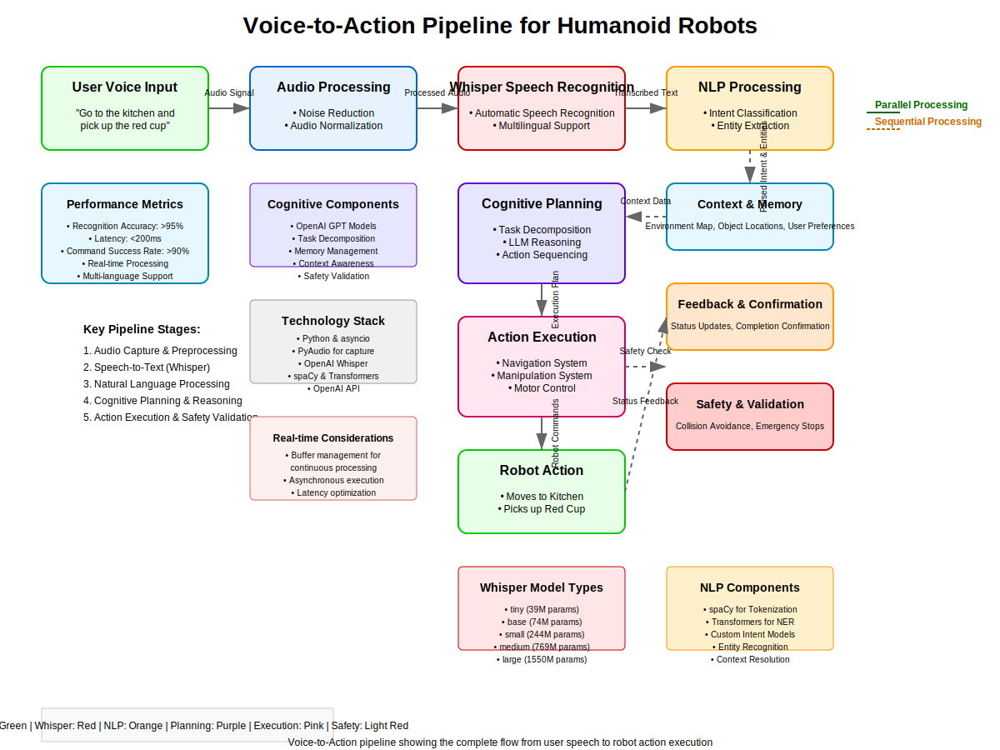

# Voice-to-Action: Whisper-Based Command Recognition

## Overview

This chapter explores the integration of OpenAI's Whisper speech recognition model with humanoid robotics systems. You'll learn how to implement voice command recognition, process natural language instructions, and map them to robot actions. The chapter covers both the technical implementation and practical considerations for robust voice-based human-robot interaction.

## Learning Objectives

By the end of this chapter, you will be able to:
- Set up and configure Whisper for real-time speech recognition
- Integrate voice recognition with ROS 2 systems
- Process natural language commands for robot execution
- Implement error handling and feedback mechanisms
- Optimize voice recognition for noisy environments
- Create custom command vocabularies for specific robot tasks

## Table of Contents

1. [Introduction to Voice Recognition in Robotics](#introduction-to-voice-recognition-in-robotics)
2. [Whisper Model Overview](#whisper-model-overview)
3. [System Architecture](#system-architecture)
4. [Installation and Setup](#installation-and-setup)
5. [Real-time Audio Processing](#real-time-audio-processing)
6. [Command Recognition and Parsing](#command-recognition-and-parsing)
7. [Integration with ROS 2](#integration-with-ros-2)
8. [Natural Language Processing](#natural-language-processing)
9. [Error Handling and Feedback](#error-handling-and-feedback)
10. [Performance Optimization](#performance-optimization)
11. [Testing and Validation](#testing-and-validation)
12. [Summary and Next Steps](#summary-and-next-steps)

## Introduction to Voice Recognition in Robotics

### The Role of Voice in Human-Robot Interaction

Voice-based interaction provides an intuitive and natural way for humans to communicate with robots. In the context of humanoid robots, voice commands can:

1. **Simplify User Interaction**: Users can give commands naturally without complex interfaces
2. **Enable Accessibility**: Voice commands make robotics accessible to users with limited mobility
3. **Support Multi-Modal Interaction**: Combine voice with other interaction modalities
4. **Improve Task Efficiency**: Quick verbal commands for common robot tasks

### Challenges in Robotic Voice Recognition

Implementing voice recognition in robotics presents unique challenges:

1. **Environmental Noise**: Robot motors, fans, and surroundings create noise
2. **Real-time Processing**: Commands need to be recognized and executed quickly
3. **Ambient Sound**: Background noise from the environment affects recognition
4. **Distance Variations**: Sound quality varies with distance from the speaker
5. **Command Ambiguity**: Natural language can be ambiguous and context-dependent

## Whisper Model Overview

### What is Whisper?

Whisper is a general-purpose speech recognition model developed by OpenAI. It demonstrates strong performance across multiple tasks including:

- Speech recognition
- Speech translation
- Language identification
- Voice activity detection

### Key Features of Whisper

1. **Multilingual Support**: Supports 99 languages
2. **Robustness**: Performs well in noisy environments
3. **Zero-Shot Performance**: Works well without fine-tuning
4. **Open Source**: Available for research and commercial use
5. **Multiple Sizes**: Different model sizes for various requirements

### Whisper Architecture

Whisper uses a Transformer-based architecture with:

- **Encoder**: Processes audio input
- **Decoder**: Generates text output
- **Attention Mechanism**: Aligns audio and text representations

## System Architecture

### Voice Recognition Pipeline



```
Audio Input → Preprocessing → Whisper → NLP → Command Mapping → Robot Action
```

### Component Overview

1. **Audio Capture**: Microphones and audio interfaces
2. **Preprocessing**: Noise reduction and audio formatting
3. **Speech Recognition**: Whisper model processing
4. **Natural Language Processing**: Command interpretation
5. **Command Mapping**: Mapping to robot actions
6. **Action Execution**: ROS 2 action execution

### Integration Points

The voice-to-action system integrates with:
- ROS 2 communication framework
- Robot behavior trees
- Navigation systems
- Manipulation interfaces

## Installation and Setup

### Prerequisites

```bash
# Python 3.8 or higher
python --version

# Required packages
pip install openai-whisper
pip install torch torchvision torchaudio
pip install pyaudio
pip install speechrecognition
pip install transformers
pip install datasets
pip install evaluate
```

### Audio Setup

```python
# audio_setup.py
import pyaudio
import wave
import numpy as np
import threading
import queue
import time

class AudioCapture:
    def __init__(self, rate=16000, chunk=1024, channels=1):
        self.rate = rate
        self.chunk = chunk
        self.channels = channels
        self.format = pyaudio.paInt16
        self.audio = pyaudio.PyAudio()

        # Audio stream
        self.stream = None
        self.recording = False
        self.audio_queue = queue.Queue()

        # Initialize audio stream
        self._initialize_stream()

    def _initialize_stream(self):
        """Initialize the audio stream"""
        try:
            self.stream = self.audio.open(
                format=self.format,
                channels=self.channels,
                rate=self.rate,
                input=True,
                frames_per_buffer=self.chunk
            )
            print(f"Audio stream initialized at {self.rate}Hz")
        except Exception as e:
            print(f"Error initializing audio stream: {e}")
            raise

    def start_recording(self):
        """Start audio recording in a separate thread"""
        self.recording = True
        self.record_thread = threading.Thread(target=self._record_audio)
        self.record_thread.start()
        print("Audio recording started")

    def stop_recording(self):
        """Stop audio recording"""
        self.recording = False
        if hasattr(self, 'record_thread'):
            self.record_thread.join()
        print("Audio recording stopped")

    def _record_audio(self):
        """Internal method to record audio in a loop"""
        while self.recording:
            try:
                data = self.stream.read(self.chunk, exception_on_overflow=False)
                self.audio_queue.put(data)
            except Exception as e:
                print(f"Error recording audio: {e}")
                break

    def get_audio_data(self):
        """Get accumulated audio data from the queue"""
        frames = []
        while not self.audio_queue.empty():
            frames.append(self.audio_queue.get())

        if frames:
            audio_data = b''.join(frames)
            return np.frombuffer(audio_data, dtype=np.int16)
        return np.array([])

    def close(self):
        """Close the audio stream and terminate PyAudio"""
        if self.stream:
            self.stream.stop_stream()
            self.stream.close()
        self.audio.terminate()
        print("Audio resources closed")

# Example usage
if __name__ == "__main__":
    audio_capture = AudioCapture()
    audio_capture.start_recording()

    try:
        for i in range(10):  # Record for 10 iterations
            time.sleep(0.5)
            audio_data = audio_capture.get_audio_data()
            if len(audio_data) > 0:
                print(f"Captured {len(audio_data)} audio samples")
    except KeyboardInterrupt:
        print("Stopping...")
    finally:
        audio_capture.stop_recording()
        audio_capture.close()
```

### Whisper Model Setup

```python
# whisper_setup.py
import whisper
import torch
import numpy as np
from typing import Optional, Dict, Any

class WhisperRecognizer:
    def __init__(self, model_size="base", device=None):
        """
        Initialize Whisper recognizer

        Args:
            model_size: Size of the Whisper model ('tiny', 'base', 'small', 'medium', 'large')
            device: Device to run the model on (cpu, cuda)
        """
        self.model_size = model_size
        self.device = device or ("cuda" if torch.cuda.is_available() else "cpu")

        print(f"Loading Whisper model '{model_size}' on {self.device}...")
        self.model = whisper.load_model(model_size, device=self.device)
        print("Model loaded successfully")

    def transcribe_audio(self, audio_data: np.ndarray, sample_rate: int = 16000) -> Dict[str, Any]:
        """
        Transcribe audio data using Whisper

        Args:
            audio_data: Audio samples as numpy array
            sample_rate: Sample rate of the audio data

        Returns:
            Dictionary containing transcription results
        """
        try:
            # Convert audio to the format expected by Whisper
            if sample_rate != 16000:
                # Resample if needed (simplified - in practice use proper resampling)
                audio_data = self._resample_audio(audio_data, sample_rate, 16000)

            # Run transcription
            result = self.model.transcribe(
                audio_data.astype(np.float32),
                language="en",  # You can set to None for auto-detection
                fp16=(self.device == "cuda")
            )

            return result
        except Exception as e:
            print(f"Error in transcription: {e}")
            return {"text": "", "segments": [], "language": "en"}

    def _resample_audio(self, audio_data: np.ndarray, orig_sr: int, target_sr: int) -> np.ndarray:
        """Simple resampling (in practice, use librosa or scipy)"""
        # This is a simplified resampling - use proper resampling in production
        if orig_sr == target_sr:
            return audio_data

        # Calculate the new length
        new_length = int(len(audio_data) * target_sr / orig_sr)
        resampled = np.interp(
            np.linspace(0, len(audio_data) - 1, new_length),
            np.arange(len(audio_data)),
            audio_data
        )
        return resampled

    def transcribe_file(self, audio_file_path: str) -> Dict[str, Any]:
        """Transcribe an audio file"""
        try:
            result = self.model.transcribe(audio_file_path)
            return result
        except Exception as e:
            print(f"Error transcribing file: {e}")
            return {"text": "", "segments": [], "language": "en"}

# Example usage
if __name__ == "__main__":
    recognizer = WhisperRecognizer(model_size="base")

    # Example: Simulate audio data
    # In practice, this would come from the audio capture system
    dummy_audio = np.random.randn(16000).astype(np.float32)  # 1 second of dummy audio

    result = recognizer.transcribe_audio(dummy_audio)
    print(f"Transcription: {result['text']}")
```

## Real-time Audio Processing

### Audio Stream Processing

```python
# real_time_audio.py
import pyaudio
import numpy as np
import threading
import queue
import time
from whisper_setup import WhisperRecognizer
from audio_setup import AudioCapture

class RealTimeAudioProcessor:
    def __init__(self, whisper_model_size="base"):
        self.audio_capture = AudioCapture()
        self.whisper = WhisperRecognizer(model_size=whisper_model_size)

        # Processing parameters
        self.silence_threshold = 500  # Adjust based on your microphone
        self.min_audio_length = 8000  # Minimum 0.5 seconds at 16kHz
        self.max_audio_length = 48000  # Maximum 3 seconds at 16kHz

        # Processing state
        self.processing = False
        self.audio_buffer = np.array([])
        self.processing_thread = None

        # Callback function for processed commands
        self.command_callback = None

    def set_command_callback(self, callback_func):
        """Set callback function for processed commands"""
        self.command_callback = callback_func

    def start_processing(self):
        """Start real-time audio processing"""
        self.processing = True
        self.audio_capture.start_recording()
        self.processing_thread = threading.Thread(target=self._process_audio_loop)
        self.processing_thread.start()
        print("Real-time audio processing started")

    def stop_processing(self):
        """Stop real-time audio processing"""
        self.processing = False
        self.audio_capture.stop_recording()
        if self.processing_thread:
            self.processing_thread.join()
        print("Real-time audio processing stopped")

    def _process_audio_loop(self):
        """Main processing loop"""
        while self.processing:
            # Get audio data from capture
            audio_data = self.audio_capture.get_audio_data()

            if len(audio_data) > 0:
                # Add to buffer
                self.audio_buffer = np.concatenate([self.audio_buffer, audio_data])

                # Check if we have enough audio for processing
                if len(self.audio_buffer) >= self.min_audio_length:
                    # Check for silence at the end to trigger processing
                    if self._is_silence_at_end(self.audio_buffer):
                        self._process_current_buffer()

            # Limit buffer size to prevent excessive memory usage
            if len(self.audio_buffer) > self.max_audio_length:
                # Keep only the most recent audio
                self.audio_buffer = self.audio_buffer[-self.max_audio_length:]

            time.sleep(0.01)  # Small delay to prevent excessive CPU usage

    def _is_silence_at_end(self, audio_buffer, window_size=1024, threshold_ratio=0.3):
        """Check if the end of the buffer contains silence"""
        if len(audio_buffer) < window_size:
            return False

        # Check the last window for silence
        end_window = audio_buffer[-window_size:]
        max_amplitude = np.max(np.abs(end_window))

        # If max amplitude is below threshold, consider it silence
        return max_amplitude < (self.silence_threshold * threshold_ratio)

    def _process_current_buffer(self):
        """Process the current audio buffer"""
        if len(self.audio_buffer) < self.min_audio_length:
            # Not enough audio, continue accumulating
            return

        # Transcribe the audio
        result = self.whisper.transcribe_audio(self.audio_buffer)
        transcription = result.get('text', '').strip()

        if transcription and len(transcription) > 3:  # Minimum length check
            print(f"Recognized: {transcription}")

            # Call the command callback if set
            if self.command_callback:
                self.command_callback(transcription)

        # Clear the buffer for next round
        self.audio_buffer = np.array([])

    def process_single_audio_clip(self, audio_data):
        """Process a single audio clip immediately"""
        result = self.whisper.transcribe_audio(audio_data)
        return result.get('text', '').strip()

# Example usage
def command_handler(command):
    """Example command handler"""
    print(f"Processing command: {command}")
    # Here you would map the command to robot actions

if __name__ == "__main__":
    processor = RealTimeAudioProcessor()
    processor.set_command_callback(command_handler)

    try:
        processor.start_processing()
        print("Press Ctrl+C to stop...")
        while True:
            time.sleep(1)
    except KeyboardInterrupt:
        print("Stopping...")
    finally:
        processor.stop_processing()
        processor.audio_capture.close()
```

## Command Recognition and Parsing

### Natural Language Command Parser

```python
# command_parser.py
import re
from typing import Dict, List, Optional, Tuple
from dataclasses import dataclass

@dataclass
class RobotCommand:
    """Represents a parsed robot command"""
    action: str
    parameters: Dict[str, any]
    confidence: float
    original_text: str

class CommandParser:
    def __init__(self):
        # Define command patterns and their corresponding actions
        self.command_patterns = {
            # Navigation commands
            'move_to': [
                r'move to (.+)',
                r'go to (.+)',
                r'go over to (.+)',
                r'walk to (.+)',
                r'navigate to (.+)',
                r'go to the (.+)'
            ],

            # Movement commands
            'move_forward': [
                r'move forward',
                r'go forward',
                r'go straight',
                r'walk forward',
                r'move ahead',
                r'go ahead'
            ],

            'move_backward': [
                r'move backward',
                r'go backward',
                r'go back',
                r'back up',
                r'move back'
            ],

            'turn_left': [
                r'turn left',
                r'turn to the left',
                r'rotate left',
                r'pivot left'
            ],

            'turn_right': [
                r'turn right',
                r'turn to the right',
                r'rotate right',
                r'pivot right'
            ],

            # Manipulation commands
            'pick_up': [
                r'pick up (.+)',
                r'grab (.+)',
                r'take (.+)',
                r'get (.+)',
                r'pick (.+) up'
            ],

            'put_down': [
                r'put down (.+)',
                r'drop (.+)',
                r'release (.+)',
                r'put (.+) down'
            ],

            'wave': [
                r'wave',
                r'wave hello',
                r'say hello',
                r'hello',
                r'greet'
            ],

            'stop': [
                r'stop',
                r'freeze',
                r'hold',
                r'wait',
                r'pause'
            ],

            'follow': [
                r'follow me',
                r'follow (.+)',
                r'come with me',
                r'follow behind'
            ],

            'dance': [
                r'dance',
                r'do a dance',
                r'move to music',
                r'perform'
            ]
        }

        # Location mappings
        self.location_mappings = {
            'kitchen': 'kitchen_location',
            'living room': 'living_room_location',
            'bedroom': 'bedroom_location',
            'office': 'office_location',
            'dining room': 'dining_room_location',
            'bathroom': 'bathroom_location',
            'hallway': 'hallway_location',
            'entrance': 'entrance_location',
            'exit': 'exit_location'
        }

        # Object mappings
        self.object_mappings = {
            'bottle': 'bottle_object',
            'cup': 'cup_object',
            'book': 'book_object',
            'phone': 'phone_object',
            'keys': 'keys_object',
            'toy': 'toy_object',
            'food': 'food_object',
            'water': 'water_object'
        }

    def parse_command(self, text: str) -> Optional[RobotCommand]:
        """
        Parse a natural language command and return a RobotCommand object

        Args:
            text: The natural language command text

        Returns:
            RobotCommand object or None if no command is recognized
        """
        if not text:
            return None

        text = text.lower().strip()

        # Try each action type
        for action, patterns in self.command_patterns.items():
            for pattern in patterns:
                match = re.search(pattern, text)
                if match:
                    # Extract parameters if any
                    parameters = self._extract_parameters(action, match, text)

                    # Calculate confidence based on pattern match quality
                    confidence = self._calculate_confidence(action, text, match)

                    return RobotCommand(
                        action=action,
                        parameters=parameters,
                        confidence=confidence,
                        original_text=text
                    )

        return None

    def _extract_parameters(self, action: str, match: re.Match, original_text: str) -> Dict[str, any]:
        """Extract parameters from the matched command"""
        parameters = {}

        if action in ['move_to', 'pick_up', 'put_down', 'follow']:
            # Extract object/location name
            if match.groups():
                param_text = match.group(1).strip()

                # Try to map to known locations/objects
                if action == 'move_to':
                    # Check if it's a known location
                    for known_loc, mapped_loc in self.location_mappings.items():
                        if known_loc in param_text:
                            parameters['location'] = mapped_loc
                            break
                    else:
                        # Use the raw location name
                        parameters['location'] = param_text

                elif action in ['pick_up', 'put_down']:
                    # Check if it's a known object
                    for known_obj, mapped_obj in self.object_mappings.items():
                        if known_obj in param_text:
                            parameters['object'] = mapped_obj
                            break
                    else:
                        # Use the raw object name
                        parameters['object'] = param_text

                elif action == 'follow':
                    parameters['target'] = param_text

        # Add additional context parameters
        parameters['timestamp'] = time.time()
        parameters['original_text'] = original_text

        return parameters

    def _calculate_confidence(self, action: str, text: str, match: re.Match) -> float:
        """Calculate confidence score for the command match"""
        # Base confidence on match length and text length
        match_length = len(match.group(0))
        text_length = len(text)

        # Calculate base confidence
        base_confidence = min(1.0, match_length / text_length)

        # Adjust based on action type
        action_weights = {
            'move_to': 0.9,
            'move_forward': 0.8,
            'move_backward': 0.8,
            'turn_left': 0.8,
            'turn_right': 0.8,
            'pick_up': 0.9,
            'put_down': 0.9,
            'wave': 0.7,
            'stop': 0.9,
            'follow': 0.9,
            'dance': 0.7
        }

        weight = action_weights.get(action, 0.7)
        confidence = base_confidence * weight

        # Ensure minimum confidence
        return max(0.3, confidence)

    def get_suggested_commands(self) -> List[str]:
        """Get a list of suggested commands for users"""
        suggestions = [
            "Move to the kitchen",
            "Go to the living room",
            "Pick up the bottle",
            "Turn left",
            "Move forward",
            "Stop",
            "Follow me",
            "Wave hello"
        ]
        return suggestions

# Example usage
if __name__ == "__main__":
    parser = CommandParser()

    test_commands = [
        "Move to the kitchen",
        "Go to the living room",
        "Pick up the bottle",
        "Turn left",
        "Move forward",
        "Stop",
        "Follow me",
        "Wave hello"
    ]

    for cmd in test_commands:
        result = parser.parse_command(cmd)
        if result:
            print(f"Command: '{cmd}' -> Action: {result.action}, Params: {result.parameters}, Confidence: {result.confidence:.2f}")
        else:
            print(f"Command: '{cmd}' -> No match found")
```

## Integration with ROS 2

### ROS 2 Voice Command Node

```python
# voice_command_node.py
import rclpy
from rclpy.node import Node
from std_msgs.msg import String, Bool
from geometry_msgs.msg import PoseStamped
from action_msgs.msg import GoalStatus
from rclpy.action import ActionClient
from rclpy.callback_groups import ReentrantCallbackGroup
from rclpy.executors import MultiThreadedExecutor
import threading
import time

from real_time_audio import RealTimeAudioProcessor
from command_parser import CommandParser, RobotCommand

class VoiceCommandNode(Node):
    def __init__(self):
        super().__init__('voice_command_node')

        # Initialize components
        self.audio_processor = RealTimeAudioProcessor()
        self.command_parser = CommandParser()

        # ROS 2 publishers and subscribers
        self.command_pub = self.create_publisher(String, 'voice_commands', 10)
        self.status_pub = self.create_publisher(String, 'voice_status', 10)
        self.feedback_pub = self.create_publisher(String, 'voice_feedback', 10)

        # ROS 2 services
        self.enable_service = self.create_service(
            Bool, 'enable_voice_control', self.enable_voice_control_callback)
        self.disable_service = self.create_service(
            Bool, 'disable_voice_control', self.disable_voice_control_callback)

        # Navigation action client
        self.nav_client = ActionClient(self, NavigateToPose, 'navigate_to_pose')

        # State variables
        self.voice_enabled = True
        self.processing_lock = threading.Lock()

        # Set up audio processing callback
        self.audio_processor.set_command_callback(self.process_recognized_command)

        self.get_logger().info('Voice Command Node initialized')

    def enable_voice_control_callback(self, request, response):
        """Service callback to enable voice control"""
        with self.processing_lock:
            if not self.voice_enabled:
                self.voice_enabled = True
                self.audio_processor.start_processing()
                self.get_logger().info('Voice control enabled')

        response.data = True
        return response

    def disable_voice_control_callback(self, request, response):
        """Service callback to disable voice control"""
        with self.processing_lock:
            if self.voice_enabled:
                self.voice_enabled = False
                self.audio_processor.stop_processing()
                self.get_logger().info('Voice control disabled')

        response.data = True
        return response

    def process_recognized_command(self, text):
        """Process recognized text from audio"""
        if not self.voice_enabled:
            return

        # Publish the recognized text
        cmd_msg = String()
        cmd_msg.data = text
        self.command_pub.publish(cmd_msg)

        # Parse the command
        robot_command = self.command_parser.parse_command(text)

        if robot_command and robot_command.confidence > 0.5:
            self.get_logger().info(f'Parsed command: {robot_command.action} with confidence {robot_command.confidence:.2f}')

            # Execute the command
            success = self.execute_command(robot_command)

            if success:
                feedback_msg = String()
                feedback_msg.data = f"Executed command: {robot_command.original_text}"
                self.feedback_pub.publish(feedback_msg)
            else:
                feedback_msg = String()
                feedback_msg.data = f"Failed to execute: {robot_command.original_text}"
                self.feedback_pub.publish(feedback_msg)
        else:
            # Command not recognized or low confidence
            feedback_msg = String()
            feedback_msg.data = f"Command not recognized: {text}"
            self.feedback_pub.publish(feedback_msg)

    def execute_command(self, robot_command: RobotCommand) -> bool:
        """Execute a parsed robot command"""
        action = robot_command.action
        params = robot_command.parameters

        try:
            if action == 'move_to':
                return self.execute_move_to(params)
            elif action == 'move_forward':
                return self.execute_move_forward(params)
            elif action == 'move_backward':
                return self.execute_move_backward(params)
            elif action == 'turn_left':
                return self.execute_turn_left(params)
            elif action == 'turn_right':
                return self.execute_turn_right(params)
            elif action == 'pick_up':
                return self.execute_pick_up(params)
            elif action == 'put_down':
                return self.execute_put_down(params)
            elif action == 'wave':
                return self.execute_wave(params)
            elif action == 'stop':
                return self.execute_stop(params)
            elif action == 'follow':
                return self.execute_follow(params)
            elif action == 'dance':
                return self.execute_dance(params)
            else:
                self.get_logger().warn(f'Unknown command action: {action}')
                return False
        except Exception as e:
            self.get_logger().error(f'Error executing command {action}: {e}')
            return False

    def execute_move_to(self, params):
        """Execute move to location command"""
        location = params.get('location', 'unknown')
        self.get_logger().info(f'Moving to {location}')

        # Look up location in a predefined map
        location_poses = {
            'kitchen_location': [2.0, 1.0, 0.0],
            'living_room_location': [0.0, 0.0, 0.0],
            'bedroom_location': [-2.0, 1.0, 0.0],
            'office_location': [1.0, -2.0, 0.0]
        }

        if location in location_poses:
            pose_data = location_poses[location]
            goal_pose = PoseStamped()
            goal_pose.header.frame_id = 'map'
            goal_pose.header.stamp = self.get_clock().now().to_msg()
            goal_pose.pose.position.x = pose_data[0]
            goal_pose.pose.position.y = pose_data[1]
            goal_pose.pose.position.z = 0.0
            goal_pose.pose.orientation.w = 1.0  # No rotation

            # Send navigation goal
            return self.send_navigation_goal(goal_pose)
        else:
            self.get_logger().warn(f'Unknown location: {location}')
            return False

    def execute_move_forward(self, params):
        """Execute move forward command"""
        self.get_logger().info('Moving forward')
        # In a real implementation, this would send movement commands
        return True

    def execute_move_backward(self, params):
        """Execute move backward command"""
        self.get_logger().info('Moving backward')
        # In a real implementation, this would send movement commands
        return True

    def execute_turn_left(self, params):
        """Execute turn left command"""
        self.get_logger().info('Turning left')
        # In a real implementation, this would send rotation commands
        return True

    def execute_turn_right(self, params):
        """Execute turn right command"""
        self.get_logger().info('Turning right')
        # In a real implementation, this would send rotation commands
        return True

    def execute_pick_up(self, params):
        """Execute pick up object command"""
        obj = params.get('object', 'unknown')
        self.get_logger().info(f'Picking up {obj}')
        # In a real implementation, this would trigger manipulation actions
        return True

    def execute_put_down(self, params):
        """Execute put down object command"""
        obj = params.get('object', 'unknown')
        self.get_logger().info(f'Putting down {obj}')
        # In a real implementation, this would trigger manipulation actions
        return True

    def execute_wave(self, params):
        """Execute wave command"""
        self.get_logger().info('Waving')
        # In a real implementation, this would trigger waving motion
        return True

    def execute_stop(self, params):
        """Execute stop command"""
        self.get_logger().info('Stopping')
        # In a real implementation, this would stop all robot motion
        return True

    def execute_follow(self, params):
        """Execute follow command"""
        target = params.get('target', 'unknown')
        self.get_logger().info(f'Following {target}')
        # In a real implementation, this would start following behavior
        return True

    def execute_dance(self, params):
        """Execute dance command"""
        self.get_logger().info('Dancing')
        # In a real implementation, this would trigger dance routine
        return True

    def send_navigation_goal(self, pose):
        """Send navigation goal to Nav2"""
        # Wait for action server
        if not self.nav_client.wait_for_server(timeout_sec=5.0):
            self.get_logger().error('Navigation action server not available')
            return False

        # Create navigation goal
        goal_msg = NavigateToPose.Goal()
        goal_msg.pose = pose

        # Send goal
        send_goal_future = self.nav_client.send_goal_async(goal_msg)

        # Wait for response (with timeout)
        import asyncio
        try:
            rclpy.spin_until_future_complete(self, send_goal_future, timeout_sec=5.0)
            goal_handle = send_goal_future.result()

            if not goal_handle.accepted:
                self.get_logger().error('Navigation goal was rejected')
                return False

            # Get result
            get_result_future = goal_handle.get_result_async()
            rclpy.spin_until_future_complete(self, get_result_future, timeout_sec=30.0)

            result = get_result_future.result().result
            status = get_result_future.result().status

            if status == GoalStatus.STATUS_SUCCEEDED:
                self.get_logger().info('Navigation succeeded')
                return True
            else:
                self.get_logger().error('Navigation failed')
                return False
        except Exception as e:
            self.get_logger().error(f'Error sending navigation goal: {e}')
            return False

    def start_listening(self):
        """Start the voice command system"""
        if self.voice_enabled:
            self.audio_processor.start_processing()
            self.get_logger().info('Voice command system started')

    def stop_listening(self):
        """Stop the voice command system"""
        self.voice_enabled = False
        self.audio_processor.stop_processing()
        self.get_logger().info('Voice command system stopped')

def main(args=None):
    rclpy.init(args=args)

    node = VoiceCommandNode()
    node.start_listening()

    try:
        # Use multi-threaded executor to handle both ROS and audio processing
        executor = MultiThreadedExecutor()
        executor.add_node(node)

        try:
            executor.spin()
        except KeyboardInterrupt:
            pass
    finally:
        node.stop_listening()
        node.destroy_node()
        rclpy.shutdown()

if __name__ == '__main__':
    main()
```

## Natural Language Processing

### Advanced NLP for Command Understanding

```python
# advanced_nlp.py
import re
import spacy
from typing import Dict, List, Optional, Tuple
from dataclasses import dataclass
from transformers import pipeline, AutoTokenizer, AutoModelForTokenClassification

@dataclass
class NLPResult:
    """Result of NLP processing"""
    entities: List[Dict[str, str]]
    intent: str
    confidence: float
    action: str
    parameters: Dict[str, any]

class AdvancedNLPProcessor:
    def __init__(self):
        # Load spaCy model for basic NLP
        try:
            self.nlp = spacy.load("en_core_web_sm")
        except OSError:
            print("SpaCy model not found. Install with: python -m spacy download en_core_web_sm")
            self.nlp = None

        # Initialize Hugging Face pipeline for named entity recognition
        try:
            self.ner_pipeline = pipeline(
                "ner",
                model="dbmdz/bert-large-cased-finetuned-conll03-english",
                tokenizer="dbmdz/bert-large-cased-finetuned-conll03-english",
                aggregation_strategy="simple"
            )
        except Exception as e:
            print(f"Could not load NER pipeline: {e}")
            self.ner_pipeline = None

        # Define intent patterns
        self.intent_patterns = {
            'navigation': [
                r'move to (.+)',
                r'go to (.+)',
                r'go over to (.+)',
                r'walk to (.+)',
                r'navigate to (.+)',
                r'go to the (.+)',
                r'go (forward|backward|left|right)'
            ],

            'manipulation': [
                r'pick up (.+)',
                r'grab (.+)',
                r'take (.+)',
                r'get (.+)',
                r'put down (.+)',
                r'drop (.+)',
                r'release (.+)'
            ],

            'social_interaction': [
                r'wave',
                r'say hello',
                r'greet',
                r'dance',
                r'perform'
            ],

            'control': [
                r'stop',
                r'pause',
                r'wait',
                r'follow (.+)'
            ]
        }

        # Entity extraction patterns
        self.entity_patterns = {
            'location': [
                r'(kitchen|living room|bedroom|office|bathroom|hallway|entrance|exit)',
                r'(table|counter|desk|shelf|couch|chair)'
            ],

            'object': [
                r'(bottle|cup|book|phone|keys|toy|food|water|ball|box)'
            ],

            'person': [
                r'(me|you|him|her|them|someone|person)'
            ],

            'direction': [
                r'(forward|backward|back|left|right|up|down|ahead)'
            ],

            'number': [
                r'(\d+)'
            ]
        }

    def process_command(self, text: str) -> Optional[NLPResult]:
        """
        Process a command using advanced NLP techniques

        Args:
            text: The input command text

        Returns:
            NLPResult object with processed information
        """
        if not text:
            return None

        # Extract entities
        entities = self.extract_entities(text)

        # Determine intent
        intent, confidence = self.determine_intent(text)

        # Map intent to action
        action = self.map_intent_to_action(intent)

        # Extract parameters
        parameters = self.extract_parameters(text, entities)

        return NLPResult(
            entities=entities,
            intent=intent,
            confidence=confidence,
            action=action,
            parameters=parameters
        )

    def extract_entities(self, text: str) -> List[Dict[str, str]]:
        """Extract named entities from text"""
        entities = []

        # Use spaCy if available
        if self.nlp:
            doc = self.nlp(text)
            for ent in doc.ents:
                entities.append({
                    'text': ent.text,
                    'label': ent.label_,
                    'start': ent.start_char,
                    'end': ent.end_char
                })

        # Use Hugging Face NER if available
        if self.ner_pipeline:
            try:
                ner_results = self.ner_pipeline(text)
                for result in ner_results:
                    entities.append({
                        'text': result['word'],
                        'label': result['entity_group'],
                        'start': result['start'],
                        'end': result['end'],
                        'confidence': result['score']
                    })
            except Exception as e:
                print(f"NER pipeline error: {e}")

        # Use pattern-based extraction as fallback
        for entity_type, patterns in self.entity_patterns.items():
            for pattern in patterns:
                matches = re.finditer(pattern, text, re.IGNORECASE)
                for match in matches:
                    # Check if this entity is already captured by NER
                    is_duplicate = any(
                        match.start() >= ent.get('start', 0) and
                        match.end() <= ent.get('end', len(text))
                        for ent in entities
                    )

                    if not is_duplicate:
                        entities.append({
                            'text': match.group(1),
                            'label': entity_type,
                            'start': match.start(),
                            'end': match.end()
                        })

        return entities

    def determine_intent(self, text: str) -> Tuple[str, float]:
        """Determine the intent of the command"""
        best_intent = 'unknown'
        best_confidence = 0.0

        for intent, patterns in self.intent_patterns.items():
            for pattern in patterns:
                if re.search(pattern, text, re.IGNORECASE):
                    # Calculate confidence based on pattern match
                    confidence = 0.8  # Base confidence for pattern match

                    # Boost confidence for more specific patterns
                    if len(pattern) > 10:  # More specific patterns
                        confidence = min(1.0, confidence + 0.1)

                    if confidence > best_confidence:
                        best_confidence = confidence
                        best_intent = intent

        return best_intent, best_confidence

    def map_intent_to_action(self, intent: str) -> str:
        """Map intent to a specific robot action"""
        intent_to_action = {
            'navigation': 'navigate',
            'manipulation': 'manipulate',
            'social_interaction': 'socialize',
            'control': 'control'
        }

        return intent_to_action.get(intent, 'unknown')

    def extract_parameters(self, text: str, entities: List[Dict[str, str]]) -> Dict[str, any]:
        """Extract parameters from text and entities"""
        parameters = {}

        # Extract entities by type
        for entity in entities:
            entity_type = entity['label'].lower()
            entity_text = entity['text'].lower()

            if entity_type in ['location', 'object', 'person', 'direction']:
                if entity_type not in parameters:
                    parameters[entity_type] = []
                parameters[entity_type].append(entity_text)

        # Extract numbers
        number_matches = re.findall(r'(\d+)', text)
        if number_matches:
            parameters['numbers'] = [int(n) for n in number_matches]

        # Add original text
        parameters['original_text'] = text

        return parameters

    def get_command_suggestions(self, context: str = "general") -> List[str]:
        """Get context-aware command suggestions"""
        suggestions = {
            'navigation': [
                "Move to the kitchen",
                "Go to the living room",
                "Navigate to the bedroom",
                "Go forward 2 meters",
                "Turn left at the corner"
            ],

            'manipulation': [
                "Pick up the red cup",
                "Grab the book from the table",
                "Put down the bottle",
                "Take the keys"
            ],

            'social': [
                "Wave hello",
                "Say hello to everyone",
                "Dance for me",
                "Introduce yourself"
            ],

            'general': [
                "Move to the kitchen",
                "Pick up the bottle",
                "Wave hello",
                "Stop moving",
                "Follow me"
            ]
        }

        return suggestions.get(context, suggestions['general'])

# Example usage
if __name__ == "__main__":
    nlp_processor = AdvancedNLPProcessor()

    test_commands = [
        "Move to the kitchen",
        "Pick up the red cup from the table",
        "Turn left and go forward",
        "Wave hello to everyone"
    ]

    for cmd in test_commands:
        result = nlp_processor.process_command(cmd)
        if result:
            print(f"Command: '{cmd}'")
            print(f"  Intent: {result.intent} (confidence: {result.confidence:.2f})")
            print(f"  Action: {result.action}")
            print(f"  Entities: {result.entities}")
            print(f"  Parameters: {result.parameters}")
            print()
```

## Error Handling and Feedback

### Voice Recognition Error Handling

```python
# error_handling.py
import time
from typing import Dict, List, Optional, Callable
from dataclasses import dataclass

@dataclass
class VoiceError:
    """Represents a voice recognition error"""
    error_type: str
    message: str
    timestamp: float
    audio_quality: float
    recovery_suggestion: str

class VoiceErrorHandler:
    def __init__(self):
        self.errors = []
        self.max_error_history = 50
        self.error_threshold = 0.3  # Threshold for error detection

        # Error recovery strategies
        self.recovery_strategies = {
            'audio_quality_poor': self._recover_audio_quality,
            'command_unclear': self._recover_unclear_command,
            'no_command': self._recover_no_command,
            'command_rejected': self._recover_command_rejected
        }

        # Audio quality metrics
        self.audio_metrics = {
            'signal_to_noise_ratio': 0.0,
            'background_noise_level': 0.0,
            'voice_activity_confidence': 0.0
        }

    def log_error(self, error_type: str, message: str, audio_quality: float = 0.0):
        """Log a voice recognition error"""
        error = VoiceError(
            error_type=error_type,
            message=message,
            timestamp=time.time(),
            audio_quality=audio_quality,
            recovery_suggestion=self._get_recovery_suggestion(error_type)
        )

        self.errors.append(error)

        # Keep error history within limits
        if len(self.errors) > self.max_error_history:
            self.errors = self.errors[-self.max_error_history:]

    def _get_recovery_suggestion(self, error_type: str) -> str:
        """Get recovery suggestion based on error type"""
        suggestions = {
            'audio_quality_poor': "Please speak closer to the microphone or move to a quieter location",
            'command_unclear': "Please repeat the command more clearly",
            'no_command': "Please provide a clear command",
            'command_rejected': "Command not recognized, please try a different command",
            'timeout': "No audio detected, please speak into the microphone",
            'model_error': "Recognition system error, please try again"
        }

        return suggestions.get(error_type, "Please try again")

    def _recover_audio_quality(self, error: VoiceError) -> bool:
        """Recovery strategy for poor audio quality"""
        print(f"Recovery: {error.recovery_suggestion}")
        # In practice, this might adjust audio settings or request user action
        return True

    def _recover_unclear_command(self, error: VoiceError) -> bool:
        """Recovery strategy for unclear commands"""
        print(f"Recovery: {error.recovery_suggestion}")
        # This might trigger a clarification request
        return True

    def _recover_no_command(self, error: VoiceError) -> bool:
        """Recovery strategy for no command detected"""
        print(f"Recovery: {error.recovery_suggestion}")
        return True

    def _recover_command_rejected(self, error: VoiceError) -> bool:
        """Recovery strategy for rejected commands"""
        print(f"Recovery: {error.recovery_suggestion}")
        return True

    def handle_error(self, error_type: str, message: str, audio_quality: float = 0.0) -> bool:
        """Handle an error with appropriate recovery strategy"""
        # Log the error
        self.log_error(error_type, message, audio_quality)

        # Get and execute recovery strategy
        recovery_func = self.recovery_strategies.get(error_type)
        if recovery_func:
            return recovery_func(self.errors[-1])

        return False

    def analyze_error_pattern(self) -> Dict[str, any]:
        """Analyze error patterns to identify recurring issues"""
        if not self.errors:
            return {}

        # Count error types
        error_counts = {}
        for error in self.errors:
            error_counts[error.error_type] = error_counts.get(error.error_type, 0) + 1

        # Calculate error rate
        total_errors = len(self.errors)
        time_span = self.errors[-1].timestamp - self.errors[0].timestamp
        error_rate = total_errors / max(1, time_span) if time_span > 0 else 0

        # Identify most common error
        most_common_error = max(error_counts, key=error_counts.get) if error_counts else None

        return {
            'error_counts': error_counts,
            'error_rate': error_rate,
            'most_common_error': most_common_error,
            'total_errors': total_errors,
            'time_span': time_span
        }

class VoiceFeedbackSystem:
    def __init__(self):
        self.feedback_callbacks = []
        self.audio_quality_threshold = 0.5
        self.confidence_threshold = 0.7

    def add_feedback_callback(self, callback: Callable):
        """Add a callback function for feedback"""
        self.feedback_callbacks.append(callback)

    def provide_audio_feedback(self, audio_data: list, quality_score: float):
        """Provide feedback on audio quality"""
        feedback = {
            'type': 'audio_quality',
            'quality_score': quality_score,
            'timestamp': time.time(),
            'suggestion': self._get_audio_quality_suggestion(quality_score)
        }

        self._trigger_feedback(feedback)

    def provide_recognition_feedback(self, recognized_text: str, confidence: float):
        """Provide feedback on recognition result"""
        feedback = {
            'type': 'recognition',
            'recognized_text': recognized_text,
            'confidence': confidence,
            'timestamp': time.time(),
            'status': 'success' if confidence >= self.confidence_threshold else 'low_confidence'
        }

        self._trigger_feedback(feedback)

    def provide_command_feedback(self, command_result: bool, command: str):
        """Provide feedback on command execution"""
        feedback = {
            'type': 'command',
            'command': command,
            'success': command_result,
            'timestamp': time.time()
        }

        self._trigger_feedback(feedback)

    def _get_audio_quality_suggestion(self, quality_score: float) -> str:
        """Get suggestion based on audio quality"""
        if quality_score < 0.3:
            return "Poor audio quality detected. Please speak closer to the microphone."
        elif quality_score < 0.6:
            return "Audio quality is acceptable but could be improved."
        else:
            return "Good audio quality detected."

    def _trigger_feedback(self, feedback: Dict):
        """Trigger all feedback callbacks"""
        for callback in self.feedback_callbacks:
            try:
                callback(feedback)
            except Exception as e:
                print(f"Error in feedback callback: {e}")
```

## Performance Optimization

### Optimized Voice Processing Pipeline

```python
# optimized_voice_pipeline.py
import asyncio
import threading
import queue
import time
import numpy as np
from concurrent.futures import ThreadPoolExecutor, as_completed
from typing import Optional, Callable, Dict, Any

class OptimizedVoicePipeline:
    def __init__(self, model_size="base", max_workers=2):
        self.model_size = model_size
        self.max_workers = max_workers

        # Initialize components
        self.audio_queue = queue.Queue(maxsize=10)  # Limit queue size
        self.result_queue = queue.Queue()

        # Thread pool for parallel processing
        self.executor = ThreadPoolExecutor(max_workers=max_workers)

        # Processing state
        self.running = False
        self.processing_thread = None
        self.recognition_thread = None

        # Performance metrics
        self.metrics = {
            'audio_latency': [],
            'recognition_time': [],
            'throughput': 0,
            'error_rate': 0
        }

        # Callbacks
        self.command_callback = None
        self.error_callback = None

    def set_callbacks(self, command_callback: Optional[Callable] = None,
                     error_callback: Optional[Callable] = None):
        """Set callback functions"""
        if command_callback:
            self.command_callback = command_callback
        if error_callback:
            self.error_callback = error_callback

    def start(self):
        """Start the optimized voice pipeline"""
        self.running = True

        # Start processing threads
        self.processing_thread = threading.Thread(target=self._processing_loop)
        self.recognition_thread = threading.Thread(target=self._recognition_loop)

        self.processing_thread.start()
        self.recognition_thread.start()

        print("Optimized voice pipeline started")

    def stop(self):
        """Stop the optimized voice pipeline"""
        self.running = False

        if self.processing_thread:
            self.processing_thread.join()
        if self.recognition_thread:
            self.recognition_thread.join()

        self.executor.shutdown(wait=True)
        print("Optimized voice pipeline stopped")

    def submit_audio(self, audio_data: np.ndarray):
        """Submit audio data for processing"""
        try:
            self.audio_queue.put_nowait({
                'data': audio_data,
                'timestamp': time.time()
            })
        except queue.Full:
            # Queue is full, drop the oldest item
            try:
                self.audio_queue.get_nowait()  # Remove oldest
                self.audio_queue.put_nowait({
                    'data': audio_data,
                    'timestamp': time.time()
                })
            except queue.Empty:
                pass  # Shouldn't happen, but just in case

    def _processing_loop(self):
        """Main processing loop"""
        while self.running:
            try:
                # Get audio data from queue
                item = self.audio_queue.get(timeout=0.1)

                # Submit for recognition in thread pool
                future = self.executor.submit(self._recognize_audio, item)

                # Store future for result retrieval
                self.result_queue.put(future)

            except queue.Empty:
                continue
            except Exception as e:
                if self.error_callback:
                    self.error_callback(f"Processing error: {e}")

    def _recognition_loop(self):
        """Loop to collect recognition results"""
        while self.running:
            try:
                # Get completed future from result queue
                future = self.result_queue.get(timeout=0.1)

                # Get the result
                result = future.result(timeout=0.1)

                if result and result['success']:
                    if self.command_callback:
                        self.command_callback(result['text'])
                elif result:
                    if self.error_callback:
                        self.error_callback(result['error'])

            except queue.Empty:
                continue
            except Exception as e:
                if self.error_callback:
                    self.error_callback(f"Recognition result error: {e}")

    def _recognize_audio(self, audio_item: Dict) -> Dict[str, Any]:
        """Recognize audio in a separate thread"""
        start_time = time.time()

        try:
            # This is where you'd call your Whisper recognition
            # For this example, we'll simulate recognition
            import whisper

            # Load model in the thread (in practice, you might want to share model)
            model = whisper.load_model(self.model_size)

            # Perform recognition
            result = model.transcribe(audio_item['data'].astype(np.float32))
            text = result.get('text', '').strip()

            recognition_time = time.time() - start_time
            self.metrics['recognition_time'].append(recognition_time)

            return {
                'success': True,
                'text': text,
                'timestamp': audio_item['timestamp'],
                'recognition_time': recognition_time
            }

        except Exception as e:
            return {
                'success': False,
                'error': f"Recognition error: {e}",
                'timestamp': audio_item['timestamp']
            }

    def get_performance_metrics(self) -> Dict[str, Any]:
        """Get current performance metrics"""
        if not self.metrics['recognition_time']:
            avg_recognition_time = 0
        else:
            avg_recognition_time = sum(self.metrics['recognition_time']) / len(self.metrics['recognition_time'])

        return {
            'average_recognition_time': avg_recognition_time,
            'total_recognitions': len(self.metrics['recognition_time']),
            'queue_size': self.audio_queue.qsize(),
            'result_queue_size': self.result_queue.qsize()
        }

# Example usage
def on_command(text):
    print(f"Recognized: {text}")

def on_error(error):
    print(f"Error: {error}")

if __name__ == "__main__":
    pipeline = OptimizedVoicePipeline(model_size="base")
    pipeline.set_callbacks(command_callback=on_command, error_callback=on_error)

    try:
        pipeline.start()

        # Simulate audio input
        for i in range(10):
            # Simulate audio data
            dummy_audio = np.random.randn(16000).astype(np.float32)
            pipeline.submit_audio(dummy_audio)
            time.sleep(0.5)

        # Let processing complete
        time.sleep(2)

        # Print metrics
        metrics = pipeline.get_performance_metrics()
        print(f"Performance metrics: {metrics}")

    except KeyboardInterrupt:
        print("Stopping...")
    finally:
        pipeline.stop()
```

## Testing and Validation

### Voice Recognition Tests

```python
# test_voice_recognition.py
import unittest
import numpy as np
from unittest.mock import Mock, patch
from command_parser import CommandParser
from advanced_nlp import AdvancedNLPProcessor
from error_handling import VoiceErrorHandler, VoiceFeedbackSystem

class TestCommandParser(unittest.TestCase):
    def setUp(self):
        self.parser = CommandParser()

    def test_move_commands(self):
        """Test navigation command parsing"""
        commands = [
            "Move to the kitchen",
            "Go to the living room",
            "Navigate to bedroom"
        ]

        for cmd in commands:
            result = self.parser.parse_command(cmd)
            self.assertIsNotNone(result)
            self.assertIn(result.action, ['move_to', 'move_forward', 'move_backward'])

    def test_manipulation_commands(self):
        """Test manipulation command parsing"""
        commands = [
            "Pick up the bottle",
            "Grab the cup",
            "Put down the book"
        ]

        for cmd in commands:
            result = self.parser.parse_command(cmd)
            self.assertIsNotNone(result)
            self.assertIn(result.action, ['pick_up', 'put_down'])

    def test_confidence_calculation(self):
        """Test confidence calculation"""
        cmd = "Move to the kitchen"
        result = self.parser.parse_command(cmd)

        self.assertIsNotNone(result)
        self.assertGreaterEqual(result.confidence, 0.3)
        self.assertLessEqual(result.confidence, 1.0)

class TestAdvancedNLPProcessor(unittest.TestCase):
    def setUp(self):
        self.nlp = AdvancedNLPProcessor()

    def test_entity_extraction(self):
        """Test entity extraction from commands"""
        cmd = "Pick up the red cup from the table"
        result = self.nlp.process_command(cmd)

        self.assertIsNotNone(result)
        # Check if object entity was extracted
        obj_entities = [ent for ent in result.entities
                       if ent.get('label', '').lower() in ['object', 'product']]
        self.assertGreater(len(obj_entities), 0)

    def test_intent_classification(self):
        """Test intent classification"""
        test_cases = [
            ("Move to the kitchen", "navigation"),
            ("Pick up the bottle", "manipulation"),
            ("Wave hello", "social_interaction")
        ]

        for cmd, expected_intent in test_cases:
            result = self.nlp.process_command(cmd)
            self.assertIsNotNone(result)
            self.assertEqual(result.intent, expected_intent)

class TestVoiceErrorHandler(unittest.TestCase):
    def setUp(self):
        self.error_handler = VoiceErrorHandler()

    def test_error_logging(self):
        """Test error logging functionality"""
        initial_count = len(self.error_handler.errors)

        self.error_handler.log_error("test_error", "Test error message", 0.5)

        self.assertEqual(len(self.error_handler.errors), initial_count + 1)
        self.assertEqual(self.error_handler.errors[-1].error_type, "test_error")

    def test_error_recovery(self):
        """Test error recovery"""
        success = self.error_handler.handle_error("command_unclear", "Test message")
        self.assertTrue(success)

    def test_error_pattern_analysis(self):
        """Test error pattern analysis"""
        # Add some test errors
        self.error_handler.log_error("audio_quality_poor", "Poor quality", 0.2)
        self.error_handler.log_error("command_unclear", "Unclear command", 0.8)
        self.error_handler.log_error("audio_quality_poor", "Poor quality again", 0.1)

        pattern_analysis = self.error_handler.analyze_error_pattern()

        self.assertIn('error_counts', pattern_analysis)
        self.assertIn('audio_quality_poor', pattern_analysis['error_counts'])
        self.assertGreater(pattern_analysis['error_counts']['audio_quality_poor'], 0)

class TestVoiceFeedbackSystem(unittest.TestCase):
    def setUp(self):
        self.feedback_system = VoiceFeedbackSystem()
        self.feedback_received = []

    def test_audio_feedback(self):
        """Test audio quality feedback"""
        def feedback_callback(feedback):
            self.feedback_received.append(feedback)

        self.feedback_system.add_feedback_callback(feedback_callback)
        self.feedback_system.provide_audio_feedback([], 0.8)

        self.assertEqual(len(self.feedback_received), 1)
        self.assertEqual(self.feedback_received[0]['type'], 'audio_quality')

    def test_recognition_feedback(self):
        """Test recognition feedback"""
        def feedback_callback(feedback):
            self.feedback_received.append(feedback)

        self.feedback_system.add_feedback_callback(feedback_callback)
        self.feedback_system.provide_recognition_feedback("Hello world", 0.9)

        self.assertEqual(len(self.feedback_received), 1)
        self.assertEqual(self.feedback_received[0]['type'], 'recognition')
        self.assertEqual(self.feedback_received[0]['recognized_text'], "Hello world")

def run_voice_tests():
    """Run all voice recognition tests"""
    unittest.main(argv=[''], exit=False, verbosity=2)

if __name__ == '__main__':
    run_voice_tests()
```

## Summary and Next Steps

### Key Takeaways

1. **Voice Integration**: Whisper provides robust speech recognition capabilities that can be integrated with robotic systems.

2. **Real-time Processing**: Proper buffering and threading are essential for real-time voice command processing.

3. **Command Parsing**: Natural language commands need to be parsed and mapped to specific robot actions.

4. **Error Handling**: Robust error handling and feedback mechanisms are crucial for reliable voice interaction.

5. **Performance Optimization**: Multi-threading and proper resource management ensure responsive voice recognition.

6. **ROS 2 Integration**: Seamless integration with ROS 2 enables voice commands to trigger robot behaviors.

### Next Steps

1. **Hardware Integration**: Integrate with actual microphone arrays and audio processing hardware.

2. **Custom Models**: Fine-tune Whisper models for specific robotic applications and environments.

3. **Context Awareness**: Implement context-aware command interpretation based on robot state.

4. **Privacy Considerations**: Implement on-device processing for privacy-sensitive applications.

5. **Multi-language Support**: Extend to support multiple languages for international applications.

6. **Adaptive Learning**: Implement learning from user corrections to improve recognition accuracy.

### Advanced Topics

For further development, consider:
- Wake word detection for always-listening systems
- Speaker identification for personalized interactions
- Emotion recognition from voice for social robotics
- Integration with vision systems for multimodal interaction
- Edge deployment for resource-constrained robots

## Exercises

1. Implement a custom command vocabulary for your specific robot platform
2. Create a wake word detection system using Porcupine or similar
3. Develop context-aware command interpretation based on robot location
4. Implement speaker identification for personalized responses
5. Create a voice command learning system that adapts to user preferences

## References

- OpenAI Whisper: https://github.com/openai/whisper
- ROS 2 Documentation: https://docs.ros.org/en/humble/
- SpaCy: https://spacy.io/
- Transformers: https://huggingface.co/docs/transformers/
- PyAudio: https://people.csail.mit.edu/hubert/pyaudio/